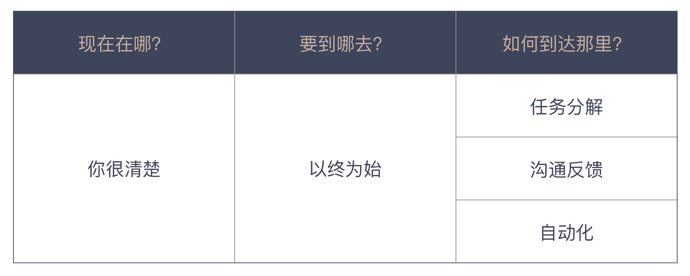

# 01 10x程序员是如何思考的？

你好，我是郑晔。

在开篇词中我们提到，程序员在工作中遇到的很多问题，大多不是程序问题，辛苦而低效的工作，多数是由偶然复杂度导致的。那这个由于偶然复杂度造成的差距会有多大呢？

1975年，弗雷德里克·布鲁克斯（Frederick
Brooks）出版了软件行业的名著《人月神话》，他给出了一个统计结果，**优秀程序员的开发效率是普通程序员的10倍。**40多年过去了，这个数字得到了行业的普遍认同。

成为10x程序员是很多程序员的追求。但工作产出并不只是由写代码的效率决定的，一些不恰当工作方法很大程度上影响着你的产出。

在接下来的这段时间里，我希望通过这个专栏和你一起探讨，作为一个程序员，该如何更高效地工作，怎样才能把时间和精力尽可能地放在处理本质复杂度的事情上，减少在偶然复杂度上的消耗。

作为整个课程第一讲，我就从我常用的一个思考框架开始。

## 一个思考框架

我曾经组织过针对应届毕业生的培训，第一堂课我往往亲自操刀，其中有一个头脑风暴的环节"畅想未来"，我会让大家思考三个问题：

-   我现在是个什么水平？
-   我想达到一个什么水平？
-   我将怎样到达那个目标？

大家会围绕着这三个问题，从各种角度展开讨论。这是一个有趣的练习，你会发现大家"最擅长"的是回答第一个问题：我现在处于什么水平？和有经验的人相比，他们大多自认为比较"菜"。但对于后两个问题的讨论，却可以切实看出人和人之间处理问题的能力差异。

有人通过之前的资料搜集，已经对自己的未来有了一个打算。比如想成为一个研发大牛，或者想做一个开源软件等，也就是说，对于第二个问题，他有明确的答案。

而有的人则是一脸茫然，他很可能根本没有考虑过这个问题。而从题目本身来看，**目标相对清晰的同学，才会进入到第三个问题，而茫然的同学，则完全无从下手。**

那么我为什么会问这几个问题呢？我是想让大家跳出现有的思考模式，摆脱仅凭直觉"闷头做事"的习惯方式，把低着的头抬起来，看一眼未来，给自己找一个方向。

否则，如果你对未来没有定位，是茫然的，尽管你也知道要努力，但劲儿该往哪里使呢？如果使劲的方向不对，那么你越使劲儿，可能会在错误的路上跑得越远。南辕北辙的道理大家都懂，但具体到自己的工作和发展上，真正能体会并实践的却是少数。

其实，这三个问题来自一个思考框架。在给其他公司团队做咨询时，我也经常会运用到它，原来的问题是：

-   Where are we?（我们现在在哪？）
-   Where are we going?（我们要到哪儿去？）
-   How can we get there?（我们如何到达那里？）

这三个问题实际上是帮我们确定：

-   现状；
-   目标；
-   实现路径。

**如果一个人能够清晰地回答出这三个问题，通常意味着他对要做的事有着清晰的认识。**这个框架虽然看似简单，但却非常有效，它已经成为我工具箱里一件非常称手的思考工具。

在我的职业生涯里，与很多人讨论不同的事时，我都会用到这个思考框架的不同变体，而在这个专栏里，我也会用它来帮助回答"怎样高效工作、怎样做好软件"这件事。

## 四个思考原则

在实际的工作中，这个思考框架会帮助我更好地了解自己的工作。比如，当一个产品经理给我交代一个要开发的功能特性时，我通常会问他这样一些问题：

-   为什么要做这个特性，它会给用户带来怎样的价值？
-   什么样的用户会用到这个特性，他们在什么场景下使用，他们又会怎样使用它？
-   达成这个目的是否有其它手段？是不是一定要开发一个系统？
-   这个特性上线之后，怎么衡量它的有效性？

如果产品经理能够回答好这些问题，说明他基本上已经把这个工作想得比较清楚了，这个时候，我才会放心地去了解后续的细节。

我们用思考框架对照一下，为什么我会问这些问题。一般来说，一个新特性要开发时，现状我是知道的。所以，我更关心目标，这里"为什么要做这个特性？"就是在问目标，"给用户带来怎样的价值"是在确定这个目标的有效性。

接下来，我会关注实现路径，用户会怎么用，是否有其他的替代手段，我需要了解产品经理的设计是经过思考的，还是"拍着脑袋"给出的。衡量有效性，则是要保证我的工作不会被浪费。

通过这个例子，我给你展示了怎么用这个思考框架提出问题。但我估计你更想了解的是，我怎么会想到问这些问题。**给出思考框架是为了让你明白为什么要提出问题，而具体问题要怎么问，就可以遵循下面这四项原则：**

-   以终为始；
-   任务分解；
-   沟通反馈；
-   自动化。

这是我从思考框架延伸出来的。在这个专栏里，我会围绕这四项原则和你详细讨论。

解释一下，**以终为始**就是在工作的一开始就确定好自己的目标。我们需要看到的是真正的目标，而不是把别人交代给我们的工作当作目标。你可以看出这个原则是在帮助我们回答思考框架中，Where
are we going?（我们要到哪儿去？）这个问题。

**任务分解**是将大目标拆分成一个一个可行的执行任务，工作分解得越细致，我们便越能更好地掌控工作，它是帮助我们回答思维框架中，How
can we get there?（我们如何到达那里？）的问题。

如果说前两个原则是要在动手之前做的分析，那后面两个原则就是在通往目标的道路上，为我们保驾护航，因为**在实际工作中，我们少不了与人和机器打交道**。

**沟通反馈**是为了疏通与其他人交互的渠道。一方面，我们保证信息能够传达出去，减少因为理解偏差造成的工作疏漏；另一方面，也要保证我们能够准确接收外部信息，以免因为自我感觉良好，阻碍了进步。

**自动化**就是将繁琐的工作通过自动化的方式交给机器执行，这是我们程序员本职工作的一部分，我们擅长的是为其他人打造自动化的服务，但自己的工作却应用得不够，这也是我们工作中最值得优化的部分。

这四个原则互相配合，形成了一个对事情的衡量标准。总体上可以保证我的工作是有效的，在明确目标和完成目标的过程中，都可以尽量减少偶然复杂度。

怎么把这四个原则用在工作中呢？我们回过头来看一下前面的场景，产品经理把要做的功能特性摆在我面前。站在**以终为始**的角度，我需要了解真正的目标是什么，所以，我会关心**为什么要做这个特性**。为了保证目标是有效的，我会关心**它给用户带来的价值**。

有了**任务分解**的视角，我需要将一个大的目标进行拆解，如果我要达成这个目标，整体解决方案是远远不够的，我需要把任务分解成一个一个小的部分。所以，我会关心一个一个**具体的使用场景**。

一方面，我会了解到更多的细节，另一方面，当时间紧迫的时候，我会和产品经理来谈谈究竟优先实现哪个场景。

为什么要学会**沟通反馈**？因为我需要明确，自己是否真正理解了产品经理提交的需求。所以，我要不断地问问题，确保自己的理解和产品经理交代的内容一致。

另外，我也需要保证我的产品做出来确实能够达到目标。所以，我会关心它**上线后的衡量手段**。因为我知道，这个行业里有太多代码上线后，从来没有运行过。

自动化的角度很有意思，**我们做的方案通常是一个自动化方案，但我们需要了解这个方案没有自动化之前是怎么做的。**如果不自动化，用户会怎么用。所以，我会关心是不是还有其它替换方案，比如，买一个现成的服务。因为很多需求的提出，只是因为我们有了一个开发团队而已。

好，现在你已经对这四个原则在工作中的应用有了一个直观的认识。但你也会发现，我问的这些问题似乎已经"超纲"了，超过了一个普通程序员应该关注的范围。但这就是真实世界，它不像考试一样，有一个标准答案。

**我们不是一个人孤独地在工作，而是与其他人在协作，想要做到高效工作，我们就要"抬起头"来，跳出写代码这件事本身。所以，我在开篇词里说，程序员解决的问题，大多不是程序问题。**

可能你对这些原则的了解还没过瘾，没关系，这篇文章只是让大家清晰地了解思考框架和原则的背后逻辑。接下来，我会结合行业里的最佳实践，给你进一步讲解这些原则和具体应用。

## 总结时刻

大多数人工作低效是由于工作中偶然复杂度太多造成的，只要能够更多地将注意力放到本质复杂度上，减少偶然复杂度造成的消耗，我们"真实"的工作效率自然会得到大幅度提升。

而想要减少偶然复杂度的消耗，就要了解一些高效的工作方式和行业的最佳实践，而这一切是可以用统一的框架进行思考的。

运用这个思考框架，我们需要问自己一些问题：

-   Where are we?（我们现在在哪？）
-   Where are we going?（我们要到哪儿去？）
-   How can we get there?（我们如何到达那里？）

为了把这个框架应用在我们程序员的工作中，我给了你四个思考原则：

-   以终为始，确定好真实目标；
-   任务分解，找到实施路径；
-   沟通反馈，解决与人打交道出现的问题；
-   自动化，解决与机器打交道出现的问题。

如果今天的内容你只能记住一件事，那请记住：**面对问题时，用思考框架问问自己，现状、目标和路径。**

最后，我想请你思考一下，如果把这个思考框架运用在你的职业发展规划上，你会如何回答这三个问题呢？

感谢阅读，如果你觉得这篇文章对你有帮助的话，也欢迎把它分享给你的朋友。
