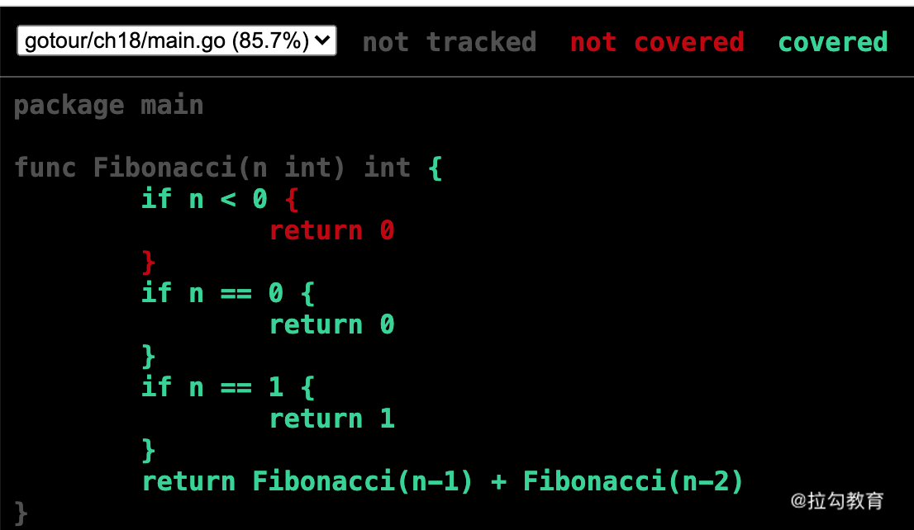

# 18 质量保证：Go 语言如何通过测试保证质量？

从这节课开始，我会带你学习本专栏的第四模块：工程管理。现在项目的开发都不是一个人可以完成的，需要多人进行协作，那么在多人协作中如何保证代码的质量，你写的代码如何被其他人使用，如何优化代码的性能等，
就是第四模块的内容。

这一讲首先来学习 Go 语言的单元测试和基准测试。

### 单元测试

在开发完一个功能后，你可能会直接把代码合并到代码库，用于上线或供其他人使用。但这样是不对的，因为你还没有对所写的代码进行测试。没有经过测试的代码逻辑可能会存在问题：如果强行合并到代码库，可能影响其他人的开发；如果强行上线，可能导致线上
Bug、影响用户使用。

#### 什么是单元测试

顾名思义，单元测试强调的是对单元进行测试。在开发中，一个单元可以是一个函数、一个模块等。一般情况下，你要测试的单元应该是一个完整的**最小单元**，比如
Go
语言的函数。这样的话，当每个最小单元都被验证通过，那么整个模块、甚至整个程序就都可以被验证通过。

单元测试由开发者自己编写，也就是谁改动了代码，谁就要编写相应的单元测试代码以验证本次改动的正确性。

#### Go 语言的单元测试

虽然每种编程语言里单元测试的概念是一样的，但它们对单元测试的设计不一样。Go
语言也有自己的单元测试规范，下面我会通过一个完整的示例为你讲解，这个例子就是经典的斐波那契数列。

斐波那契数列是一个经典的黄金分隔数列：它的第 0 项是 0；第 1 项是 1；从第
2
项开始，每一项都等于前两项之和。所以它的数列是：0、1、1、2、3、5、8、13、21......

> 说明：为了便于总结后面的函数方程式，我这里特意写的从第 0
> 项开始，其实现实中没有第 0 项。

根据以上规律，可以总结出它的函数方程式。

1.  F(0)=0
2.  F(1)=1
3.  F(n)=F(n - 1)+F(n - 2)

有了函数方程式，再编写一个 Go
语言函数来计算斐波那契数列就比较简单了，代码如下：

***ch18/main.go***

    func Fibonacci(n int) int {

       if n < 0 {

          return 0

       }

       if n == 0 {

          return 0

       }

       if n == 1 {

          return 1

       }

       return Fibonacci(n-1) + Fibonacci(n-2)

    }

也就是通过递归的方式实现了斐波那契数列的计算。

Fibonacci
函数已经编写好了，可以供其他开发者使用，不过在使用之前，需要先对它进行单元测试。你需要新建一个
go 文件用于存放单元测试代码。刚刚编写的 Fibonacci
函数在\*ch18/main.go\*文件中，那么对 Fibonacci
函数进行单元测试的代码需要放在\*ch18/main_test.go\*中\*，\*测试代码如下：

***ch18/main_test.go***

    func TestFibonacci(t *testing.T) {

       //预先定义的一组斐波那契数列作为测试用例

       fsMap := map[int]int{}

       fsMap[0] = 0

       fsMap[1] = 1

       fsMap[2] = 1

       fsMap[3] = 2

       fsMap[4] = 3

       fsMap[5] = 5

       fsMap[6] = 8

       fsMap[7] = 13

       fsMap[8] = 21

       fsMap[9] = 34

       for k, v := range fsMap {

          fib := Fibonacci(k)

          if v == fib {

             t.Logf("结果正确:n为%d,值为%d", k, fib)

          } else {

             t.Errorf("结果错误：期望%d,但是计算的值是%d", v, fib)

          }

       }

    }

在这个单元测试中，我通过 map 预定义了一组测试用例，然后通过 Fibonacci
函数计算结果。同预定义的结果进行比较，如果相等，则说明 Fibonacci
函数计算正确，不相等则说明计算错误。

然后即可运行如下命令，进行单元测试：

    ➜ go test -v ./ch18

这行命令会运行 ch18
目录下的所有单元测试，因为我只写了一个单元测试，所以可以看到结果如下所示：

    ➜ go test -v ./ch18 

    === RUN   TestFibonacci

        main_test.go:21: 结果正确:n为0,值为0

        main_test.go:21: 结果正确:n为1,值为1

        main_test.go:21: 结果正确:n为6,值为8

        main_test.go:21: 结果正确:n为8,值为21

        main_test.go:21: 结果正确:n为9,值为34

        main_test.go:21: 结果正确:n为2,值为1

        main_test.go:21: 结果正确:n为3,值为2

        main_test.go:21: 结果正确:n为4,值为3

        main_test.go:21: 结果正确:n为5,值为5

        main_test.go:21: 结果正确:n为7,值为13

    --- PASS: TestFibonacci (0.00s)

    PASS

    ok      gotour/ch18     (cached)

在打印的测试结果中，你可以看到 PASS
标记，说明单元测试通过，而且还可以看到我在单元测试中写的日志。

这就是一个完整的 Go 语言单元测试用例，它是在 Go
语言提供的测试框架下完成的。Go
语言测试框架可以让我们很容易地进行单元测试，但是需要遵循五点规则。

1.  含有单元测试代码的 go 文件必须以 \_test.go 结尾，Go
    语言测试工具只认符合这个规则的文件。
2.  单元测试文件名 \_test.go 前面的部分最好是被测试的函数所在的 go
    文件的文件名，比如以上示例中单元测试文件叫 main_test.go，因为测试的
    Fibonacci 函数在 main.go 文件里。
3.  单元测试的函数名必须以 Test 开头，是可导出的、公开的函数。
4.  测试函数的签名必须接收一个指向 testing.T
    类型的指针，并且不能返回任何值。
5.  函数名最好是 Test + 要测试的函数名，比如例子中是
    TestFibonacci，表示测试的是 Fibonacci 这个函数。

遵循以上规则，你就可以很容易地编写单元测试了。单元测试的重点在于熟悉业务代码的逻辑、场景等，以便尽可能地全面测试，保障代码质量。

#### 单元测试覆盖率

以上示例中的 Fibonacci
函数是否被全面地测试了呢？这就需要用单元测试覆盖率进行检测了。

Go 语言提供了非常方便的命令来查看单元测试覆盖率。还是以 Fibonacci
函数的单元测试为例，通过一行命令即可查看它的单元测试覆盖率。

    ➜ go test -v --coverprofile=ch18.cover ./ch18

这行命令包括 --coverprofile 这个
Flag，它可以得到一个单元测试覆盖率文件，运行这行命令还可以同时看到测试覆盖率。Fibonacci
函数的测试覆盖率如下：

    PASS

    coverage: 85.7% of statements

    ok      gotour/ch18     0.367s  coverage: 85.7% of statements

可以看到，测试覆盖率为 85.7%。从这个数字来看，Fibonacci
函数应该没有被全面地测试，这时候就需要查看详细的单元测试覆盖率报告了。

运行如下命令，可以得到一个 HTML 格式的单元测试覆盖率报告：

    ➜ go tool cover -html=ch18.cover -o=ch18.html

命令运行后，会在当前目录下生成一个 ch18.html
文件，使用浏览器打开它，可以看到图中的内容：

单元测试覆盖率报告

红色标记的部分是没有测试到的，绿色标记的部分是已经测试到的。这就是单元测试覆盖率报告的好处，通过它你可以很容易地检测自己写的单元测试是否完全覆盖。

根据报告，我再修改一下单元测试，把没有覆盖的代码逻辑覆盖到，代码如下：

    fsMap[-1] = 0

也就是说，由于图中 n
的部分显示为红色，表示没有测试到，所以我们需要再添加一组测试用例，用于测试
n 的情况。现在再运行这个单元测试，查看它的单元测试覆盖率，就会发现已经是
100% 了。

### 基准测试

除了需要保证我们编写的代码的逻辑正确外，有时候还有性能要求。那么如何衡量代码的性能呢？这就需要基准测试了。

#### 什么是基准测试

基准测试（Benchmark）是一项用于测量和评估软件性能指标的方法，主要用于评估你写的代码的性能。

#### Go 语言的基准测试

Go
语言的基准测试和单元测试规则基本一样，只是测试函数的命名规则不一样。现在还以
Fibonacci 函数为例，演示 Go 语言基准测试的使用。

Fibonacci 函数的基准测试代码如下：

***ch18/main_test.go***

    func BenchmarkFibonacci(b *testing.B){

       for i:=0;i<b.N;i++{

          Fibonacci(10)

       }

    }

这是一个非常简单的 Go 语言基准测试示例，它和单元测试的不同点如下：

1.  基准测试函数必须以 Benchmark 开头，必须是可导出的；
2.  函数的签名必须接收一个指向 testing.B
    类型的指针，并且不能返回任何值；
3.  最后的 for 循环很重要，被测试的代码要放到循环里；
4.  b.N
    是基准测试框架提供的，表示循环的次数，因为需要反复调用测试的代码，才可以评估性能。

写好了基准测试，就可以通过如下命令来测试 Fibonacci 函数的性能：

    ➜ go test -bench=. ./ch18

    goos: darwin

    goarch: amd64

    pkg: gotour/ch18

    BenchmarkFibonacci-8     3461616               343 ns/op

    PASS

    ok      gotour/ch18     2.230s

运行基准测试也要使用 go test 命令，不过要加上 -bench 这个
Flag，它接受一个表达式作为参数，以匹配基准测试的函数，"."表示运行所有基准测试。

下面着重解释输出的结果。看到函数后面的 -8
了吗？这个表示运行基准测试时对应的 GOMAXPROCS 的值。接着的 3461616
表示运行 for 循环的次数，也就是调用被测试代码的次数，最后的 343 ns/op
表示每次需要花费 343 纳秒。

基准测试的时间默认是 1 秒，也就是 1 秒调用 3461616 次、每次调用花费 343
纳秒。如果想让测试运行的时间更长，可以通过 -benchtime 指定，比如 3
秒，代码如下所示：

    go test -bench=. -benchtime=3s ./ch18

#### 计时方法

进行基准测试之前会做一些准备，比如构建测试数据等，这些准备也需要消耗时间，所以需要把这部分时间排除在外。这就需要通过
ResetTimer 方法重置计时器，示例代码如下：

    func BenchmarkFibonacci(b *testing.B) {

       n := 10

       b.ResetTimer() //重置计时器

       for i := 0; i < b.N; i++ {

          Fibonacci(n)

       }

    }

这样可以避免因为准备数据耗时造成的干扰。

除了 ResetTimer 方法外，还有 StartTimer 和 StopTimer
方法，帮你灵活地控制什么时候开始计时、什么时候停止计时。

#### 内存统计

在基准测试时，还可以统计每次操作分配内存的次数，以及每次操作分配的字节数，这两个指标可以作为优化代码的参考。要开启内存统计也比较简单，代码如下，即通过
ReportAllocs() 方法：

    func BenchmarkFibonacci(b *testing.B) {

       n := 10

       b.ReportAllocs() //开启内存统计

       b.ResetTimer() //重置计时器

       for i := 0; i < b.N; i++ {

          Fibonacci(n)

       }

    }

现在再运行这个基准测试，就可以看到如下结果：

    ➜ go test -bench=.  ./ch18

    goos: darwin

    goarch: amd64

    pkg: gotour/ch18

    BenchmarkFibonacci-8  2486265  486 ns/op  0 B/op  0 allocs/op

    PASS

    ok      gotour/ch18     2.533s

可以看到相比原来的基准测试多了两个指标，分别是 0 B/op 和 0
allocs/op。前者表示每次操作分配了多少字节的内存，后者表示每次操作分配内存的次数。这两个指标可以作为代码优化的参考，尽可能地越小越好。

> 小提示：以上两个指标是否越小越好？这是不一定的，因为有时候代码实现需要空间换时间，所以要根据自己的具体业务而定，做到在满足业务的情况下越小越好。

#### 并发基准测试

除了普通的基准测试外，Go 语言还支持并发基准测试，你可以测试在多个
goroutine 并发下代码的性能。还是以 Fibonacci
为例，它的并发基准测试代码如下：

    func BenchmarkFibonacciRunParallel(b *testing.B) {

       n := 10

       b.RunParallel(func(pb *testing.PB) {

          for pb.Next() {

             Fibonacci(n)

          }

       })

    }

可以看到，Go 语言通过 RunParallel 方法运行并发基准测试。RunParallel
方法会创建多个 goroutine，并将 b.N 分配给这些 goroutine 执行。

#### 基准测试实战

相信你已经理解了 Go
语言的基准测试，也学会了如何使用，现在我以一个实战帮你复习。

还是以 Fibonacci
函数为例，通过前面小节的基准测试，会发现它并没有分配新的内存，也就是说
Fibonacci
函数慢并不是因为内存，排除掉这个原因，就可以归结为所写的算法问题了。

在递归运算中，一定会有重复计算，这是影响递归的主要因素。解决重复计算可以使用缓存，把已经计算好的结果保存起来，就可以重复使用了。

基于这个思路，我将 Fibonacci 函数的代码进行如下修改：

    //缓存已经计算的结果

    var cache = map[int]int{}

    func Fibonacci(n int) int {

       if v, ok := cache[n]; ok {

          return v

       }

       result := 0

       switch {

       case n < 0:

          result = 0

       case n == 0:

          result = 0

       case n == 1:

          result = 1

       default:

          result = Fibonacci(n-1) + Fibonacci(n-2)

       }

       cache[n] = result

       return result

    }

这组代码的核心在于采用一个 map
将已经计算好的结果缓存、便于重新使用。改造后，我再来运行基准测试，看看刚刚优化的效果，如下所示：

    BenchmarkFibonacci-8  97823403  11.7 ns/op

可以看到，结果为 11.7 纳秒，相比优化前的 343 纳秒，性能足足提高了 28
倍。

### 总结

单元测试是保证代码质量的好方法，但单元测试也不是万能的，使用它可以降低
Bug 率，但也不要完全依赖。除了单元测试外，还可以辅以 Code
Review、人工测试等手段更好地保证代码质量。

在这节课的最后给你留个练习题：在运行 go test 命令时，使用 -benchmem 这个
Flag 进行内存统计。

下一讲我将介绍"性能优化：Go 语言如何进行代码检查和优化？"记得来听课！
