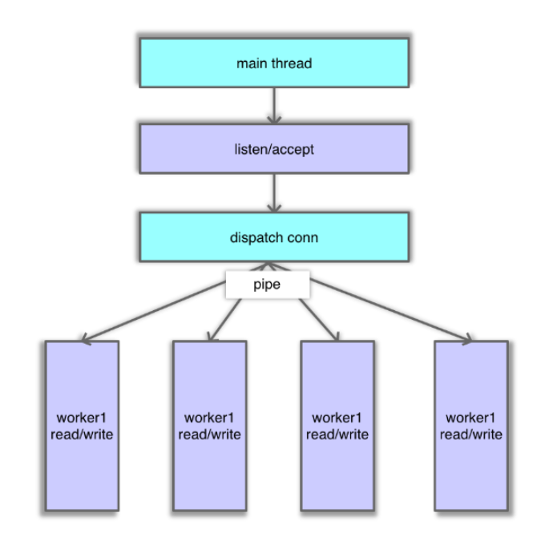
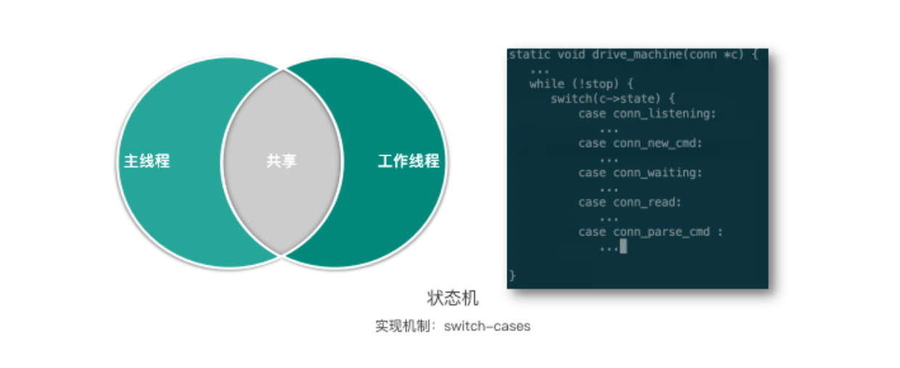
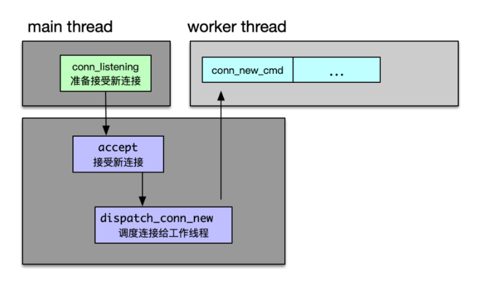
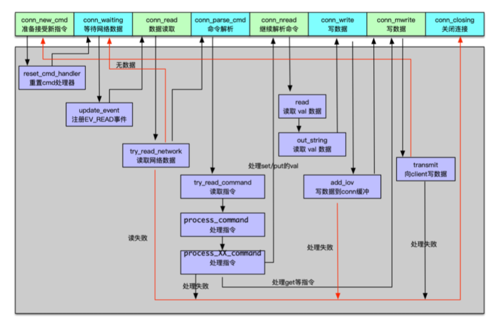
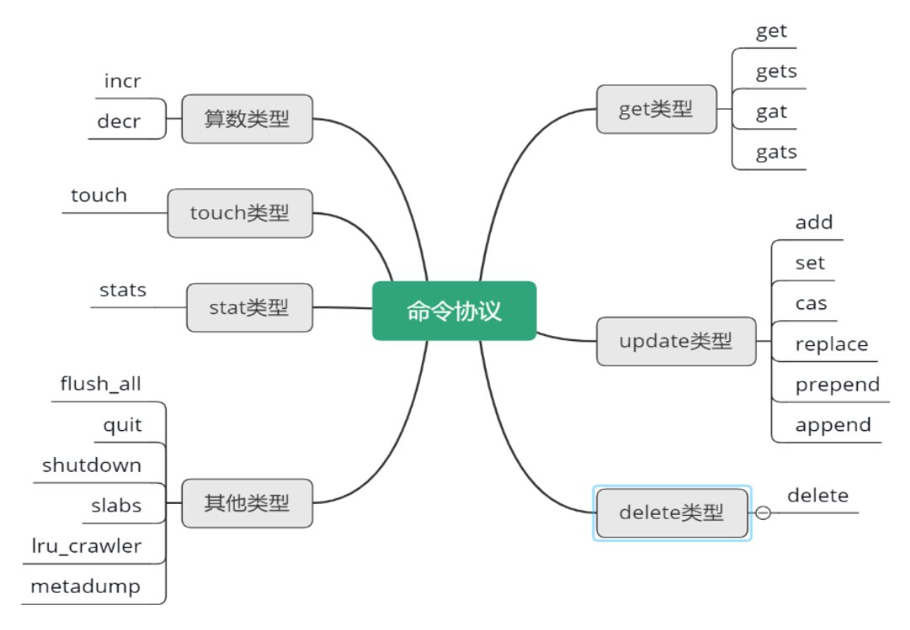
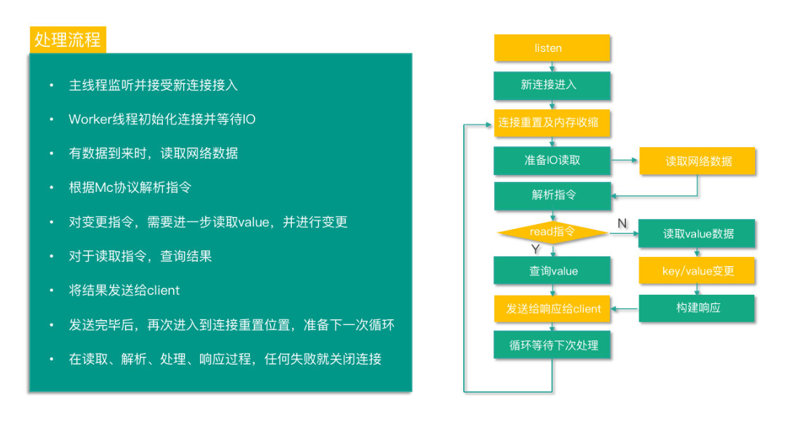
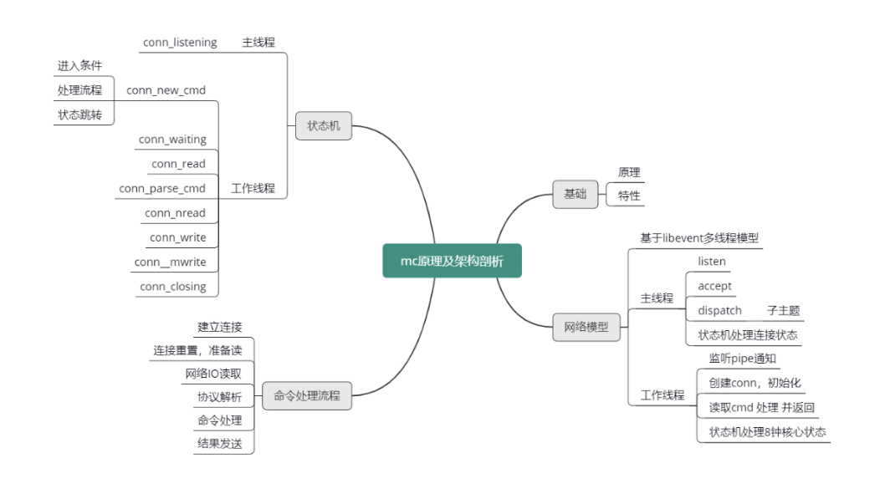

# 09 MC是如何使用多线程和状态机来处理请求命令的？

你好，我是你的缓存老师陈波，欢迎你进入第 9 课时"Memcached
网络模型及状态机"的学习。

###### 网络模型

了解了 Mc 的系统架构之后，我们接下来可以逐一深入学习 Mc
的各个模块了。首先，我们来学习 Mc 的网络模型。

###### 主线程

Mc 基于 Libevent 实现多线程网络 IO 模型。Mc 的 IO
处理线程分主线程和工作线程，每个线程各有一个
event_base，来监听网络事件。主线程负责监听及建立连接。工作线程负责对建立的连接进行网络
IO 读取、命令解析、处理及响应。

Mc 主线程在监听端口时，当有连接到来，主线程 accept
该连接，并将连接调度给工作线程。调度处理逻辑，主线程先将 fd 封装成一个
CQ_ITEM
结构，并存入新连接队列中，然后轮询一个工作线程，并通过管道向该工作线程发送通知。工作线程监听到通知后，会从新连接队列获取一个连接，然后开始从这个连接读取网络
IO
并处理，如下图所示。主线程的这个处理逻辑主要在状态机中执行，对应的连接状态为
conn_listening。

###### 工作线程

工作线程监听到主线程的管道通知后，会从连接队列弹出一个新连接，然后就会创建一个
conn 结构体，注册该 conn 读事件，然后继续监听该连接上的 IO
事件。后续这个连接有命令进来时，工作线程会读取 client
发来的命令，进行解析并处理，最后返回响应。工作线程的主要处理逻辑也是在状态机中，一个名叫
drive_machine 的函数。

###### 状态机

这个状态机由主线程和工作线程共享，实际是采用 switch-case
来实现的。状态机函数如下图所示，switch 连接的
state，然后根据连接的不同状态，执行不同的逻辑操作，并进行状态转换。接下来我们开始分析
Mc 的状态机。

###### 主线程状态机

如下图所示，主线程在状态机中只处理 conn_listening 状态，负责 accept
新连接和调度新连接给工作线程。状态机中其他状态处理基本都在工作线程中进行。由于
Mc 同时支持 TCP、UDP 协议，而互联网企业大多使用 TCP
协议，并且通过文本协议，来访问 Mc，所以后面状态机的介绍，将主要结合 TCP
文本协议来进行重点分析。

###### 工作线程状态机

工作线程的状态机处理逻辑，如下图所示，包括刚建立 conn
连接结构体时进行的一些重置操作，然后注册读事件，在有数据进来时，读取网络数据，并进行解析并处理。如果是读取指令或统计指令，至此就基本处理完毕，接下来将响应写入连接缓冲。如果是更新指令，在进行初步处理后，还会继续读取
value
部分，再进行存储或变更，待变更完毕后将响应写入连接缓冲。最后再将响应写给
client。响应 client
后，连接会再次重置连接状态，等待进入下一次的命令处理循环中。这个过程主要包含了
conn_new_cmd、conn_waiting、conn_read、conn_parse_cmd、conn_nread、conn_write、conn_mwrite、conn_closing
这 8 个状态事件。

###### 工作线程状态事件及逻辑处理

###### conn_new_cmd

主线程通过调用 dispatch_conn_new，把新连接调度给工作线程后，worker
线程创建 conn 对象，这个连接初始状态就是
conn_new_cmd。除了通过新建连接进入 conn_new_cmd
状态之外，如果连接命令处理完毕，准备接受新指令时，也会将连接的状态设置为
conn_new_cmd 状态。

进入 conn_new_cmd 后，工作线程会调用 reset_cmd_handler 函数，重置 conn
的 cmd 和 substate 字段，并在必要时对连接 buf 进行收缩。因为连接在处理
client 来的命令时，对于写指令，需要分配较大的读 buf 来存待更新的 key
value，而对于读指令，则需要分配较大的写 buf 来缓冲待发送给 client 的
value 结果。持续运行中，随着大 size value
的相关操作，这些缓冲会占用很多内存，所以需要设置一个阀值，超过阀值后就进行缓冲内存收缩，避免连接占用太多内存。在后端服务以及中间件开发中，这个操作很重要，因为线上服务的连接很容易达到万级别，如果一个连接占用几十
KB 以上的内存，后端系统仅连接就会占用数百 MB 甚至数 GB 以上的内存空间。

###### conn_parse_cmd

工作线程处理完 conn_new_cmd
状态的主要逻辑后，如果读缓冲区有数据可以读取，则进入 conn_parse_cmd
状态，否则就会进入到 conn_waiting 状态，等待网络数据进来。

###### conn_waiting

连接进入 conn_waiting 状态后，处理逻辑很简单，直接通过 update_event
函数注册读事件即可，之后会将连接状态更新为 conn_read。

###### conn_read

当工作线程监听到网络数据进来，连接就进入 conn_read 状态。对 conn_read
的处理，是通过 try_read_network 从 socket
中读取网络数据。如果读取失败，则进入 conn_closing
状态，关闭连接。如果没有读取到任何数据，则会返回 conn_waiting，继续等待
client 端的数据到来。如果读取数据成功，则会将读取的数据存入 conn 的 rbuf
缓冲，并进入 conn_parse_cmd 状态，准备解析 cmd。

###### conn_parse_cmd

conn_parse_cmd 状态的处理逻辑就是解析命令。工作线程首先通过
try_read_command 读取连接的读缓冲，并通过 \\n
来分隔数据报文的命令。如果命令首行长度大于 1024，关闭连接，这就意味着
key 长度加上其他各项命令字段的总长度要小于 1024字节。当然对于 key，Mc
有个默认的最大长度，key_max_length，默认设置为
250字节。校验完毕首行报文的长度，接下来会在 process_command
函数中对首行指令进行处理。

process_command 用来处理 Mc
的所有协议指令，所以这个函数非常重要。process_command
会首先按照空格分拆报文，确定命令协议类型，分派给 process_XX_command
函数处理。

Mc
的命令协议从直观逻辑上可以分为获取类型、变更类型、其他类型。但从实际处理层面区分，则可以细分为
get 类型、update 类型、delete 类型、算术类型、touch 类型、stats
类型，以及其他类型。对应的处理函数为，process_get_command,
process_update_command, process_arithmetic_command,
process_touch_command等。每个处理函数能够处理不同的协议，具体参见下图所示思维导图。

###### conn_parse_cmd

注意 conn_parse_cmd 的状态处理，只有读取到
\\n，有了完整的命令首行协议，才会进入 process_command，否则会跳转到
conn_waiting，继续等待客户端的命令数据报文。在 process_command
处理中，如果是获取类命令，在获取到 key 对应的 value 后，则跳转到
conn_mwrite，准备写响应给连接缓冲。而对于 update
变更类型的指令，则需要继续读取 value 数据，此时连接会跳转到 conn_nread
状态。在 conn_parse_cmd 处理过程中，如果遇到任何失败，都会跳转到
conn_closing 关闭连接。

###### complete_nread

对于 update 类型的协议指令，从 conn 继续读取 value 数据。读取到 value
数据后，会调用 complete_nread，进行数据存储处理；数据处理完毕后，向 conn
的 wbuf 写响应结果。然后 update 类型处理的连接进入到 conn_write 状态。

###### conn_write

连接 conn_write 状态处理逻辑很简单，直接进入 conn_mwrite 状态。或者当
conn 的 iovused 为 0 或对于 udp 协议，将响应写入 conn 消息缓冲后，再进入
conn_mwrite 状态。

###### conn_mwrite

进入 conn_mwrite 状态后，工作线程将通过 transmit
来向客户端写数据。如果写数据失败，跳转到
conn_closing，关闭连接退出状态机。如果写数据成功，则跳转到
conn_new_cmd，准备下一次新指令的获取。

###### conn_closing

最后一个 conn_closing
状态，前面提到过很多次，在任何状态的处理过程中，如果出现异常，就会进入到这个状态，关闭连接，这个连接也就
Game Over了。

###### Mc 命令处理全流程

至此，Mc 的系统架构和状态机的内容就全部讲完了，再梳理一遍 Mc
对命令的处理全过程，如下图所示，从而加深对 Mc
的状态机及命令处理流程的理解。

-   Mc
    启动后，主线程监听并准备接受新连接接入。当有新连接接入时，主线程进入
    conn_listening 状态，accept 新连接，并将新连接调度给工作线程。

-   Worker
    线程监听管道，当收到主线程通过管道发送的消息后，工作线程中的连接进入
    conn_new_cmd 状态，创建 conn
    结构体，并做一些初始化重置操作，然后进入 conn_waiting
    状态，注册读事件，并等待网络 IO。

-   有数据到来时，连接进入 conn_read 状态，读取网络数据。

-   读取成功后，就进入 conn_parse_cmd 状态，然后根据 Mc 协议解析指令。

-   对于读取指令，获取到 value 结果后，进入 conn_mwrite 状态。

-   对于变更指令，则进入 conn_nread，进行 value 的读取，读取到 value
    后，对 key 进行变更，当变更完毕后，进入
    conn_write，然后将结果写入缓冲。然后和读取指令一样，也进入
    conn_mwrite 状态。

-   进入到 conn_mwrite 状态后，将结果响应发送给
    client。发送响应完毕后，再次进入到 conn_new_cmd
    状态，进行连接重置，准备下一次命令处理循环。

-   在读取、解析、处理、响应过程，遇到任何异常就进入
    conn_closing，关闭连接。

总结下最近 3 个课时的内容。首先讲解了 Memcached 的原理及特性。然后结合
Memcached 的系统架构，学习了 Mc 基于 Libevent 的多线程网络模型，知道了
Mc 的 IO
主线程负责接受连接及调度，工作线程负责读取指令、处理并响应。本课时还有一个重点是
Memcached 状态机，知道了主线程处理 conn_listening，工作线程处理其他 8
种重要状态。每种状态下对应不同的处理逻辑，从而将 Mc
整个冗长复杂的处理过程进行分阶段的处理，每个阶段只关注有限的逻辑，从而确保整个处理过程的清晰、简洁。

最后通过梳理 Mc 命令处理的全过程，学习了 Mc
如何建立连接，如何进行命令读取、处理及响应，从而把 Mc
的系统架构、多线程网络模型、状态机处理进行逻辑打通。

为了方便理解，提供本课时所有知识点的思维导图，如下图所示。

