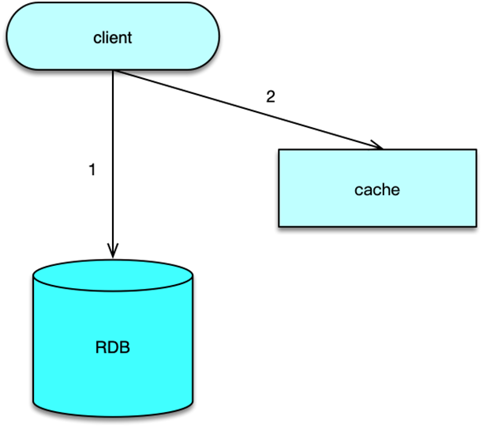
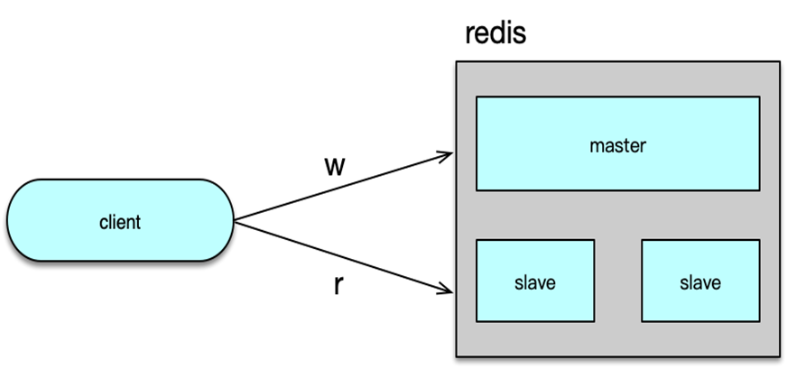
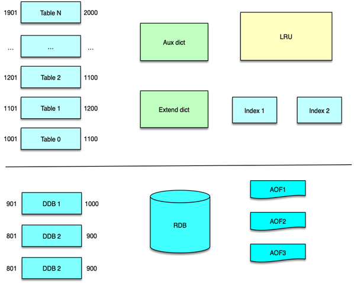
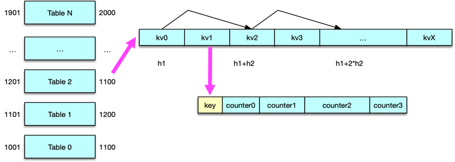

# 34 如何为海量计数场景设计缓存体系？

在上一课时我们讲解了如何为秒杀系统进行缓存设计，在本课时我们将具体讲解如何为海量计数场景设计缓存服务。

## 计数常规方案

计数服务在互联网系统中非常常见，用户的关注粉丝数、帖子数、评论数等都需要进行计数存储。计数的存储格式也很简单，key
一般是用户 uid 或者帖子 id 加上后缀，value 一般是 8 字节的 long 型整数。

最常见的计数方案是采用缓存 + DB 的存储方案。当计数变更时，先变更计数
DB，计数加 1，然后再变更计数缓存，修改计数存储的 Memcached 或
Redis。这种方案比较通用且成熟，但在高并发访问场景，支持不够友好。在互联网社交系统中，有些业务的计数变更特别频繁，比如微博
feed
的阅读数，计数的变更次数和访问次数相当，每秒十万到百万级以上的更新量，如果用
DB 存储，会给 DB 带来巨大的压力，DB
就会成为整个计数服务的瓶颈所在。即便采用聚合延迟更新 DB
的方案，由于总量特别大，同时请求均衡分散在大量不同的业务端，巨大的写压力仍然是
DB 的不可承受之重。因此这种方案只适合中小规模的计数服务使用。

在 Redis 问世并越来越成熟后，很多互联网系统会直接把计数全部存储在 Redis
中。通过 hash 分拆的方式，可以大幅提升计数服务在 Redis
集群的写性能，通过主从复制，在 master
后挂载多个从库，利用读写分离，可以大幅提升计数服务在 Redis
集群的读性能。而且 Redis
有持久化机制，不会丢数据，在很多大中型互联网场景，这都是一个比较适合的计数服务方案。

在互联网移动社交领域，由于用户基数巨大，每日发表大量状态数据，且相互之间有大量的交互动作，从而产生了海量计数和超高并发访问，如果直接用
Redis 进行存储，会带来巨大的成本和性能问题。

## 海量计数场景

以微博为例，系统内有大量的待计数对象。如从用户维度，日活跃用户 2
亿+，月活跃用户接近 5 亿。从 Feed 维度，微博历史 Feed
有数千亿条，而且每日新增数亿条的新 Feed。这些用户和 Feed
不但需要进行计数，而且需要进行多个计数。比如，用户维度，每个用户需要记录关注数、粉丝数、发表
Feed 数等。而从 Feed 维度，每条 Feed
需要记录转发数、评论数、赞、阅读等计数。

而且，在微博业务场景下，每次请求都会请求多个对象的多个计数。比如查看用户时，除了获取该用户的基本信息，还需要同时获取用户的关注数、粉丝数、发表
Feed 数。获取微博列表时，除了获取 Feed 内容，还需要同时获取 Feed
的转发数、评论数、赞数，以及阅读数。因此，微博计数服务的总访问量特别大，很容易达到百万级以上的
QPS。

因此，在海量计数高并发访问场景，如果采用缓存 + DB 的架构，首先 DB
在计数更新就会存在瓶颈，其次，单个请求一次请求数十个计数，一旦缓存
miss，穿透到 DB，DB 的读也会成为瓶颈。因为 DB 能支撑的 TPS 不过
3000\~6000 之间，远远无法满足高并发计数访问场景的需要。

采用 Redis
全量存储方案，通过分片和主从复制，读写性能不会成为主要问题，但容量成本却会带来巨大开销。

因为，一方面 Redis 作为通用型存储来存储计数，内存存储效率低。以存储一个
key 为 long 型 id、value 为 4 字节的计数为例，Redis 至少需要 65
个字节左右，不同版本略有差异。但这个计数理论只需要占用 12
个字节即可。内存有效负荷只有 ^12^⁄~65~=18.5%。如果再考虑一个 long 型 id
需要存 4 个不同类型的 4 字节计数，内存有效负荷只有 (8+16)/(65\*4)=
9.2%。

另一方面，Redis
所有数据均存在内存，单存储历史千亿级记录，单份数据拷贝需要 10T
以上，要考虑核心业务上 1 主 3 从，需要 40T 以上的内存，再考虑多 IDC
部署，轻松占用上百 T 内存。就按单机 100G
内存来算，计数服务就要占用上千台大内存服务器。存储成本太高。

## 海量计数服务架构

为了解决海量计数的存储及访问的问题，微博基于 Redis
定制开发了计数服务系统，该计数服务兼容 Redis
协议，将所有数据分别存储在内存和磁盘 2 个区域。首先，内存会预分配 N
块大小相同的 Table 空间，线上一般每个 Table 占用 1G 字节，最大分配 10
个左右的 Table 空间。首先使用 Table0，当存储填充率超过阀值，就使用
Table1，依次类推。每个 Table 中，key 是微博 id，value
是自定义的多个计数。

微博的 id 按时间递增，因此每个内存 Table 只用存储一定范围内的 id
即可。内存 Table 预先按设置分配为相同 size 大小的 key-value
槽空间。每插入一个新
key，就占用一个槽空间，当槽位填充率超过阀值，就滚动使用下一个
Table，当所有预分配的 Table
使用完毕，还可以根据配置，继续从内存分配更多新的 Table
空间。当内存占用达到阀值，就会把内存中 id 范围最小的 Table 落盘到 SSD
磁盘。落盘的 Table 文件称为 DDB。每个内存 Table 对应落盘为 1 个 DDB
文件。

计数服务会将落盘 DDB
文件的索引记录在内存，这样当查询需要从内存穿透到磁盘时，可以直接定位到磁盘文件，加快查询速度。

计数服务可以设置 Schema 策略，使一个 key 的 value
对应存储多个计数。每个计数占用空间根据 Schema 确定，可以精确到 bit。key
中的各个计数，设置了最大存储空间，所以只能支持有限范围内的计数。如果计数超过设置的阀值，则需要将这个
key 从 Table 中删除，转储到 aux dict 辅助词典中。

同时每个 Table 负责一定范围的 id，由于微博 id
随时间增长，而非逐一递增，Table
滚动是按照填充率达到阀值来进行的。当系统发生异常时，或者不同区域网络长时间断开重连后，在老数据修复期间，可能在之前的
Table 中插入较多的计数 key。如果旧 Table
插入数据量过大，超过容量限制，或者持续搜索存储位置而不得，查找次数超过阀值，则将新
key 插入到 extend dict 扩展词典中。

微博中的 feed 一般具有明显的冷热区分，并且越新的 feed
越热，访问量越大，越久远的 feed 越冷。新的热 key 存放内存 Table，老的冷
key 随所在的 Table 被置换到 DDB 文件。当查询 DDB 文件中的冷 key
时，会采用多线程异步并行查询，基本不影响业务的正常访问。同时，这些冷 key
从 DDB 中查询后，会被存放到 LRU 中，从而方便后续的再次访问。

计数服务的内存数据快照仍然采用前面讲的 RDB + 滚动 AOF 策略。RDB
记录构建时刻对应的 AOF 文件 id 及 pos 位置。全量复制时，master
会将磁盘中的 DDB 文件，以及内存数据快照对应的 RDB 和 AOF 全部传送给
slave。

在之后的所有复制就是全增量复制，slave 在断开连接，再次重连 master
时，汇报自己同步的 AOF 文件 id 及位置，master
将对应文件位置之后的内容全部发送给 slave，即可完成同步。

计数服务中的内存 Table 是一个一维开放数据，每个 key-value 按照 Schema
策略占用相同的内存。每个 key-value 内部，key 和多个计数紧凑部署。首先 8
字节放置 long 型 key，然后按Schema 设置依次存放各个计数。

key 在插入及查询时，流程如下。

首先根据所有 Table 的 id 范围，确定 key 所在的内存 Table。

然后再根据 double-hash 算法计算 hash，用 2 个 hash 函数分别计算出 2 个
hash 值，采用公示 h1+N\*h2 来定位查找。

在对计数插入或变更时，如果查询位置为空，则立即作为新值插入
key/value，否则对比 key，如果 key 相同，则进行计数增减；如果 key
不同，则将 N 加
1，然后进入到下一个位置，继续进行前面的判断。如果查询的位置一直不为空，且
key 不同，则最多查询设置的阀值次数，如果仍然没查到，则不再进行查询。将该
key 记录到 extend dict 扩展词典中。

在对计数 key 查找时，如果查询的位置为空，说明 key 不存在，立即停止。如果
key 相同，返回计数，否则 N 加
1，继续向后查询，如果查询达到阀值次数，没有遇到空，且 key 不同，再查询
aux dict 辅助字典 和 extend dict 扩展字典，如果也没找到该 key，则说明该
key 不存在，即计数为 0。

## 海量计数服务收益

微博计数服务，多个计数按 Schema 进行紧凑存储，共享同一个 key，每个计数的
size 按 bit 设计大小，没有额外的指针开销，内存占用只有 Redis 的 10%
以下。同时，由于 key 的计数 size 固定，如果计数超过阀值，则独立存储 aux
dict 辅助字典中。

同时由于一个 key
存储多个计数，同时这些计数一般都需要返回，这样一次查询即可同时获取多个计数，查询性能相比每个计数独立存储的方式提升
3\~5 倍。
