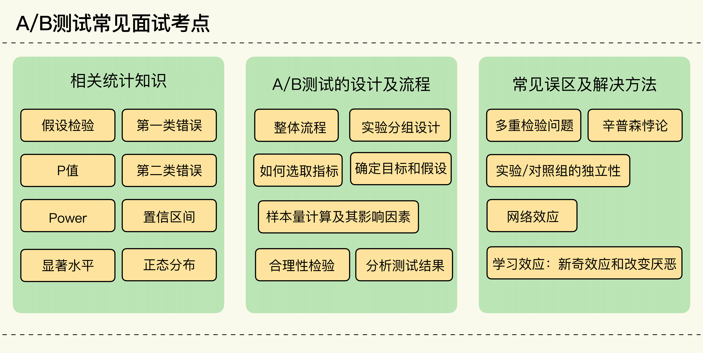

# 13 融会贯通：A_B测试面试必知必会（上）

你好，我是博伟。

在接下来的两节课呢，我们换换脑子，来聊一个相对轻松点的话题：与A/B测试相关的面试应用。

近几年随着A/B测试在互联网、电商、广告等各个行业的广泛应用，已经成为数据、产品、增长等相关职位面试的一个重要组成部分。所以我就根据自己多年做面试官的经验，帮你总结了常见的A/B测试相关面试考点，一方面我会通过典型真题来讲解面试思路，另一方面也会把我在面试中的一些沉淀与思考分享出来。

另外我还想强调的是，这两节课虽然是在讲面试题，但其实也是在以另一种方式考查你对所学知识的灵活运用。面试中考察的不仅是你对知识的掌握，更关注你在工作场景中要怎么运用。所以希望你能通过这两节面试课的学习，既能学会拆解题目，提高面试能力，同时也能把我们学过的知识融会贯通。

面试题目是无穷的，但考点是有限的。我把相关的考点总结成了一张图，方便你着重复习。接下来我们就开始正式的面试讲解吧。-

## 面试应用一

某共享出行公司改进了司机使用App的用户界面，希望能给司机更好的用户体验，在提高司机使用App频率的同时，也能提高司机的收入。那么问题就是：请你设计一个A/B测试，来验证新的司机App是否比旧的司机App体验要好。

**考点：**

-   A/B测试的流程。
-   实验组/对照组的独立性。

**解题思路：**

很多同学遇到这个面试题，首先想到的就是串一遍A/B测试的流程，于是就按照以下流程开始回答。

**确定目标和假设** ---\>
**确定指标**（说出评价指标和潜在的护栏指标）---\> **确定实验单位---**\>
**随机分组**（一般为均分） ---\>
**确定样本量**（这里注意，强调需要已知哪些统计量来确定样本量）---\>
**实施测试** ---\> **合理性检验**（要说出具体的检验都有哪些）---\>
**分析结果**（注意说明P值法和置信区间法的判断标准）

如果你只回答了设计流程这一点，可能仅仅是个及格分，因为题中还设置了至少1个隐藏的坑点，这也恰恰就能拉开你与其他面试者的距离。

首先要注意，在回答流程时一定要结合题目的具体内容展开讲解，否则就是照本宣科，会给面试官留下不能活学活用的印象。如果你不知道怎么回答比较好，可以参照我在第8节课串讲案例的思路和方法。

不过这道题最大的坑点还不在这儿，你需要再细心点儿。仔细看"共享出行"这个具体情境，如果你对第11节课中两组独立性这个知识点掌握得足够牢固，就会发现面试官在这道题中，想考查你的绝不是串讲一遍流程这么简单。

面试现场也是工作的实际场景，那你就需要具体情境具体分析，洞察出设计实验时需要保持实验组和对照组的独立性。

我们来通过一个例子深度剖析一下。

假设我们选取在上海使用该共享出行的司机，把他们随机分成实验组和对照组，每组各占50%。其中在实验组，司机使用新的司机App，对照组则使用旧的司机App。

我们先来看实验组：
如果新App的确提升了司机的用户体验，司机的使用频率提高，这意味着实验组的订单量就会增加。因为订单总量（需求）是一定，这样就会导致对照组的订单量减少。

与此相反的是，如果新App降低了司机的用户体验，司机使用App的频率降低，那么实验组的订单量就会减少，对照组的订单量则会增加。

这时你就会发现：**实验组和对照组不是独立的，而是相互影响的。**这就违背了A/B测试中实验组和对照组必须是相互独立的前提假设，从而导致实验结果不准确。

在题目中的场景下，比较好的解决方法是在不同的城市进行测试：我们找到两个相似的城市A和B（相似的目的是使两组具有可比性，比如业务在当地的发展程度、经济发展程度、人们的出行习惯等），实验组是城市A中的司机使用新App，
对照组是城市B中的司机使用旧App。这样的话两组就不会相互影响。

所以针对这道题，完整且正确的回答方式应该是：先指出两组独立性被破坏的问题，通过举例分析说明两组是相互影响的；然后提出你的解决方案；最后结合实际情境串讲流程。

其实啊，如果你是个高手，就应该看出题中还有一个隐藏的考点：学习效应。

因为题目中是测试新的用户界面，所以还可能会有老用户的学习效应：新奇效应或改变厌恶。关于这个考点，你在这里简单提及，说明识别及解决方法即可，不需要长篇大论再进行展开。因为这道题考察的核心重点依旧是两组的独立性和设计流程，但是如果你能留心到潜在的学习效应问题这个坑，这就相当于你在优秀的回答之外，还给了面试官一个惊喜，证明你有填坑的能力。

## 面试应用二

在过去的实践中，你有没有经历过这种情况：A/B测试虽然得到了显著的结果（比如P值小于5%），但最终还是决定不在业务/产品中实施测试中的变化。原因是什么呢？请举例说明。

**考点：实施A/B测试中的变化要考虑的因素**

**解题思路：**

这道题很简短，乍看上去会觉得很容易，往往这个时候你就要小心谨慎了。仔细想想，面试官想通过这道题来考查什么知识点呢？考察你的什么能力呢？

在知识点上，面试官主要考查的是：在实践中实施A/B测试中的变化时，需要考虑的因素有哪些。

这个问题其实是非常直接的，你很容易知道面试官在考察什么知识点。不过我想强调的是这类问题在面试中还有很多的变体，你需要在不同的变体中识别出本质问题。

-   核心问题：面试官会从结论出发（最终没有实施变化），问你可能会有哪些原因。
-   变体1：面试官会给你测试结果的数据，数据中的P值虽然小于5%，但是十分接近5%，比如4%。说明两组变量间的不同其实非常小，对实际业务的影响十分有限。
-   变体2：面试官会直接问你，实施A/B测试中变化的成本是什么。

无论怎么变化，归根结底都是一句话：结果是统计显著的，但是业务并不显著，因此在实践中没有实施变化。

在实践中，统计上的显著结果只是最终实施变化的原因之一，另一个方面还要考虑到实施变化的成本和收益。收益的话我们可以根据显著结果的差值来估算，但是就成本而言，我们需要考虑的因素是多方面的，就像我在第7节课中讲的，需要估算业务上的显著性。

所以在回答这类题目时，结合案例围绕着以上这些成本展开讲解，提出结果是统计显著，但是业务上不显著，所以最后才没有在实践中实施变化。

具体来说，在实践中实施变化主要有以下几种成本。

**人力成本**

指的是要实施变化的相关人员的时间成本，比如工程师需要花时间去实施具体的变化，编写相关代码。产品经理需要花时间去收集整理新的要求，组织相关会议，编写文档。如果变化会引起用户困惑的话，那么客服人员还要花时间去给用户答疑解惑。

**机会成本**

在实践中，时间和资源在业务/产品的不断迭代当中是永远不够用的，请你想象一个场景：在新版本上线前，如果同时有A和B两个变化都具有统计显著性（P值均小于5%），但我们的时间和资源有限，在上线前只能实施一个变化，那这个时候肯定会选择对业务影响较大的变化。

那你就会问了，当这两个的P值都小于5%时，我该怎么比较哪个变化对业务产生的影响更大呢？

具体来说有两种方法。

第一种方法就是估算变化带来的业务影响。这种方法适用于不同变化有着不同的评价指标，或者不同的受众范围。

比如变化A使转化率提升了2%，每年可以多带来10万的新用户。变化B使留存率提高了0.5%，每年可以多留住5万的现有用户。此时我们就要衡量增加10万新用户和留住5万现有用户的价值哪个更大（比如可以通过数据分析或者建模的方式确定新用户和现有用户的平均价值）。

当然这也和所处阶段的业务目标有很大关系，你需要看当时的业务重点是拉新还是留存。一旦我们量化估算出变化带来的业务影响，就可以决定该优先实施哪个变化了。

第二种方法是计算[效应值](https://www.simplypsychology.org/effect-size.html)（Effect
Size）。这种方法适用于变化相似且评价指标相同时。

比如改进推荐算法的实验，大都以点击率作为评价指标。那么现在有新算法A和新算法B，和老算法相比都有提升，那么这时就要计算每个实验的效应值：

-
效应值在统计中是用来表示指标变化的幅度的，效应值越大，就说明两组指标越不同。

如果我们计算得到的新算法A的效应值比新算法B的大，就说明A的改进效果幅度更大，影响也更大，那就可以决定优先实施A变化了。

计算效应值其实也是估算变化带来的影响，不过因为这些变化都有相同的评价指标，所以我们只需要算出效应值来进行比较即可。

**代码成本**

实施变化一般需要代码的改动，这种改动会潜在地增加代码出错的概率，同时随着代码库越来越复杂，也会增加未来代码改动的成本。

## 面试应用三

我们对公司网站进行了改版，想要以此来提升用户参与度。通过A/B测试发现，新版本的用户参与度确实显著提升了，所以我们随后就对所有用户显示了新版网站。但是过了一段时间后，用户参与度又回到了之前的水平。假设，这个A/B测试本身没有技术上或者统计计算上的问题。你觉得导致这种情况的原因会是什么呢？又该怎么解决呢？

**考点：学习效应**

**解题思路：**

这道题在知识点上的难度并不高，主要考察的是学习效应的问题。不过你要是只回答了这一个原因，这其实是大多数面试者都容易想到的，也仅仅只是一个合格的分数。

我先把自己更推荐的回答方式写出来，然后再带你仔细分析这道面试题。

比较推荐的回答方式是：先列举导致这种情况可能的原因有哪些，再结合题目的具体场景进行一一排除，最后得出自己的结论，给出解决方法。

为什么要这么回答呢？主要是因为相比较仅仅回答一个原因，或者直接给出解决方法，这种回答方式更能体现你对问题的全面理解。我在之前的课程中也强调过，知道为什么会出现这个问题，并发现问题，有时候甚至比解决问题还要重要。所以面试官在这里重点想要考察的，就是你对出现问题的原因的探究。

变化实施后的实际效果和A/B测试的结果不一致，其中的原因有很多种，最常见的原因主要是两个：

-   实施A/B测试中出现的技术Bug。
-   在计算测试结果时出现错误（比如还没到足够的样本量就去计算结果）。

接下来我们进行一一排除。

首先，题目中明确说了，技术上和统计计算上都没有问题，那接下来就要排除A/B测试常见的误区。

其次，由于题目中的场景并不是社交网络或者像共享经济的双边市场，实验组和对照组不会相互干扰，所以也不存在实验/对照组独立性被破坏的情况。

接着，从测试本身的设置和对结果的描述来看，没有细分分析或者多个实验组，又不会有多重假设问题或者辛普森悖论。

最后，对于网站不同版本这种问题，其实最常见的问题是学习效应，就像我刚才分析的那样，把其他常见的原因都排除了，那么其实考察的知识点就是学习效应。考察学习效应的面试题形式有很多种，有的会直接问你学习效应，有的就会像是本题中，给你一个具体的场景，让你判断。

根据题目描述的情况，应该是学习效应中的新奇效应：用户刚开始对于新版本很好奇，所以参与度会上升。但随着时间的推移，慢慢又会回归到正常平均水平。

至于如何识别和解决学习效应，如果你还不能顺利回答出来，那就得再回去复习第10节课的内容了。

所以你看，在面试中，面试官考察你的不仅是知识点，更重要的是你对问题的发散理解，以及思考问题的方式。

## **小结**

在这节课里，我主要讲了3道面试题，通过我的详细分析你也能够发现，拆解题目是一项很重要的能力。

很多人在面试前都会去刷题，刷题固然重要，但是在面试这种高压场景下，可能回出现大脑短暂空白的情况。其实面试题目也是有套路的，就像搏击中的双方，你需要猜测对方可能会出什么招式，如果你能在对方出招前反应出他的下一步动作，哪怕是一秒钟，就有机会制胜对方。所以相对于海量刷题，学会拆解题目就显得更重要了。

相信你通过今天的学习，对于A/B测试相关面试的形式和考点有了初步的了解，你一定还意犹未尽，没关系，我们下节课接着来剖析典型面试题及考点。

## 思考题

你有遇到过什么有意思的A/B测试的面试题吗？或者是有什么好的面试经验吗？欢迎分享出来，我们一起探讨。

欢迎分享出来，我们一起交流、探讨。也欢迎你把本节课推荐给你的朋友，一起进步、成长。
