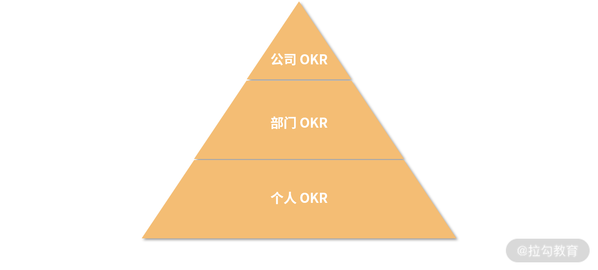
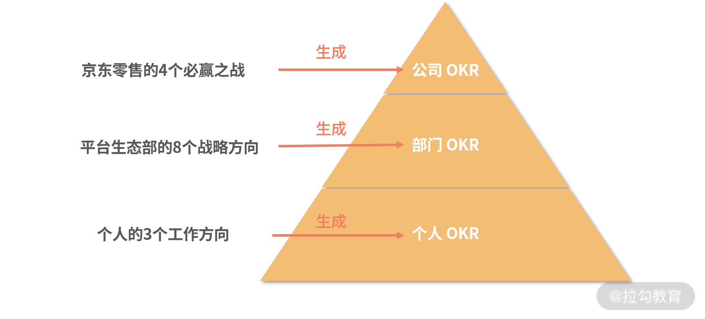
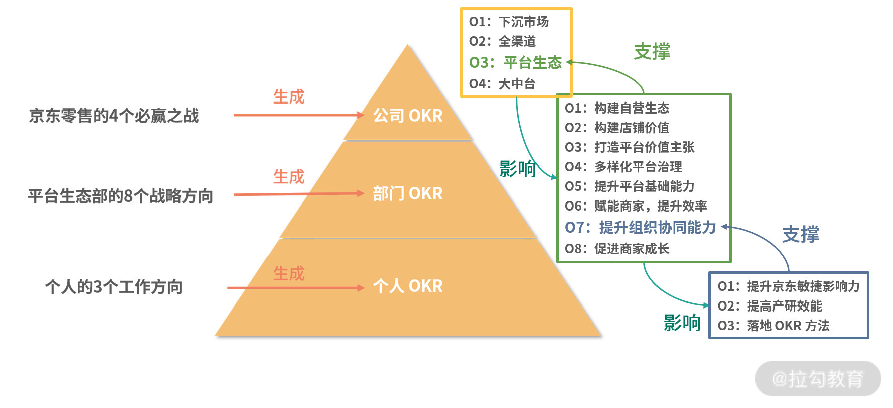

# 04 OKR 生成：各层级的 OKR 要遵循什么规律？

你好，我是留留老师。

上一课时，我介绍了 OKR
的应用可以帮助我们更好地管理和制定组织战略目标，通过 OKR
的结构化拆解去解决战略所要的增长问题。那么，当一个组织战略确定后，我们是如何通过层层对齐和拆解，帮助组织战略落地的呢？这个时候我们就要掌握
OKR 在组织中各层级的生成规律。

掌握组织中不同层级 OKR
的生成和对齐规律，有利于我们制定支撑组织战略和对于组织有价值的
OKR，否则组织从上到下就无法形成合力，战略落地也就存在挑战。接下来，我通过亲历案例，帮你掌握这些规律。

### 公司、部门和个人 OKR 之间的关联

在 2019 年，我帮助京东平台生态部主持了一次战略会，在现场，部门 VP
以及各个二级部门负责人进行了非常富有成效的探讨，最终产出了部门的多个战略方向，如下：

> O1：构建自营生态 O2：构建店铺价值 O3：打造平台价值主张
> O4：多样化平台治理 O5：提升平台基础能力 O6：赋能商家，提升效率
> O7：提升组织协同能力 O8：促进商家成长

我们通过战略会的共识，产出了生态部 8 个战略方向，也就生成了部门 8
个维度的 O。此外，战略会上，部门 VP
也谈及到了京东零售的四大必赢之战，如下：

> O1：下沉市场 O2：全渠道 O3：平台生态 O4：大中台

京东零售的四大必赢之战也就是京东零售的四个战略方向，对应着，就是生成了公司层面
4 个战略维度的 O。其中的平台生态方向就是指我们部门的业务，VP
还强调，作为承接集团战略的平台生态部，在京东未来的发展中会扮演更加重要的角色。

最后，我作为京东平台生态部的一员，我希望帮助部门做好敏捷和 OKR
转型来提高组织的效能。所以，再来看看我个人在 2019 年的 3 个工作方向：

> O1：提升京东敏捷影响力 O2：提高产研效能 O3：落地 OKR 方法

至此，我给你介绍了 3 组 OKR
的案例。案例中不仅有公司层级的战略方向，也有部门维度的战略目标，还涉及了个人的工作方向。为了更好地诠释他们之间的关系，我画了一张示意图：

一个公司由于组织架构和层级的存在，至少有三个层级的
OKR。如果用以上的案例来对应，那么公司级 OKR 就对应着京东零售的 4
个必赢之战，部门级 OKR 对应着平台生态部门的 8 个战略方向，个人 OKR
则对应我自己的 3 个工作方向，具体可以用下图来表示。

而且，这三个层级的 OKR
互相影响，互相支撑。我相信眼尖的小伙伴已经发现，京东零售 4
个必赢之战包含了平台生态的业务方向，也就是说公司级制定的战略方向影响着部门级的战略制定，而作为平台生态部的
8 个方向之一的"提升组织协同能力"则与我制定的 3
个工作方向息息相关。平台生态部的其他方向则由其他负责人认领并具体 OKR
化，至于每个 O 中包含的多个 KR 内容，则需要持续沟通达成共识即可。

上面这张图系统化呈现了各个层级的 OKR
制定和上下对齐的把控，可以让组织刚性的战略目标落地不偏移，这也是我们要掌握的公司、部门和个人
OKR 的生成和关联规律。

既然个人和部门的目标中都要承载公司的战略，可为什么我在京东又看到一些部门的工作目标和上述的公司四大必赢之战好像一点关联都没有，这又是怎么回事呢？

**为什么有的部门目标和战略没有对齐？**

除了主持过部门战略会，在一次和 HR 合作的制定 OKR
工作坊上，我带领平台生态部 HR 侧的小伙伴产出了 HR 部门的工作方向：

> O1：引进高职级人才 O2：提升员工专业力和通用力 O3：建设和传播文化
> O4：沉淀组织机制

当时做完工作坊，我很诧异，HR
的工作方向尽然和上述公司级以及部门级战略方向并不一致，这是为什么呢？

我们都知道，一个商业组织最重要的是要有核心的业务能力定位，并通过该核心业务能力来确定战略，选择业务的增长方向。然而，组织中一个业务目标的实现，最终靠的还是人，所以组织中人员能力的持续提升以及影响人行为的文化的持续建设对于组织的长期发展也很重要，在当下国内的组织中，把这部分职责划给了
HR 部门，在京东属于 CHO
体系（组织中负责人力资源建设的部门，职责包括绩效、薪酬、员工福利、培训等诸多方面）。

再换句话说，我在上面提到的京东零售的战略目标是公司级的业务增长
OKR，一般由公司 CEO来关注并确立。而 HR 侧的小伙伴的 OKR 是非业务型的增长
OKR，属于 CHO 体系的战略目标，一般由公司 CHO
来关注并确立。只是从优先级上来说，一个公司的业务型 OKR 肯定比非业务型
OKR 重要，因为只有业务型 OKR
的成功执行，公司才会有营收，有了营收才有支付组织能力建设的成本，但这两者都缺一不可。

我们一起回想下，在上一课时我列举的百度李彦宏的 OKR
案例中，百度的三大战略方向，不仅包括移动生态和 AI 商业模式 2 个业务类
OKR，也包括组织能力提升的非业务类 OKR，同样也是这个道理。

所以，OKR 生成的另外一个规律，就是组织中 OKR
的类型不仅包括了业务型，也包括了非业务型。但无论是哪种类型
OKR，最终落地都要靠人去执行。那么，个人 OKR 的生成包括哪些方面呢？

**个人 OKR 的生成规律**

个人 OKR
的制定，可以有上下对齐、自驱以及外部支撑三种来源。为了帮你更好地理解这个生成规律，我依旧列举个人的案例来进行说明。

  **我的上级 OKR 示例**      
  -------------------------- ------------------------------
  O1：产研效能提升           KR1：敏捷成熟度达到85分
                             KR2：敏捷团队OKR覆盖度80%
                             KR3：需求平均交付时长为32天
                             KR4：重点接口自动化覆盖达70%
  O2：业务组件化建设         
  O3：平台生态核心项目支持   
  O4：商品平台能力提升       

如上表，我的上级 OKR 包含 4 个 O，我把 O1 进行了具体描述，分为了 4 个
KR。接下来，来看一下我的 OKR：

  **我的OKR示例**                                                                           
  ----------------------------------------------------------------------------------------- ----------------------------------------------------------------------------------------------------------------------
  O1：通过敏捷能力建设，提高产研运团队的产品需求交付效率                                    KR1：通过 Scrum 方法、Kanban 方法、敏捷需求实践3个维度的敏捷能力建设，每个季度保证 24 个敏捷团队的敏捷能力达 85 分
                                                                                            KR2：对每个季度的敏捷能力评估得分较低的团队进行辅导，每周持续跟进2个团队的改进措施并以邮件的形式进行改进的跟踪和落地
  O2：OKR工作法落地和执行，保证业务目标高质量增长                                           KR1：通过季度初 OKR 制定-季度中 OKR 评审-季度末 OKR 闭环评价的流程落地，帮助整个部门 OKR 的应用覆盖达到 80%
                                                                                            KR2：在本季度通过 5 场培训和 20 场团队级 OKR 辅导，培养 10 名团队级后续能带领团队独立运转 OKR 工作法的 OKR 教练
  O3：通过多元化的方式，提升部门和京东的敏捷影响力，并赋能其他部门提升敏捷和OKR的应用能力   KR1：对京东外，通过图文、视频等多元化的方式，每月产出一个敏捷类 /OKR 类文章，每个文章在微信域平均阅读 UV300 以上
                                                                                            KR2：对京东内，以线上/线下的方式，给京东兄弟部门分享培训敏捷/OKR 方法，每月至少一次

我的 OKR 则包含了 3 个 O，每个 O 继续拆解成了 2 个 KR。从上级和我的 OKR
中，我们可以得出以下个人 OKR 的生成结论：

1、**个人的 OKR 部分来源于上级的 OKR 拆解**，在这个案例中，上级 O1 中
KR1 的敏捷成熟度和 KR2 的 OKR 覆盖度对应着我的 O1 和
O2，我从上往下对齐形成的个人 O1 和 O2 继续拆解成能支撑这两个目标完成的
KR。

2、**个人的 OKR 部分来源于个体职责的自驱**，就像我 O3
中提到的提升敏捷影响力，上级的 O是没有该方向的，所以个人 O3
中的敏捷影响力的塑造是基于本人能力以及组织的发展，完完全全是自驱希望给组织带来的绩效价值。

3、**个人的 OKR
部分来源于对外部的支持**，在京东内部有很多部门会找我去培训敏捷和 OKR
方法，对应着我在 O3 中提及的赋能其他部门能力提升方向，这一类的 OKR
就属于外部支撑型。

这就是生成个人 OKR 的规律，当工作中个人去制定 OKR
时，**需要注意从上往下的对齐拆解以及横向的支持**，并能基于自己的能力自驱给组织创造额外的绩效价值，通过个人自驱型
OKR 的设立，就能把 OKR 鼓励挑战和自驱的理念落地。

### 总结

今天我和你分享了我亲身经历的 OKR 产生过程，揭示了组织中各层级 OKR
的生成规律。到此，相信你也已经知道个人的 OKR
和领导、公司发展之间的关联。

概括起来，就是以下这 3 个重要结论：

-   组织中各个层级的 OKR
    互相影响，互相支撑。如果各层级各自做各自的，就无法通过 OKR
    帮助组织战略目标更好地落地。
-   战略目标分业务型和非业务型，OKR 的生成也对应着有业务型 OKR
    和非业务型 OKR。组织中，不仅要关注业务型 OKR
    的制定和落地，也要关注组织发展和能力建设的 OKR。
-   个人 OKR 由三个部分生成，分别是：与上级 OKR
    对齐拆解、个体岗位职责自驱、外部支持相关。

那么小伙伴，在你的组织中，是通过什么方法来让战略目标从上往下对齐落地的呢？又是采取什么方式去制定个人目标呢？你的组织在制定战略方向时关心组织能力建设吗？欢迎在留言区分享你的经验，也欢迎你留言和我交流，我们一起来探讨下通过
OKR 生成的规律能否解决你的问题。

在掌握了 OKR 生成的规律后，你是不是已经迫不及待地想要写一写 OKR
了？别急，写 OKR 也有很多要点。学完下一讲，我相信你在写 OKR
时会茅塞顿开，下一课时我将介绍"怎么样才能写好 OKR"。
