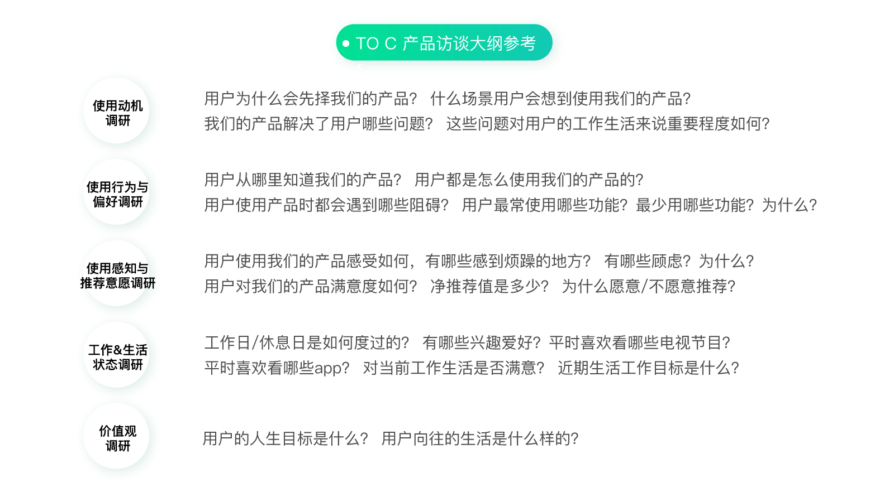
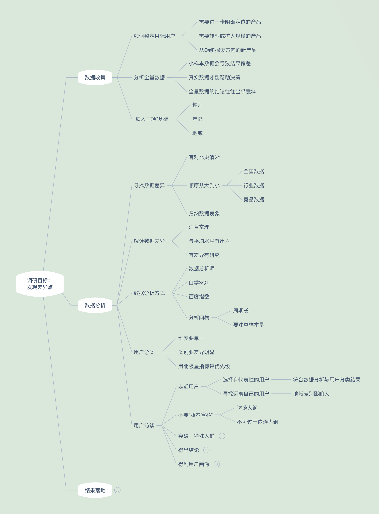
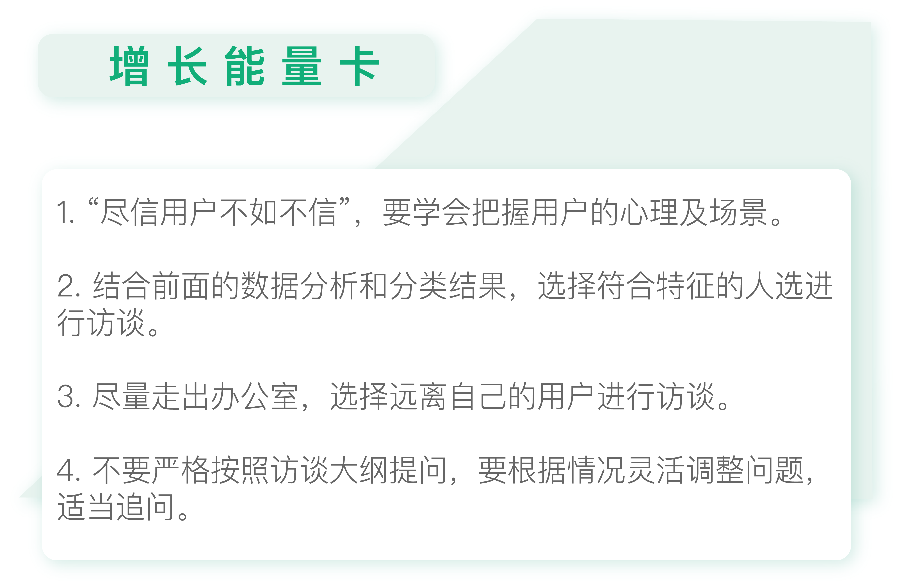

# 12 用户访谈：像侦探一样寻找破案线索（上）

你好，我是刘津。

今天我会和你探讨如何通过用户访谈进一步挖掘用户的差异点，达成调研目标。

在上一讲中我讲了如何做用户分类。分好类别后，我们可以通过现有的数据生成简单的用户画像。当然，仅有这些信息肯定是不够的，为了更深入地挖掘差异点，还需要结合**用户访谈**。

## 传统访谈常见的问题

我参与过很多次的用户访谈。可以说，这是一项比较耗时的工作，每个用户都需要访谈1\~2个小时左右。如果是大型的用户调研，可能需要正式访谈十几名用户，最后还要汇总报告。

从表面上看，整个过程严谨、专业、有条不紊。但实际上，这里可能会产生很多问题。

首先，愿意来到你的办公室接受访谈的人群，本身可能就比较特别，并不能代表平均水平。这样研究的结果会存在偏差。

其次，很多调研人员并不了解业务，这可能导致研究出的结果很难落地。

第三，来自同一个城市的用户，难免都比较相似，难以帮助你洞察到有价值的差异点。

第四，用户说的未必代表自己的真实想法。

有个经典的故事，说的是某公司为一款即将面市的游戏机做调研，请了很多用户过来。其中一个问题是问用户希望这款游戏机是什么颜色的，很多人都选择了黄色。访谈结束后公司拿出了不同颜色的游戏机让用户挑选以感谢他们配合调查，结果发现绝大部分用户都拿走了黑色的游戏机。

当然，这不能怪用户"言行不一致"，而是用户在看到真实的颜色之后，可能发现和自己想象的并不一样。

所以，访谈其实是门学问，要**把握好用户的心理和场景**，不能用户说什么就是什么，这样反而是在给自己"挖坑"。

在接下来的两讲中，我会给你介绍访谈时的一些注意事项，帮助你用最短的时间最高效地获取到洞察，而不会像传统方式一样费力不讨好，甚至得到错误的方向，那样就太得不偿失了。

## 选择有代表性的用户

首先是要选择有代表性的用户，否则就会南辕北辙，离目标越来越远了。所谓的"有代表性"的用户，就是**结合前面的数据分析和分类结果，选择符合特征的人选**。

比如宜人贷把用户分为工薪族及小微企业主，结合之前对"年龄""性别""地域"的分析结果，选择若干二线城市、25\~35岁之间、数量接近的工薪族男性及小微企业主进行访谈。

访谈人数没有固定的要求，可以是各5个，也可以是各10个，最重要的是在这个过程中我们是否可以洞察到有价值的信息。

## 寻找远离自己的用户

在前面的文章里，我提到只要看三项数据"年龄""性别""地域"就可以挖掘到很多信息。

尤其是"地域"：国内外的差距、北方和南方的差距、甚至同一个省的不同城市，都有巨大的差异。这里面的学问真是太多了，访谈的时候很容易挖出东西来。

先拿国内外的差异来说吧。

分众传媒的电梯广告，在中国的传媒领域是个创举，但这个点子在美国就行不通。因为美国地广人稀，楼也不会建的很高，安装成本又高......

国外很多不错的产品来了中国频繁遭遇"滑铁卢"，而国内却不断有原创的产品冒出来领先全球，比如共享单车、手机支付等等，这无疑是和国内特殊的国情有关。

再拿国内的差异来举例。

我有个朋友在银行工作，她参加了两年微众组织的全国银行业调研。参与实地调研的时候，她发现，国内不同地域的用户特点相差非常大。

比如深圳和扬州，两地人的收入不同、家庭结构不同、房价不同、购房资金来源不同、贷款压力不同、视野不同......太多太多了。

扬州房价2万一平米，基本都是本地人，结婚一般都是家长全款买房，所以很多年轻人都是挣多少花多少。深圳房价8万一平米，大部分都是外地人，所以千方百计地理财。

除了地域外，年龄也是如此。它后面隐藏着很多，比如你的家庭结构、人生节点、重要开支等等信息。

当然这只是从金融的角度看。如果从不同业务来看，都有不同的信息隐藏在"性别""年龄""地域"这三个主要因素后面。

我这个朋友之前还做过旅游产品，当时她就发现：扬州年轻人有钱想消费了，就特别喜欢去南京，他们觉得去省会就很开心；但是深圳年轻人就喜欢去香港或者出国。所以，地域信息中还隐藏着旅行偏好。

因此，为了能更了解我们的用户，一定要尽量走出习惯的办公环境，多走到用户身边，尤其是和我们距离很远的用户。这样我们更容易发现原先不知道的信息，也更有可能获得洞察。

在宜人贷，我们当初选择去哪里访谈用户时，有很多二线城市可供选择。但我们并没有选择石家庄这样临近的城市，而是选择了更远的武汉。

一是因为我们武汉的用户占比高于占全国人口的比例，也就是倾向度更高；二是因为武汉离我们远，我们对当地情况不了解，这就意味着容易有更多收获和发现。最后事实也证明，那一次的调研效果非常好，有了重大的发现，在下一讲我会具体提到。

讲到这，你可能会说："我没有机会去外地调研啊。"可你真的一点办法都没有吗？不是的。

一方面，你需要主动找领导争取机会；另一方面，也可以退而求其次寻找你身边符合条件的人。你可以先确定想要访谈的用户特征，比如男性、25-30岁、在武汉打工。然后可以寻找身边符合条件或条件接近的朋友、亲戚，或是朋友的朋友。

好好利用你的"朋友圈"进行调研，说不定你会洞察到非常有价值的信息。

## 不要"照本宣科"

选定好用户，接下来就可以正式进行访谈了。

一般来说访谈有个大致的范围，可以参考下图。

我们一般会以此为蓝本撰写访谈大纲，并逐一询问用户。除了用户的基本信息外，里面包含有使用动机、使用行为与偏好、使用感知与推荐意愿、工作及生活状态、价值观调研等等。

**有大纲本来是件好事，但是千万不要过于依赖大纲。**

这些内容仅作为参考，重点是挖掘它背后的东西。所以一定要随机应变、保持警醒，一旦发现什么"不对劲"的地方就立刻深挖下去。

我们之前所有洞察到的关键点，几乎都不来自于这些常规问题，而是在"临场发挥"的新问题中得到的。

我记得早年在网易工作时，我们有个专门做用户研究的同学邀请了产品经理旁听他的访谈。产品经理事后很不满意，说这个用研太不懂业务了。明明很多问题都可以进一步深挖的，用研却点到即止，只是机械地完成大纲里的提问。

所以我经常觉得，做调研不需要多专业，而是要有一颗好奇心，其实它和破案没有什么两样。

## 用户调研知识地图

根据今天的专栏内容，用户调研知识地图中补充了"分析"这部分的新支点。重点在于如何做好用户访谈。

## 思考题

试着按照我说的方式列出筛选条件及分好类别的用户名单，并准备访谈大纲。访谈时注意随机应变，看看会不会有什么意外的发现？

欢迎把你的思考和疑问通过留言分享出来，与我和其他同学一起讨论。

如果你觉得有所收获，也欢迎把文章分享给你的朋友。
