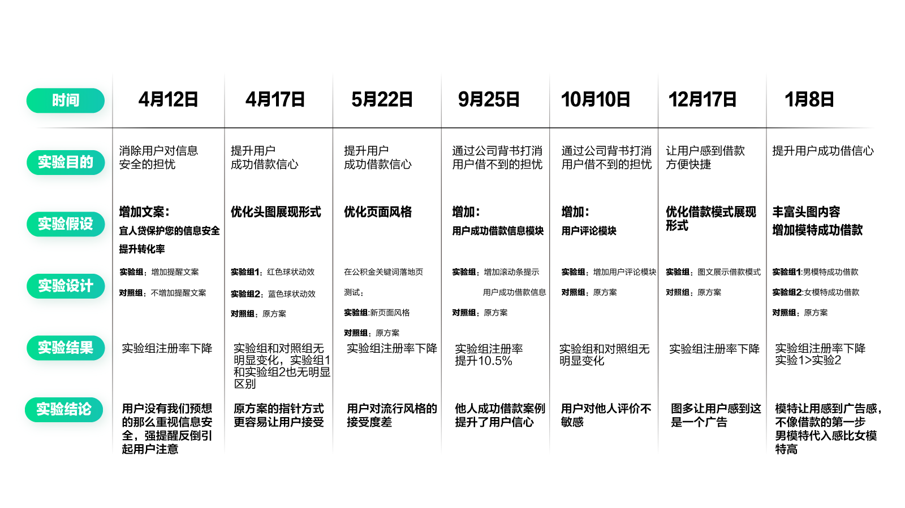
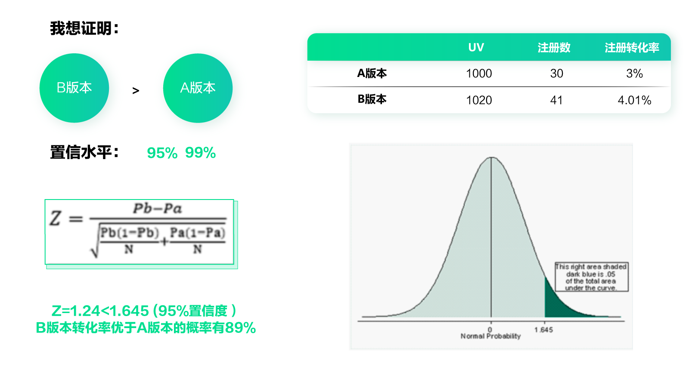
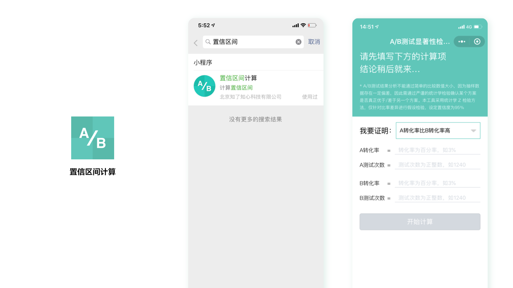
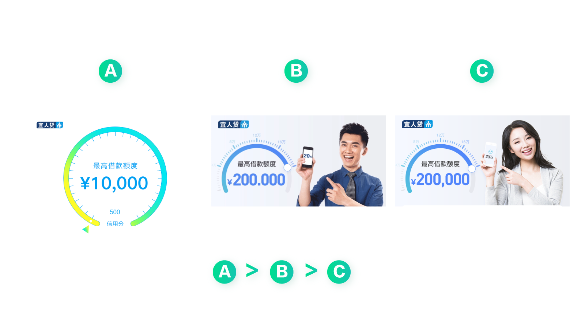
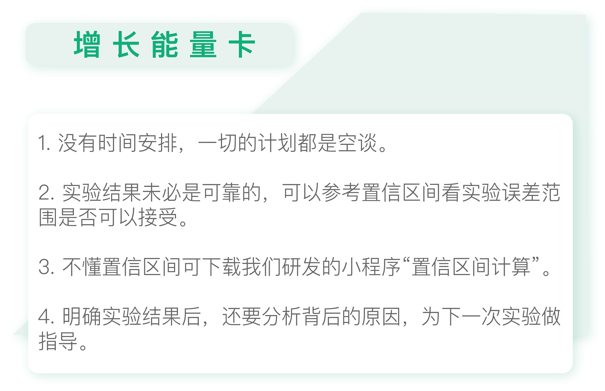

# 36 手把手教你设计一次成功的实验（下）

你好，我是刘津。

今天我们接上一讲内容，继续学习如何做一次成功的实验。

以营销落地页优化为例，上一讲我们已经确定了待测试的事项，并排列好优先级，现在我们就需要制定具体的时间计划了。

## 可视化时间安排

**可视化时间安排，是为了让你可以更直观地接收时间计划。**没有时间计划，一切的安排都是空谈。最好能按照下表，制定一个详尽的实验计划表。里面包含了具体时间、实验目的、实验假设、设计内容、实验结果及实验结论。

当然，你需要让所有相关成员都能看到这个表，对近期的实验计划了然于心。如果能把它贴在白板上，或是大家都能看到的最显眼的位置就更好了。这样可以提醒大家按计划完成工作，并及时了解实验进度及结果。

## 量化结果并复盘

每一次实验的结果，我们都需要把它记录下来并进行分析。不过，你**表面上看到的实验结果，可未必是可靠的。**

### 别再被AB测试结果误导

举个例子，当你抛一次硬币的时候，它可能是正面朝上；你抛两次或者三次，可能它还是正面朝上。但是你能说正面朝上的概率是100%吗？肯定不能。当你抛到一定次数时，你会发现正面朝上的概率基本稳定在50%左右。所以，**做实验必须保持一定的量级，否则结果不具有代表性。**

另外，**做实验需要考虑时间周期。**比如一个大型的首页改版，一般要看一个月以上的数据，因为一开始用户会感觉不习惯，经过一段时间才能养成新的习惯。所以不能看几天数据就盲目判断结果。

即使一个小型的实验，也需要看一段时间的数据，待数据基本保持稳定了再下论断。

我们再来看下面这样一个测试数据：A版本UV1000，注册数30，注册转化率3%；B版本UV1020，注册数41，注册转化率4.01%。先不考虑时间的问题，你能判断B版本比A版本效果更好吗？

通过前面的分析，我们知道无法确定B版本比A版本好，因为不知道样本量是否足够。那么到底该如何判断实验结果呢？这就要引入置信区间的概念了。

### 置信区间：评估A/B测试结果的利器

置信区间是一个统计学名词，它以区间形式对产生这个样本的总体的参数分布中的某一个未知参数值给出估计。相对于点估计（用一个样本统计量来估计参数值）而言，置信区间还包含了估计的精确度信息。

这个概念可能有些难懂，不过用在A/B测试里，你可以简单地理解成：置信区间是用来表示实验的误差范围的。

要知道，早期科学实验中科学家们是不承认实验有误差的。因为他们认为所有的测量都必须是精确的，只要出现了误差，那一定是实验出现了错误。不过现在我们都知道了，其实误差是不可避免的。即使实验条件再精确，也是无法完全避免随机干扰的影响。所以，做科学实验时往往需要实验能够复现，而且要测量多次，再用取平均值之类的手段才能得出最终的结果。

为了排除偶然因素，进行多次测试是有效的办法。就像前面说的，只要你扔硬币的次数足够得多，正面朝上的概率总是能接近50%的，但却不会绝对等于50%。

所以，在科学实验中，总是会在结果上加一个误差范围。

给你举个通俗一点的例子吧，假设有个天才儿童小明，经过测量，我们得知小明的智商是140，测量误差是±10。也就是说，小明智商数值的区间是\[140-10，140+10\]。给出这样一个智商范围，你能知道他的确切智商吗？很明显，你无法确切地知道。虽然我们确定小明的真实智商值只有一个，但这个数值可以是这个误差范围内的任意数字。

这里的误差范围，或者说误差区间，在统计概率中就叫做置信区间。

### 置信区间的计算方式

做过抽样调查的人都知道，由于样本量不足，实验结果可能产生很大的偏差。于是，很多人会产生这样的问题：在抽样调查中，样本能在多大程度上代表总体？有没有公式可以拿来表示？

其实这个问题本质上就是想知道数据统计的误差范围是多少，也就是置信区间。为了了解置信区间的计算方法，我在网上查阅了很多内容，这里面包含了点估计、区间估计；中心极限定理与大数定理；标准差与标准误差、置信区间公式等等。如果你没有专业的数理统计知识，理解起来还是比较费劲的。

我原来也整理了这些数学原理的内容，但是后来还是删掉了。因为我在给自己的朋友们讲解测试方法的时候发现，对于大部分人来说，他们并不需要知道背后复杂的数学原理，只需要有人快速告诉他们这个实验结果靠谱不靠谱就够了。

判断实验结果是不是靠谱，我们就需要看置信水平了。简单来说，如果置信水平为95％，就意味着当我们抽样100次的时候，可以得到100个区间，而这其中大约95个置信区间是符合我们设定的条件的（95%是统计学中常用的置信水平，如果置信水平过低容易得出错误结论）。

回到刚才那个例子，你只需要知道常用的置信水平是95%（也可以定为99%）。也就是说，如果我们能证明B版本比A版本好的概率在95%以上，就可以认为B版本更好了。

通过上面这张图里的数据例子，我们得到B版本转化率优于A版本的概率有89%。如果置信水平定为95%的话，那么不能证明B版本效果更好。

我们再来看另一个例子：A版本UV2000，注册数60，注册转化率3%；B版本UV2020，注册数82，注册转化率4.05%。

最后计算出的结果是：B版本转化率优于A版本的概率有95%以上。因此在95%置信度的限制下，我们可以得出"B版本比A版本效果更好"的结论。

具体的计算方式其实并不难，只需要把关键数值代入到公式里就可以了，但这依然有些麻烦。于是我们研发了一个免费的置信区间小程序，新手不需要学习专业的统计学知识，不需要套公式，也能快速评估实验结果。

### 不懂置信区间，独家小程序帮你忙

在微信小程序里，搜索"置信区间计算"，就可以看到这个小程序了。

这里，我们只要把A、B方案的转化率和测试次数分别输入进去，就可以立刻得到结果了。是不是很方便呢？

当然了，希望大家**在实验中不要过于依赖置信区间的概念**，毕竟增长是一件灵活、四两拨千斤的事情，而且我们也一直在强调"去专业化"。专业虽然是必要的，但是太执着于"专业"就没必要了。更重要的是洞察和判断，你千万不要被"专业"绑架。

### 分析实验结果，准备下一次实验

即便有了明确的实验结果，也不要盲目的做论断，还**要分析数据背后的原因，知其然更知其所以然**，这个实验才有意义。

比如下图这个实验，A版本是原始版本，B和C是测试版本。AB测试的结果是A版本数据好于B版本数据，B版本数据好于C版本数据。

那我们就需要分析了，为什么原始版本最好。根据以前的调研结果，我们很容易理解用户喜欢简单易懂的图形，不喜欢太多视觉元素干扰。并且凭借常识我们也可以判断，加了人物形象后页面有点营销的味道，而用户想要的是稳定、可靠、值得信赖的感觉。

但是为什么男性形象比女性形象更好呢？这就有点让人摸不着头脑了。毕竟我们大部分用户都是男性，男性不是应该喜欢看美女才对吗？经过反复讨论，我们认为这和一个心理学现象"代入感"有关。

用户更喜欢看到和自己类似的，或者自己想成为的人。比如B版本，会让人感觉到，自己也能像那个男性一样成功借到钱，非常开心的样子。但是他看到C版本，就不会有这种感觉，会觉得这和自己没有关系。

所以从这个实验中，我们不仅可以知道哪个版本效果更好，还可以得出两条重要的结论：

-   用户更喜欢简洁的视觉元素，画面应该重点强调专业、信赖感。
-   用户喜欢和他相关的形象，产生场景代入感。

有了这样的结论，就可以指导我们在此基础上准备下一次的实验，而不会像没头苍蝇一样乱打乱撞了。

## 思考题

今天的思考题是，继续上次的实验计划，加入可视化的时间安排，以及对实验结果的预期和分析。

欢迎把你的思考和疑问通过留言分享出来，与我和其他同学一起讨论。如果你觉得有所收获，也欢迎把文章分享给你的朋友。
