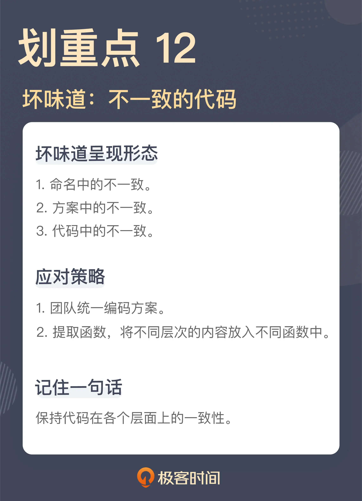

# 12 不一致的代码：为什么你的代码总被吐槽难懂？

　　你好，我是郑晔。

　　上一讲，我们讲了从依赖关系引申出来的坏味道，从代码本身看，这些坏味道并不如之前讲的那些，有非常明显的标识，一眼就能看出问题，但它们都属于问题高发的地带，一不小心就陷入其中，却不知所以。对于这类的问题，我们需要额外打起精神来发现问题。

　　今天，我们再来看一类需要你打起精神的坏味道，它们的出发点也是来自同一个根源：一致性。

　　大多数程序员都是在一个团队中工作，对于一个团队而言，一致性是非常重要的一件事。因为不一致会造成认知上的负担，在一个系统中，做类似的事情，却有不同的做法，或者起到类似作用的事物，却有不同的名字，这会让人产生困惑。所以，即便是不甚理想的标准，也比百花齐放要好。

　　大部分程序员对于一致性本身的重要性是有认知的。但通常来说，大家理解的一致性都表现在比较大的方面，比如，数据库访问是叫
DAO 还是叫 Mapper，抑或是
Repository，在一个团队内，这是有统一标准的，但编码的层面上，要求往往就不是那么细致了。所以，我们才会看到在代码细节上呈现出了各种不一致。我们还是从一段具体的代码来分析问题。

## 命名中的不一致

　　有一次，我在代码评审中看到了这样一段代码：

``` java
　　enum DistributionChannel {
　　  WEBSITE,
　　  KINDLE_ONLY,
　　  ALL
　　}
```

　　这段代码使用标记作品的分发渠道，从这段代码的内容上，我们可以看到，目前的分发渠道包括网站（WEBSITE）、只在
Kindle（KINDLE_ONLY），还是全渠道（ALL）。

　　面对这段代码，我有些疑惑，于是我提了一个问题：

　　我：这里的 WEBSITE 和 KINDLE_ONLY 分别表示的是什么？

　　同事：WEBSITE 表示作品只会在我们自己的网站发布，KINDLE_ONLY
表示这部作品只会在 Kindle 的电子书商店里上架。

　　我：二者是不是都表示只在单独一个渠道发布？

　　同事：是啊！

　　我：既然二者都有只在一个平台上架发布的含义，为什么不都叫 XXX 或者
XXX_ONLY？

　　同事：呃，你说得有道理。

　　我之所以会注意到这里的问题，一个主要的原因就是，在这里 WEBSITE 和
KINDLE_ONLY 两个名字的不一致。

　　按照我对一致性的理解，表示**类似含义的代码应该有一致的名字**，比如，很多团队里都会把业务写到服务层，各种服务的命名也通常都是
XXXService，像 BookService、ChapterService
等等。而**一旦出现了不一致的名字，通常都表示不同的含义**，比如，对于那些非业务入口的业务组件，它们的名字就会不一样，会更符合其具体业务行为，像
BookSender ，它表示将作品发送到翻译引擎。

　　一般来说，枚举值表示的含义应该都有一致的业务含义，一旦出现不同，我就需要确定不同的点到底在哪里，这就是我提问的缘由。

　　显然，这段代码的作者给这两个枚举值命名时，只是分别考虑了它应该起什么名字，却忽略了这个枚举值在整体中扮演的角色。

　　理解这一点，改动是很容易，后来，代码被统一成了一个形式：

``` java
　　enum DistributionChannel {
　　  WEBSITE,
　　  KINDLE,
　　  ALL
　　}
```

## 方案中的不一致

　　还是在一次代码评审中，我看到了这样一段代码：

``` java
　　public String nowTimestamp() {

　　  DateFormat format = new SimpleDateFormat("yyyy-MM-dd HH:mm:ss");
　　  Date now = new Date();
　　  return format.format(now);
　　}
```

　　这是一段生成时间戳的代码，当一个系统向另外一个系统发送请求时，需要带一个时间戳过去，这里就是把这个时间戳按照一定格式转成了字符串类型，主要就是传输用，便于另外的系统进行识别，也方便在开发过程中进行调试。

　　那我为什么还说它是有问题的呢？因为这种写法是 Java 8
之前的写法，而我们用的 Java 版本是 Java 8 之后的。

　　在很长的一段时间里，Java
的日期时间解决方案一直是一个备受争议的设计，它的问题很多，有的是概念容易让人混淆（比如：Date
和 Calendar 什么情况下该用哪个），有的是接口设计的不直观（比如：Date 的
setMonth 参数是从 0 到 11），有的是实现容易造成问题（比如：前面提到的
SimpleDateFormat
需要考虑多线程并发的问题，需要每次构建一个新的对象出来）。

　　这种乱象存在了很长时间，有很多人都在尝试解决这个问题（比如 [Joda
Time](https://www.joda.org/joda-time/)）。从 Java 8 开始，Java 官方的
SDK
借鉴了各种程序库，引入了全新的日期时间解决方案。这套解决方案与原有的解决方案是完全独立的，也就是说，使用这套全新的解决方案完全可以应对我们的所有工作。

　　我们现在的这个项目是一个全新的项目，我们使用的版本是 Java
11，这就意味着我们完全可以使用这套从 Java 8
引入的日期时间解决方案。所以，我们在项目里的约定就是所有的日期时间类型就是使用这套新的解决方案。

　　现在你可能已经知道我说的问题在哪里了，在这个项目里，我们的要求是使用新的日期时间解决方案，而这里的
SimpleDateFormat 和 Date
是旧解决方案的一部分。所以，虽然这段代码本身的实现是没有问题的，然而，放在项目整体中，这却是一个坏味道，因为它没有和其它的部分保持一致。

　　后来，同事用新的解决方案改写了原来的代码：

``` java
　　public String nowTimestamp() {

　　  LocalDateTime now = LocalDateTime.now()
　　  return now.format(DateTimeFormatter.ofPattern("yyyy-MM-dd HH:mm:ss"));

　　}
```

　　之所以会出现这样的问题，主要是因为一个项目中，应对同一个问题出现了多个解决方案，如果没有一个统一的约定，项目成员会根据自己写代码时的感觉随机选择一个方案，这样的结果就是出现方案上的不一致。

　　为什么一个项目中会出现多个解决方案呢？一个原因就是时间。随着时间流逝，人们会意识到原有解决方案存在的各种问题，于是，有人就会提出新的解决方案，像我们这里提到的
Java 日期时间的解决方案，就是 JDK
本身随时间演化造成的。有的项目时间比较长，也会出现类似的问题，尤其是像
C/C++ 这种自造轮子的重灾区。我曾经在 InfoQ
上讲过[一个例子](https://www.infoq.cn/article/2010/12/ugly-code-8)，在一段代码里同时出现了两种字符串类型。

　　有时，程序员也会因为自己的原因引入不一致。比如，在代码中引入做同一件事情类似的程序库。像判断字符串是否为空或空字符串，Java
里常用的程序库就有
[Guava](https://guava.dev/releases/snapshot-jre/api/docs/com/google/common/base/Strings.html)
和 [Apache 的 Commons
Lang](http://commons.apache.org/proper/commons-lang/apidocs/org/apache/commons/lang3/StringUtils.html)，它们能做类似的事情，所以，程序员也会根据自己的熟悉程度选择其中之一来用，造成代码中出现不一致。

　　这两个程序库是很多程序库的基础，经常因为引入了其它程序库，相应的依赖就出现在我们的代码中。所以，我们必须约定，哪种做法是我们在项目中的标准做法，以防出现各自为战的现象。比如，在我的团队中，我们就选择
Guava
作为基础库，因为相对来说，它的风格更现代，所以，团队就约定类似的操作都以
Guava 为准。

## 代码中的不一致

　　我们再来看一段代码：

``` java
　　public void createBook(final List<BookId> bookIds) throws IOException {

　　  List<Book> books = bookService.getApprovedBook(bookIds)

　　  CreateBookParameter parameter = toCreateBookParameter(books)

　　  HttpPost post = createBookHttpRequest(parameter)

　　  httpClient.execute(post)

　　}
```

　　这是一段在翻译引擎中创建作品的代码。首先，根据要处理的作品 ID
获取其中已经审核通过的作品，然后，发送一个 HTTP
请求在翻译引擎中创建出这个作品。

　　这么短的一段代码有什么问题吗？问题就在于这段代码中的不一致。你可能会想："不一致？不一致体现在哪里呢？"答案就是，这些代码不是一个层次的代码。

　　通过了解这段代码的背景，你可能已经看出一些端倪了。首先是获取审核通过的作品，这是一个业务动作，接下来的三行其实是在做一件事，也就是发送创建作品的请求。具体到代码上，这三行代码分别是创建请求的参数，根据参数创建请求，最后，再把请求发送出去。这三行代码合起来完成了一个发送创建作品请求这么一件事，而这件事才是一个完整的业务动作。

　　所以，我说这个函数里的代码并不在一个层次上，有的是业务动作，有的是业务动作的细节。理解了这一点，我们就可以把这些业务细节的代码提取到一个函数里：

``` java
　　public void createBook(final List<BookId> bookIds) throws IOException {

　　  List<Book> books = bookService.getApprovedBook(bookIds)

　　  createRemoteBook(books)

　　}

　　private void createRemoteBook(List<Book> books) throws IOException {

　　  CreateBookParameter parameter = toCreateBookParameter(books)

　　  HttpPost post = createBookHttpRequest(parameter)

　　  httpClient.execute(post)

　　}
```

　　从结果上看，原来的函数（createBook）里面全都是业务动作，而提取出来的函数（createRemoteBook）则都是业务动作的细节，各自的语句都是在一个层次上了。

　　能够分清楚代码处于不同的层次，基本功还是分离关注点，这一点，我在《\[软件设计之美\]》这个专栏里已经多次强调了。

　　一旦我们将不同的关注点分解出来，我们还可以进一步调整代码的结构。像前面拆分出来的这个方法，我们已经知道它的作用是发出一个请求去创建作品，本质上并不属于这个业务类的一部分。所以，我们还可以通过引入一个新的模型，将这个部分调整出去：

``` java
　　public void createBook(final List<BookId> bookIds) throws IOException {

　　  List<Book> books = this.bookService.getApprovedBook(bookIds);

　　  this.translationEngine.createBook(books);

　　}

　　class TranslationEngine {

　　  public void createBook(List<Book> books) throws IOException {

　　    CreateBookParameter parameter = toCreateBookParameter(books)

　　    HttpPost post = createBookHttpRequest(parameter)

　　    httpClient.execute(post)

　　  }

　　}
```

　　我估计，这段代码的调整，超出了很多人对于"代码应该怎么写"的认知范围。一说到分层，大多数人想到的只是模型的分层，很少有人会想到在函数的语句中也要分层。各种层次的代码混在一起，许多问题也就随之而来了，最典型莫过于我们之前讲过的长函数。

　　从本质上说，我们在做的依然是模型的分层，只不过，这次的出发点是函数的语句。这也是我一直强调的"分离关注点，越小越好"的意义所在。观察代码的粒度足够小，很多问题自然就会暴露出来。

　　这里我顺便说一个与测试相关的话题，程序员开始写测试时，有一个典型的问题：如何测试一个私有方法。有人建议用一些特殊能力（比如反射）去测试。我给这个问题的答案是，**不要测私有方法**。

　　之所以有测试私有方法的需求，一个重要的原因就是分离关注点没有做好，把不同层次的代码混在了一起。前面这段代码，如果要测试前面那个
createRemoteBook 方法还是有一定难度的，但调整之后，引入了
TranslationEngine
这个类，这个方法就变成了一个公开方法，我们就可以按照一个公开方法去测试了，所有的问题迎刃而解。

　　**很多程序员纠结的技术问题，其实是一个软件设计问题**，不要通过奇技淫巧去解决一个本来不应该被解决的问题。

## 总结时刻

　　今天我们讲了因为不一致导致的一些问题，对于一个团队来说，一致是非常重要的，是降低集体认知成本的重要方式。我们分别见识了：

　　我们知道了，类似含义的代码应该有类似的命名，不一致的命名表示不同的含义，需要给出一个有效的解释。

　　方案中的不一致，一方面是由于代码长期演化造成的，另一方面是项目中存在完成同样功能的程序库。无论是哪种原因，都需要团队先统一约定，保证所有人按照同一种方式编写代码。

　　代码中的不一致常常是把不同层次的代码写在了一起，最典型的就是把业务层面的代码和实现细节的代码混在一起。解决这种问题的方式，就是通过提取方法，把不同层次的代码放到不同的函数里，而这一切的前提还是是分离关注点，这个代码问题的背后还是设计问题。

　　如果今天的内容你只能记住一件事，那请记住：**保持代码在各个层面上的一致性**。

　　

## 思考题

　　对于一致性的认知，我相信大家都有。但是，对于不同层次的代码混在一起可能是很多人都没有注意过的，你可以查看一下自己的代码，看看有哪些不同层次的代码混在了一起。

　　欢迎在留言区写下你看到的代码，你身边要是有人写出了不一致的代码，也欢迎你把这节课分享给他。

　　感谢阅读，我们下一讲再见！
