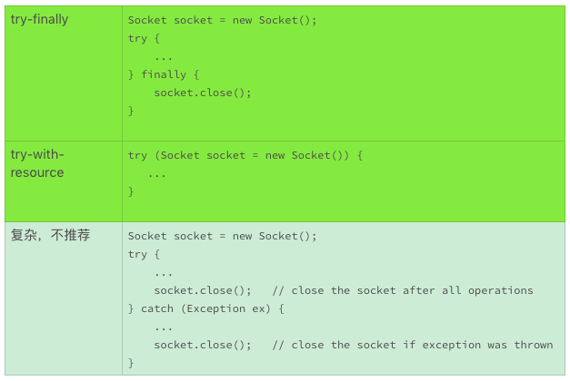
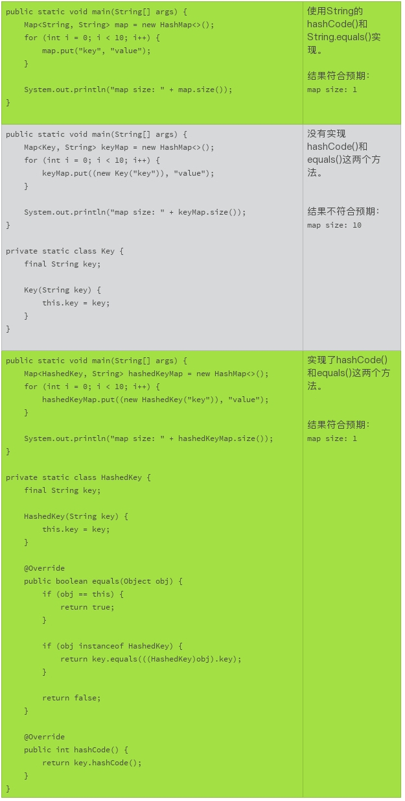

# 26 有哪些招惹麻烦的性能陷阱？

前面，我们讨论了改善代码性能的最基本的办法。接下来，我们讨论一些最佳实践，让我们先从一些容易被忽略的性能陷阱开始。

## 使用性能测试工具

今天我们的讲解需要用到一个工具，它就是JMH。JMH是为Java语言或者其他基于JVM的编程语言设计的一个基准测试工具。这一节，我们会使用这个工具来分析一些性能的陷阱。这里我们简单地介绍下，这个工具该怎么使用。

第一步，使用Maven工具建立一个基准测试项目（需要使用Maven工具）：

    $ mvn archetype:generate \
              -DinteractiveMode=false \
              -DarchetypeGroupId=org.openjdk.jmh \
              -DarchetypeArtifactId=jmh-java-benchmark-archetype \
              -DgroupId=com.example \
              -DartifactId=myJmh \
              -Dversion=1.0

这个命令行，会生成一个myJmh的工程目录，和一个基准测试模板文件（myJmh/src/main/java/com/example/MyBenchmark.java）。通过更改这个测试模板，就可以得到你想要的基准测试了。

比如，你可以使用后面我们用到的基准测试代码，替换掉模板中的基准测试方法（measureStringApend）。

    package com.example;

    import org.openjdk.jmh.annotations.Benchmark;

    public class MyBenchmark {
        @Benchmark
        public String measureStringApend() {
            String targetString = "";
            for (int i = 0; i < 10000; i++) {
                targetString += "hello";
            }

            return targetString;
        }
    }

第二步，编译基准测试：

    $ cd myJmh
    $ mvn clean install

第三步，运行你的基准测试：

    $ cd myJmh
    $ Java -jar target/benchmarks.jar

稍微等待，基准测试结果就出来了。我们需要关注的是"Score"这一栏，它表示的是每秒钟可以执行的基准测试方法的次数。

    Benchmark                Mode  Cnt        Score          Error  Units
    MyBenchmark.testMethod  thrpt   25        35.945 ▒       0.694  ops/s

这是JMH工具基本的使用流程，有关这个工具更多的选项和更详细的使用，需要你参考JMH的相关文档。

下面，我们通过字符串连接操作和哈希值的例子，来谈论一下这个工具要怎么使用，以及对应的性能问题。同时，我们再看看其他影响性能的一些小陷阱，比如内存的泄露、未关闭的资源和遗漏的hashCode。

## 字符串的操作

在Java的核心类库里，有三个字符串操作的类，分别问String、StringBuilder和StringBuffer。通过下面的基准测试，我们来了解下这三种不同的字符串操作的性能差异。为了方便，我把JMH测试的数据，标注在每个基准测试的方法注释里了。

        // JMH throughput benchmark: about 32 operations per second
        @Benchmark
        public String measureStringApend() {
            String targetString = "";
            for (int i = 0; i < 10000; i++) {
                targetString += "hello";
            }

            return targetString;
        }

        // JMH throughput benchmark: about 5,600 operations per second
        @Benchmark
        public String measureStringBufferApend() {
            StringBuffer buffer = new StringBuffer();
            for (int i = 0; i < 10000; i++) {
                buffer.append("hello");
            }

            return buffer.toString();
        }

        // JMH throughput benchmark: about 21,000 operations per second
        @Benchmark
        public String measureStringBuilderApend() {
            StringBuilder builder = new StringBuilder();
            for (int i = 0; i < 10000; i++) {
                builder.append("hello");
            }

            return builder.toString();
        }

对于字符串连接的操作，这个基准测试结果显示，使用StringBuffer的字符串连接操作，比使用String的操作快了近200倍；使用StringBuilder
的字符串连接操作，比使用String的操作快了近700倍。

String的字符串连接操作为什么慢呢？
这是因为每一个字符串连接的操作（targetString +=
"hello"），都需要创建一个新的String对象，然后再销毁，再创建。这种模式对CPU和内存消耗都比较大。

StringBuilder和StringBuffer为什么快呢？因为StringBuilder和StringBuffer的内部实现，预先分配了一定的内存。字符串操作时，只有预分配内存不足，才会扩展内存，这就大幅度减少了内存分配、拷贝和释放的频率。

StringBuilder为什么比StringBuffer还要快呢？StringBuffer的字符串操作是多线程安全的，而StringBuilder的操作就不是。如果我们看这两个方法的实现代码，除了线程安全的同步以外，几乎没有差别。

    public final class StringBuffer
        extends AbstractStringBuilder
        implements java.io.Serializable, Comparable<StringBuffer>, CharSequence {
        // snipped

        @Override
        @HotSpotIntrinsicCandidate
        public synchronized StringBuffer append(String str) {
            toStringCache = null;
            super.append(str);
            return this;
        }

        //  snipped
    }

    public final class StringBuilder
        extends AbstractStringBuilder
        implements java.io.Serializable, Comparable<StringBuilder>, CharSequence {
        // snipped

        @Override
        @HotSpotIntrinsicCandidate
        public StringBuilder append(String str) {
            super.append(str);
            return this;
        }

        // snipped
    }

JMH的基准测试，并没有涉及到线程同步问题，难道使用synchronized关键字也会有性能损耗吗？

我们再来看看另外一个基准测试。这个基准测试，使用线程不安全的StringBuilder以及同步的字符串连接，部分模拟了线程安全的StringBuffer.append()方法的实现。为了方便你对比，我把没有使用同步的代码也拷贝在下面。

        // JMH throughput benchmark: about 21,000 operations per second
        @Benchmark
        public String measureStringBuilderApend() {
            StringBuilder builder = new StringBuilder();
            for (int i = 0; i < 10000; i++) {
                builder.append("hello");
            }

            return builder.toString();
        }

        // JMH throughput benchmark: about 16,000 operations per second
        @Benchmark
        public String measureStringBuilderSynchronizedApend() {
            StringBuilder builder = new StringBuilder();
            for (int i = 0; i < 10000; i++) {
                synchronized (this) {
                    builder.append("hello");
                }
            }

            return builder.toString();
        }

这个基准测试结果显示，虽然基准测试并没有使用多个线程，但是使用了线程同步的代码比不使用线程同步的代码慢。线程同步，就是StringBuffer比StringBuilder慢的原因之一。

通过上面的基准测试，我们可以得出这样的结论：

1.  频繁的对象创建、销毁，有损代码的效率；

2.  减少内存分配、拷贝、释放的频率，可以提高代码的效率；

3.  即使是单线程环境，使用线程同步依然有损代码的效率。

从上面的基准测试结果，是不是可以得出结论，我们应该使用StringBuilder来进行字符串操作呢？我们再来看几个基准测试的例子。

下面的例子，测试的是常量字符串的连接操作。从测试结果，我们可以看出，使用String的连接操作，要比使用StringBuilder的字符串连接快5万倍，这是一个让人惊讶的性能差异。

        // JMH throughput benchmark: about 1,440,000,000 operations per second
        @Benchmark
        public void measureSimpleStringApend() {
            for (int i = 0; i < 10000; i++) {
                String targetString = "Hello, " + "world!";
            }
        }

        // JMH throughput benchmark: about 26,000 operations per second
        @Benchmark
        public void measureSimpleStringBuilderApend() {
            for (int i = 0; i < 10000; i++) {
                StringBuilder builder = new StringBuilder();
                builder.append("hello, ");
                builder.append("world!");
            }
        }

这个巨大的差异，主要来自于Java编译器和JVM对字符串处理的优化。" Hello,
" + " world! "
这样的表达式，并没有真正执行字符串连接。编译器会把它处理成一个连接好的常量字符串"Hello,
world!"。这样，也就不存在反复的对象创建和销毁了，常量字符串的连接显示了超高的效率。

如果字符串的连接里，出现了变量，编译器和JVM就没有办法进行优化了。这时候，StringBuilder的效率优势才能体现出来。下面的两个基准测试结果，就显示了变量对于字符长连接操作效率的影响。

        // JMH throughput benchmark: about 9,000 operations per second
        @Benchmark
        public void measureVariableStringApend() {
            for (int i = 0; i < 10000; i++) {
                String targetString = "Hello, " + getAppendix();
            }
        }

        // JMH throughput benchmark: about 26,000 operations per second
        @Benchmark
        public void measureVariableStringBuilderApend() {
            for (int i = 0; i < 10000; i++) {
                StringBuilder builder = new StringBuilder();
                builder.append("hello, ");
                builder.append(getAppendix());
            }
        }

        private String getAppendix() {
           return "World!";
        }

通过上面的基准测试，我们可以总结出下面的几条最佳实践：

1.  Java的编译器会优化常量字符串的连接，我们可以放心地把长的字符串换成多行；

2.  带有变量的字符串连接，StringBuilder效率更高。如果效率敏感的代码，建议使用StringBuilder。String的连接操作可读性更高，效率不敏感的代码可以使用，比如异常信息、调试日志、使用不频繁的代码；

3.  如果涉及大量的字符串操作，使用StringBuilder效率更高；

4.  除非有线程安全的需求，不推荐使用线程安全的StringBuffer。

## 内存的泄露

内存泄漏是C语言的一个大问题。为了更好地管理内存，Java提供了自动的内存管理和垃圾回收机制。但是，Java依然会泄露内存。这种内存泄漏的主要表现是，如果一个对象不再有用处，而且它的引用还没有清零，垃圾回收器就意识不到这个对象需要及时回收，这时候就引发了内存泄露。

生命周期长的集合，是Java容易发生内存泄漏的地方。比如，可以扩张的静态的集合，或者存活时间长的缓存等。如果不能及时清理掉集合里没有用处的对象，就会造成内存的持续增加，引发内存泄漏问题。

比如下面这两个例子，就容易发生内存泄露。

静态的集合：

    static final List<Object>
             staticCachedObjects = new LinkedList<>();

    // snipped
    staticCachedObjects.add(...);

长寿的缓存：

    final List<Object>
            longLastingCache = new LinkedList<>();

    // snipped
    longLastingCache.add(...);

解决这个问题的办法通常是使用SoftReference和WeakReference来存储对象的引用，或者主动地定期清理。

静态的集合：

    static final List<WeakReference<Object>>
            staticCachedObjects = new LinkedList<>();

    // snipped
    staticCachedObjects.add(...);

长寿的缓存：

    final List<WeakReference<Object>>
            longLastingCache = new LinkedList<>();

    // snipped
    longLastingCache.add(...);

需要注意的是，缓存的处理是一个复杂的问题，使用SoftReference和WeakReference未必能够满足你的业务需求。更有效的缓存解决方案，依赖于具体的使用场景。

## 未关闭的资源

有很多系统资源，需要明确地关闭，要不然，占用的系统资源就不能有效地释放。比如说，数据库连接、套接字连接和
I/O
操作等。原则上，所有实现了Closable接口的对象，都应该调用close()操作；所有需要明确关闭的类，都应该实现Closable接口。

需要注意的是，close()操作，一定要使用try-finally或者try-with-resource语句。要不然，关闭资源的代码可能很复杂。

-
如果一个类需要关闭，但是又没有实现Closable接口，就比较麻烦，比如URLConnection.
URLConnection.connect()能够建立连接，该连接需要关闭，但是URLConnection没有实现Closable接口，关闭的办法只能是关闭对应的I/O接口，可是关闭I/O输入和输出接口中的一个，还不能保证整个连接会完全关闭。谨慎的代码，需要把I/O输入和输出都关闭掉，哪怕不需要输入或者输出。但是这样一来，我们的编码负担就会加重。所以最好的方法就是实现Closable接口。

双向关闭I/O：

    URL url = new URL("http://www.google.com/");
    URLConnection conn = url.openConnection();
    conn.connect();

    try (InputStream is = conn.getInputStream()) {
        // sinnped
    }

    try (OutputStream os = conn.getOutputStream()) {
        // sinnped
    }

单向关闭I/O：

    URL url = new URL("http://www.google.com/");
    URLConnection conn = url.openConnection();
    conn.connect();

    try (InputStream is = conn.getInputStream()) {
        // sinnped
    }

    // The output strean is not close, the connection may be still alive.

## 遗漏的hashCode

在使用Hashtbale、HashMap、HashSet这样的依赖哈希（hash）值的集合时，有时候我们会忘记要检查产生哈希值的对象，一定要实现hashCode()和equals()这两个方法。缺省的hashCode()实现，返回值是每一个对象都不同的数值。即使是相等的对象，不同的哈希值，使用基于哈希值的集合时，也会被看作不同的对象。这样的行为，可能不符合我们的预期。而且，使用没有实现hashCode()和equals()这两个方法的对象，可能会造成集合的尺寸持续增加，无端地占用内存，甚至会造成内存的泄漏。

所以，我们使用基于hash的集合时，一定要确保集合里的对象，都正确地实现了hashCode()和equals()这两个方法。

## 撞车的哈希值

实现hashCode()这个方法的，并没有要求不相等对象的返回值也必须是不相等的。但是如果返回的哈希值不同，对集合的性能就会有比较大的影响。

下面的两个基准测试结果显示，如果10,000个对象，只有10个不同的哈希值，它的集合运算的性能是令人担忧的。和使用了不用哈希值的实现相比，性能有几百倍的差异。

这种性能差异，主要是由基于哈希值的集合的实现方式决定的。哈希值如果相同，就要调用其他的方法来识别一个对象。哈希值如果不同，哈希值本身就可以确定一个对象的索引。如果哈希值撞车比例大，这种检索和计算的差距就会很大。

        // JMH throughput benchmark: about 5,000 operations per second
        @Benchmark
        public void measureHashMap() throws IOException {
            Map<HashedKey, String> map = new HashMap<>();
            for (int i = 0; i < 10000; i++) {
                map.put(new HashedKey(i), "value");
            }
        }

        private static class HashedKey {
            final int key;

            HashedKey(int key) {
                this.key = key;
            }

            @Override
            public boolean equals(Object obj) {
                if (obj == this) {
                    return true;
                }

                if (obj instanceof HashedKey) {
                    return key == ((HashedKey)obj).key;
                }

                return false;
            }

            @Override
            public int hashCode() {
                return key;
            }
        }

        // JMH throughput benchmark: about 9.5 operations per second
        @Benchmark
        public void measureCollidedHashMap() throws IOException {
            Map<CollidedKey, String> map = new HashMap<>();
            for (int i = 0; i < 10000; i++) {
                map.put(new CollidedKey(i), "value");
            }
        }

        private static class CollidedKey {
            final int key;

            CollidedKey(int key) {
                this.key = key;
            }

            @Override
            public boolean equals(Object obj) {
                if (obj == this) {
                    return true;
                }

                if (obj instanceof CollidedKey) {
                    return key == ((CollidedKey)obj).key;
                }

                return false;
            }

            @Override
            public int hashCode() {
                return key % 10;
            }
        }

## 小结

今天，我们主要讨论了一些容易被忽略的性能陷阱。比如，字符串怎么操作才是高效的；Java常见的内存泄漏；资源关闭的正确方法以及集合的相关性能问题。

我们虽然使用了Java作为示例，但是像集合和字符串操作这样的性能问题，并不局限于特定的编程语言，你也可以看看你熟悉的编程语言有没有类似的问题。

## 一起来动手

这一次的练手题，我们来练习使用JMH工具，分析更多的性能问题。在"撞车的哈希值"这一小节，我们测试了HashMap的put方法，你能不能测试下其他方法以及其他基于哈希值的集合（HashSet，Hashtable）？我们测试的是10,000个对象，只有10个哈希值。如果10,000个对象，有5,000个哈希值，性能影响有多大？

下面的这段代码，你能够找到它的性能问题吗？

    package com.example;

    import java.util.Arrays;
    import java.util.Random;

    public class UserId {
        private static final Random random = new Random();

        private final byte[] userId = new byte[32];

        public UserId() {
            random.nextBytes(userId);
        }

        @Override
        public boolean equals(Object obj) {
            if (obj == this) {
                return true;
            }

            if (obj instanceof UserId) {
                return Arrays.equals(this.userId, ((UserId)obj).userId);
            }

            return false;
        }

        @Override
        public int hashCode() {
            int retVal = 0;

            for (int i = 0; i < userId.length; i++) {
                retVal += userId[i];
            }

            return retVal;
        }
    }

我们前面讨论了下面这段代码的性能问题，你能够使用JMH测试一个你的改进方案带来的效率提升吗？

    import java.util.HashMap;
    import java.util.Map;

    class Solution {
        /**
         * Given an array of integers, return indices of the two numbers
         * such that they add up to a specific target.
         */
        public int[] twoSum(int[] nums, int target) {
            Map<Integer, Integer> map = new HashMap<>();
            for (int i = 0; i < nums.length; i++) {
                int complement = target - nums[i];
                if (map.containsKey(complement)) {
                    return new int[] { map.get(complement), i };
                }
                map.put(nums[i], i);
            }
            throw new IllegalArgumentException("No two sum solution");
        }
    }

另外，你也可以检查一下你手头的代码，看看有没有踩到类似的坑。如果遇到类似的陷阱，看一看能不能改进。

容易被忽略的性能陷阱，有很多种。这些大大小小的经验，需要我们日复一日的积累。如果你有这方面的经验，或者看到这方面的技术，请你分享在留言区，我们一起来学习、积累这些经验。

也欢迎点击"请朋友读"，把这篇文章分享给你的朋友或者同事，一起交流一下。
