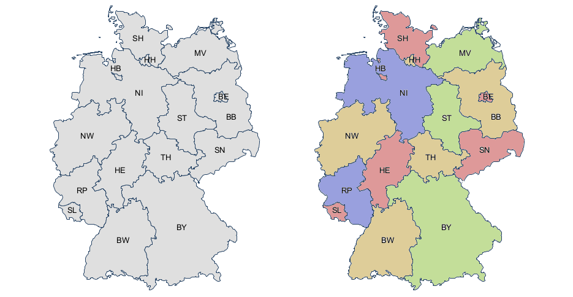

# 039 编程范式游记（10）- 逻辑编程范式

这篇文章重点介绍 Prolog 语言。Prolog（Programming in Logic
的缩写）是一种逻辑编程语言。它创建在逻辑学的理论基础之上，最初被运用于自然语言等研究领域。现在它已被广泛地应用在人工智能的研究中，可以用来建造专家系统、自然语言理解、智能知识库等。

Prolog 语言最早由艾克斯马赛大学（Aix-Marseille University）的 Alain
Colmerauer 与 Philippe Roussel 等人于 20 年代 60 年代末研究开发的。1972
年被公认为是 Prolog 语言正式诞生的年份，自 1972 年以后，分支出多种
Prolog 的方言。

最主要的两种方言为 Edinburgh 和 Aix-Marseille。最早的 Prolog 解释器由
Roussel 建造，而第一个 Prolog 编译器则是 David Warren 编写的。

Prolog 一直在北美和欧洲被广泛使用。日本政府曾经为了建造智能计算机而用
Prolog 来开发 ICOT 第五代计算机系统。在早期的机器智能研究领域，Prolog
曾经是主要的开发工具。

20 世纪 80 年代 Borland 开发的 Turbo Prolog，进一步普及了 Prolog
的使用。1995 年确定了 ISO Prolog 标准。

有别于一般的函数式语言，Prolog
的程序是基于谓词逻辑的理论。最基本的写法是定立对象与对象之间的关系，之后可以用询问目标的方式来查询各种对象之间的关系。系统会自动进行匹配及回溯，找出所询问的答案。

Prolog
代码中以大写字母开头的元素是变量，字符串、数字或以小写字母开头的元素是常量。下划线（\_）被称为匿名变量。

# Prolog 的语言特征

逻辑编程是靠推理，比如下面的示例：

    program mortal(X) :- philosopher(X).
     
    philosopher(Socrates).
    philosopher(Plato).
    philosopher(Aristotle).
     
    mortal_report:-
    write('Known mortals are:'), nl, mortal(X),
    write(X),nl,
    fail.

我们可以看到下面的几个步骤。

1.  先定义一个规则：哲学家是人类。
2.  然后陈述事实：苏格拉底、亚里士多德、柏拉图都是哲学家。
3.  然后，我们问，谁是人类？于是就会输出苏格拉底、亚里士多德、柏拉图。

下面是逻辑编程范式的几个特征。

-   逻辑编程的要点是将正规的逻辑风格带入计算机程序设计之中。
-   逻辑编程建立了描述一个问题里的世界的逻辑模型。
-   逻辑编程的目标是对它的模型建立新的陈述。
-   通过陈述事实------因果关系。
-   程序自动推导出相关的逻辑。

# 经典问题：地图着色问题

我们再来看一个经典的四色地图问题。任何一个地图，相邻区域不能用相同颜色，只要用四种不同的颜色就够了。

首先，定义四种颜色。

    color(red).
    color(green).
    color(blue).
    color(yellow).

然后，定义一个规则：相邻的两个地区不能用相同的颜色。

    neighbor(StateAColor, StateBColor) :- color(StateAColor), color(StateBColor), 
        StateAColor \= StateBColor. /* \= is the not equal operator */

最前面的两个条件：`color(StateAColor)` 和 `color(StateBColor)`
表明了两个变量 `StateAColor` 和 `StateBColor`。然后，第三个条件：
`StateAColor \= StateBColor` 表示颜色不能相同。

接下来的事就比较简单了。我们描述事实就好了，描述哪些区域是相邻的事实。

比如，下面描述了 BW 和 BY 是相邻的。

    germany(BW, BY) :- neighbor(BW, BY).

下面则描述多个区 BW、 BY、 SL、 RP、 和 ND 的相邻关系：

    germany(BW, BY, SL, RP, HE) :- neighbor(BW, BY), neighbor(BW, RP), neighbor(BW, HE).

于是，我们就可以描述整个德国地图的相邻关系了。

    germany(SH, MV, HH, HB, NI, ST, BE, BB, SN, NW, HE, TH, RP, SL, BW, BY) :- 
    neighbor(SH, NI), neighbor(SH, HH), neighbor(SH, MV),
    neighbor(HH, NI),
    neighbor(MV, NI), neighbor(MV, BB),
    neighbor(NI, HB), neighbor(NI, BB), neighbor(NI, ST), neighbor(NI, TH),
    neighbor(NI, HE), neighbor(NI, NW),
    neighbor(ST, BB), neighbor(ST, SN), neighbor(ST, TH),
    neighbor(BB, BE), neighbor(BB, SN),
    neighbor(NW, HE), neighbor(NW, RP),
    neighbor(SN, TH), neighbor(SN, BY),
    neighbor(RP, SL), neighbor(RP, HE), neighbor(RP, BW),
    neighbor(HE, BW), neighbor(HE, TH), neighbor(HE, BY),
    neighbor(TH, BY),
    neighbor(BW, BY).

最后，我们使用如下语句，就可以让 Prolog 推导到各个地区的颜色。

    ?- germany(SH, MV, HH, HB, NI, ST, BE, BB, SN, NW, HE, TH, RP, SL, BW, BY).

# 小结

Prolog
这种逻辑编程，把业务逻辑或是说算法抽象成只关心规则、事实和问题的推导这样的标准方式，不需要关心程序控制，也不需要关心具体的实现算法。只需要给出可以用于推导的规则和相关的事实，问题就可以被通过逻辑推导来解决掉。是不是很有意思，也很好玩？

如果有兴趣，你可以学习一下，这里推荐两个学习资源：

-   [Prolog
    Tutorial](http://www.doc.gold.ac.uk/~mas02gw/prolog_tutorial/prologpages/)
-   [Learn Prolog Now!](http://www.learnprolognow.org/)
