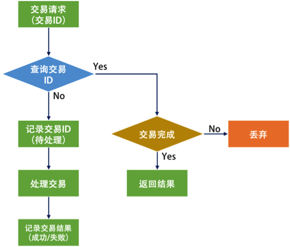

# 044 弹力设计篇之"幂等性设计"

所谓幂等性设计，就是说，一次和多次请求某一个资源应该具有同样的副作用。用数学的语言来表达就是：f(x)
= f(f(x))。

比如，求绝对值的函数，abs(x) = abs(abs(x))。

为什么我们需要这样的操作？说白了，就是在我们把系统解耦隔离后，服务间的调用可能会有三个状态，一个是成功（Success），一个是失败（Failed），一个是超时（Timeout）。前两者都是明确的状态，而超时则是完全不知道是什么状态。

比如，超时原因是网络传输丢包的问题，可能是请求时就没有请求到，也有可能是请求到了，返回结果时没有返回到等情况。于是我们完不知道下游系统是否收到了请求，而收到了请求是否处理了，成功
/
失败的状态在返回时是否遇到了网络问题。总之，请求方完全不知道是怎么回事。

举几个例子:

-   订单创建接口，第一次调用超时了，然后调用方重试了一次。是否会多创建一笔订单？
-   订单创建时，我们需要去扣减库存，这时接口发生了超时，调用方重试了一次。是否会多扣一次库存？
-   当这笔订单开始支付，在支付请求发出之后，在服务端发生了扣钱操作，接口响应超时了，调用方重试了一次。是否会多扣一次钱？

因为系统超时，而调用户方重试一下，会给我们的系统带来不一致的副作用。

在这种情况下，一般有两种处理方式。

-   一种是需要下游系统提供相应的查询接口。上游系统在 timeout
    后去查询一下。如果查到了，就表明已经做了，成功了就不用做了，失败了就走失败流程。
-   另一种是通过幂等性的方式。也就是说，把这个查询操作交给下游系统，我上游系统只管重试，下游系统保证一次和多次的请求结果是一样的。

对于第一种方式，需要对方提供一个查询接口来做配合。而第二种方式则需要下游的系统提供支持幂等性的交易接口。

# 全局 ID

要做到幂等性的交易接口，需要有一个唯一的标识，来标志交易是同一笔交易。而这个交易
ID 由谁来分配是一件比较头疼的事。因为这个标识要能做到全局唯一。

如果由一个中心系统来分配，那么每一次交易都需要找那个中心系统来。
这样增加了程序的性能开销。如果由上游系统来分配，则可能会导致可能会出现分配
ID 重复了的问题。因为上游系统可能会是一个集群，它们同时承担相同的工作。

为了不产生分配冲突，我们需要使用一个不会冲突的算法，比如使用 UUID
这样冲突非常小的算法。但 UUID
的问题是，它的字符串占用的空间比较大，索引的效率非常低，生成的 ID
太过于随机，完全不是人读的，而且没有递增，如果要按前后顺序排序的话，基本不可能。

在全局唯一 ID 的算法中，这里介绍一个 Twitter 的开源项目
Snowflake。它是一个分布式 ID 的生成算法。其核心思想是，产生一个 long
型的 ID，其中：

-   41bits 作为毫秒数。大概可以用 69.7 年。
-   10bits 作为机器编号（5bits 是数据中心，5bits 的机器 ID），支持 1024
    个实例。
-   12bits 作为毫秒内的序列号。一毫秒可以生成 4096 个序号。

其他的像 Redis 或 MongoDB 的全局 ID
生成都和这个算法大同小异。我在这里就不多说了。你可以根据实际情况加上业务的编号。

# 处理流程

对于幂等性的处理流程来说，说白了就是要过滤一下已经收到的交易。要做到这个事，我们需要一个存储来记录收到的交易。

于是，当收到交易请求的时候，我们就会到这个存储中去查询。如果查找到了，那么就不再做查询了，并把上次做的结果返回。如果没有查到，那么我们就记录下来。

但是，上面这个流程有个问题。因为绝大多数请求应该都不会是重新发过来的，所以让
100% 的请求都到这个存储里去查一下，这会导致处理流程可能会很慢。

所以，最好是当这个存储出现冲突的时候会报错。也就是说，我们收到交易请求后，直接去存储里记录这个
ID（相对于数据的 Insert 操作），如果出现 ID
冲突了的异常，那么我们就知道这个之前已经有人发过来了，所以就不用再做了。比如，数据库中你可以使用
`insert into … values … on DUPLICATE KEY UPDATE …` 这样的操作。

对于更新的场景来说，如果只是状态更新，可以使用如下的方式。如果出错，要么是非法操作，要么是已被更新，要么是状态不对，总之多次调用是不会有副作用的。

    update table set status = “paid” where id = xxx and status = “unpaid”;

当然，网上还有 MVCC
通过使用版本号的方式，等等方式，我觉得这些都不标准，我们希望我们有一个标准的方式来做这个事，所以，最好还是用一个
ID。

因为我们的幂等性服务也是分布式的，所以，需要这个存储也是共享的。这样每个服务就变成没有状态的了。但是，这个存储就成了一个非常关键的依赖，其扩展性和可用性也成了非常关键的指标。

你可以使用关系型数据库，或是 key-value 的 NoSQL（如
MongoDB）来构建这个存储系统。

# HTTP 的幂等性

**HTTP GET 方法用于获取资源，不应有副作用，所以是幂等的**。比如：GET
`http://www.bank.com/account/123456`，不会改变资源的状态，不论调用一次还是
N 次都没有副作用。请注意，这里强调的是一次和 N
次具有相同的副作用，而不是每次 GET 的结果相同。GET
`http://www.news.com/latest-news`这个 HTTP
请求可能会每次得到不同的结果，但它本身并没有产生任何副作用，因而是满足幂等性的。

**HTTP HEAD 和 GET 本质是一样的，区别在于 HEAD 不含有呈现数据，而仅仅是
HTTP
头信息，不应用有副作用，也是幂等的**。有的人可能觉得这个方法没什么用，其实不是这样的。想象一个业务情景：欲判断某个资源是否存在，我们通常使用
GET，但这里用 HEAD 则意义更加明确。也就是说，HEAD
方法可以用来做探活使用。

**HTTP OPTIONS 主要用于获取当前 URL
所支持的方法，所以也是幂等的**。若请求成功，则它会在 HTTP
头中包含一个名为"Allow"的头，值是所支持的方法，如"GET, POST"。

**HTTP DELETE
方法用于删除资源，有副作用，但它应该满足幂等性**。比如：DELETE
`http://www.forum.com/article/4231`，调用一次和 N
次对系统产生的副作用是相同的，即删掉 ID 为 4231
的帖子。因此，调用者可以多次调用或刷新页面而不必担心引起错误。

**HTTP POST 方法用于创建资源，所对应的 URI
并非创建的资源本身，而是去执行创建动作的操作者，有副作用，不满足幂等性**。比如：POST
`http://www.forum.com/articles`的语义是在`http://www.forum.com/articles`下创建一篇帖子，HTTP
响应中应包含帖子的创建状态以及帖子的 URI。两次相同的 POST
请求会在服务器端创建两份资源，它们具有不同的 URI；所以，POST
方法不具备幂等性。

**HTTP PUT 方法用于创建或更新操作，所对应的 URI
是要创建或更新的资源本身，有副作用，它应该满足幂等性**。比如：PUT
`http://www.forum/articles/4231`的语义是创建或更新 ID 为 4231
的帖子。对同一 URI 进行多次 PUT 的副作用和一次 PUT 是相同的；因此，PUT
方法具有幂等性。

所以，对于 POST
的方式，很可能会出现多次提交的问题，就好比，我们在论坛中发贴时，所遇到的有时候网络有问题对同一篇贴子出现多次提交的情况。对此的一般的幂等性的设计如下。

-   首先，在表单中需要隐藏一个 token，这个 token
    可以是前端生成的一个唯一的
    ID。用于防止用户多次点击了表单提交按钮，而导致后端收到了多次请求，却不能分辨是否是重复的提交。这个
    token 是表单的唯一标识。（这种情况其实是通过前端生成 ID 把 POST
    变成了 PUT。）
-   然后，当用户点击提交后，后端会把用户提示的数据和这个 token
    保存在数据库中。如果有重复提交，那么数据库中的 token
    会做排它限制，从而做到幂等性。
-   当然，更为稳妥的做法是，后端成功后向前端返回 302
    跳转，把用户的前端页跳转到 GET 请求，把刚刚 POST
    的数据给展示出来。如果是 Web
    上的最好还把之前的表单设置成过期，这样用户不能通过浏览器后退按钮来重新提交。这个模式又叫做
    [PRG
    模式](https://en.wikipedia.org/wiki/Post/Redirect/Get)（Post/Redirect/Get）。

# 小结

好了，我们来总结一下今天分享的主要内容。首先，幂等性的含义是，一个调用被发送多次所产生的总的副作用和被发送一次所产生的副作用是一样的。而服务调用有三种结果：成功、失败和超时，其中超时是我们需要解决的问题。

解决手段可以是超时后查询调用结果，也可以是在被调用的服务中实现幂等性。为了在分布式系统中实现幂等性，我们需要实现全局
ID。Twitter 的 Snowflake 就是一个比较好用的全局 ID
实现。最后，我给出了幂等性接口的处理流程。

下篇文章中，我们讲述服务的状态。希望对你有帮助。

也欢迎你分享一下你的分布式服务中所有交易接口是否都实现了幂等性？你所使用的全局
ID 算法又是什么呢？
