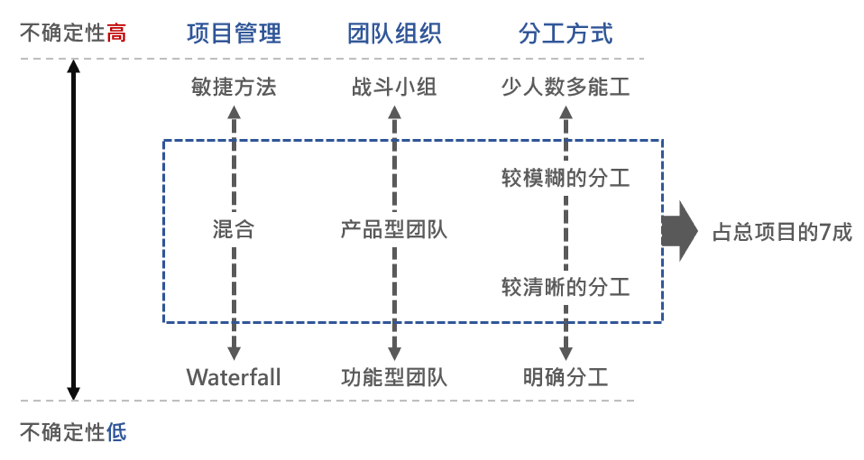
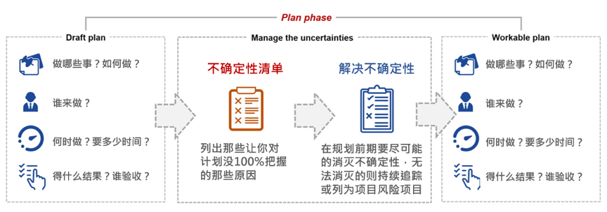

# 050 你的研发流程符合你的组织架构吗？谈高效研发流程那些事（二）

你好，我是箴亚管理顾问公司负责人，同时也是TGO鲲鹏会台北分会学习委员游舒帆，今天想跟大家分享的话题是"高效研发流程的第二步，研发管理流程的选型"。在上一篇文章中我与大家分享了组织架构与打造高效研发流程间的关联，本文将着重于研发过程的探讨。

刚出社会时，我在一家ERP软件公司从事研发工作，我在那里接触到了非常正规的软件工程，也见识到当研发流程与业务特性匹配时的高效，以及不匹配时产生的诸多问题。在2000年初期，软件开发大多仍遵循瀑布式(Waterfall)方法，必然得先进行需求收集、分析、设计，然后进入开发与测试，经过一道道程序后将成品完整的交付。

在ERP软件公司的那些年，我也参与了软件成熟度模型CMMI
Lv4的导入与认证，**过程中，我见识到了CMMI的严谨之处，同时也体会到严谨背后带来的低效与冗余**。由于当时我所负责的产品处于需求不明确、市场性待验证的状态，如果要依照CMMI的规则产出完整的需求列表与完整的分析文件，估计是不可能的。

因此在过程中我试着提出用假设性需求，以及用雏型替代成品的方法来进行市场验证。出乎意料的是，这个提议获得了CMMI顾问团队的认同，而这也是我对CMMI有所改观的转折点。公司内推动小组的负责人告诉我："**CMMI本来就是一个模型，每家公司得依照自己最适合的方式建构流程，但最终须能达到CMMI要求的水平。"**

2011年，我开始负责SaaS相关业务，也首次接触了敏捷观念以及Scrum，与此同时，互联网开始进入火爆增长期，所有的企业都在求新求快，技术团队也被要求要具备更灵活、更弹性、更迅速的特性，只是一两年时光，国内所有公司都在讨论敏捷开发，而不再有人讨论PMP和CMMI所主张的瀑布式项目管理与研发流程管理方法。

2013年，我开始在团队中大量引用敏捷观念，通过频繁的交付来验证用户与市场需求，也在技术社区中与许多朋友交流项目管理与软件开发方法，我看见越来越多的人想拥抱敏捷，但同时我也发现，许多人对敏捷其实一知半解，并且对PMP及CMMI有着错误的偏见。

2015年，我进入互联网公司后，人人口中所谈的都是敏捷，万一在讨论过程中有人提到CMMI或PMP，就会有人露出鄙视的眼神，他们误以为过去项目做不好，是PMP与CMMI所造成的，却未曾思考过，**或许项目失败的真正原因不在流程与工具，而是运用的那些人。**

## 关于瀑布式或敏捷开发方法的选择

在前一篇文章中，我提到当企业内外部状况稳定，需求的变化性较少，可预测性高时，功能型组织是相对适合的组织架构，而相同的概念，其实也适用于传统的PMP管理方法。**PMP强调程序、输入(input)、输出(output)与权责，这与功能型组织不谋而合；相较之下，敏捷强调的快速响应、迭代，则与产品型组织或战斗小组更加匹配。**

当一家公司内可能存在多种组织架构时，是否也意味着应该存在多种开发流程呢？我的答案是"肯定的"，当我们过度坚持公司内只能有少数一两套程序，硬要逼所有人配合时，其实已经与敏捷所追求的"专注于更快的创造价值，持续精进"的理念背道而驰了。

最近几年，我一直在同时并行管理多种组织与开发流程，接下来将跟大家分享在不同的场景下我是如何选择的：

### 1.需求具备高度不确定性，重要性高，但时程紧迫度一般

例如新商业模式的探索、从2B跨入2C的新产品等，这样的任务我一般会以战斗小组的形式组成团队，团队成员会根据当下需求随时做调整，可能是1位产品经理配2位研发工程师，也可能是3位具备分析能力的资深工程师。

这样的团队基本上不会有太明确的分工与流程来局限他们，团队可以选择自己熟练的工具，协议合适的分工，唯一的目标就是把问题给解决掉。

### 2.需求有一定不确定性，且时程紧迫

例如要赶及在某一天推出新产品或新feature，藉此创造市场话题。这样的任务一般我会交由产品型组织来完成，而为了持续降低不确定性，他们需要频繁的交付成果以验证市场反应，以期在deadline之前把产品交付出来。在我过去几年实施敏捷的经验里，这一类的项目约占总项目的7成左右。

在这类项目中，为了同时兼顾效率与质量，团队基本上会依循一定的程序进行项目目标定义、需求厘清、开发、测试与布署，而在分工上，一个人可能会同时兼任多种角色，例如资深工程师除了要写代码外，也要负责架构设计与需求厘清，而产品经理可能同时兼任项目经理与原型设计。

复杂度较高的项目，可能设有独立的项目经理，否则多数状况下产品经理必须兼任项目经理角色，他们必须对项目负责；而架构师与用户体验设计师则不见得会参与每个项目，除非项目涉及较大的架构变迁或选型，以及明显的用户体验缺陷或改进。

分工的方式会根据不同的项目而有所不同，唯一的原则就是，分工必须是必要的，如果只是在工作流程上卡一关，但没有对项目带来实质效益，那分工便非必要。

### 3.需求具有高度确定性

例如与战略伙伴合作的项目，彼此已经先把所有需求厘清，并且敲定了验收时间。这样的项目一般我会另外组织项目团队，按瀑布式开发流程推进，并切出几个重要的里程碑进行阶段性验收。

如果敏捷是藉由更快且更频繁的交付，以期降低不确定性并更快的创造价值，那么在目前的项目中，需求基本上已经非常明确，时程也按着彼此协议好的时间进行，中间其实不存在太多需要通过迭代来验证的内容。唯一需要的是按表操课、如期如质的将成果交付出来。

独立的团队，明确的计划、分工与权责，加上里程碑查核，这类案子的稳定度是最高的。所以时至今日，多数的外包项目，都还是依循着这种程序，否则将在报价、管理与验收上产生诸多困难。

上述内容汇整后，可以用下面这张图做个概括性的理解，根据目标与需求的不确定性的高低，所采取的项目管理方法、团队组织与分工方式也不同。

## 追求敏捷，但更要重视项目管理基本功

在领导团队时，我特别强调项目管理的基本功，因为我认为多数的问题都是出在基本功不够扎实。在项目开始前与进行中，一般我会对产品经理提出很多问题，以确保项目能如原先预期推进。

在项目启动阶段，一般会由团队就已知信息先拟定draft
plan，其内容主要是陈述项目要做哪些事？打算如何进行？由谁来做？预计花费多少时间？以及将得到什么样的结果？

而当团队将计划产出后，我会问产品经理："这个项目中有哪些不确定性，可能会导致你无法准时交付？"项目管理早期的主要问题大多是"需求不够清晰"、"不确定人力资源能否配合"、"对工作的估时过长或过短"、"技术可行性待验证"、"老板可能还会改动需求"等等，而这些，就是导致项目进行阶段会频繁发生变更(change)的原因。

相对的，如果你在规划时期，就已经先把这些问题排除了，那运行时会面临的变更就相对减少了，案子的进行也会相对轻松许多。

这些对我来说都是项目管理的基本功，**敏捷虽然强调拥抱不确定性，并欢迎随时的更动，但不意味着我们要对那些不确定性置之不理，而是要尽快的让不确定成为确定。**
敏捷强调不断进步与反馈，我们必须通过一个又一个项目的磨练，让自己能把需求看得更清楚，对时程估算得更准确，能更有效的对齐老板的期待，而要做到这些，团队就需要逼着自己不断进步。

若你对Scrum架构有所研究，你便会发现best
practice里头强调的架构，其实正是针对上述几个最常见的项目不确定性而来的。例如，针对时程，Scrum强调固定的交付周期，以1-4周为佳，而且强调是固定团队，在过程中也尽可能避免团队成员同时参与多个项目，在这个基础上，再来讨论这样的团队，在一个迭代时间内可以完成多少工作。

Scrum给出了一些框架与规范，确实有助于提升团队的项目管理水平，如果团队原本的项目管理能力只有60分，或许导入Scrum后能提升到80分，但如果要做到90分，团队还是要根据所遭遇到的问题进行持续不断的改善。

## 进步，是永远不变的追求

曾有一个team
leader在一次会议后问我："老大，不断打破与调整流程，让大家忙得要命，背后追求的到底是什么？"

我说："进步。忙是一时的，但你想想一年前我们做一样的事情花多少时间，现在又花多少时间？针对一个异常，过去我们是发生后才知道，现在我们已经可以弭平于未发之时。从前我们没日没夜的工作，换来的却是很多谩骂，但现在我们花更少的时间，却换回更多的掌声，因为我们持续在进步。"

如果需求管理不当、时程估算误差过大、未以正确的态度面对不确定性、项目过程控管差劲，却总是靠着团队加班来填补落差，团队可以靠着热情撑过一小段时间，但随着时间延长，团队总是会乏力，身为技术领袖应该要以持续进步为己任，而不该沾沾自喜于团队的超时工作。

记得，永远都要追求更快、更好、更有价值，别用战术上的勤奋，来掩饰战略上的怠惰。
