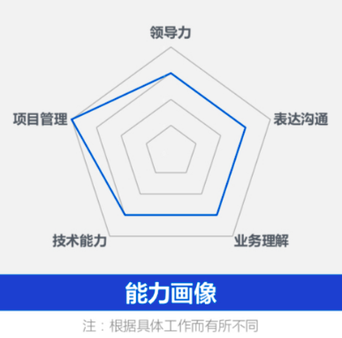
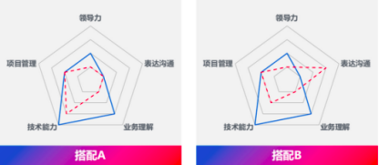
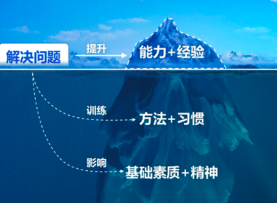

# 157 成敏：技术人才的管理公式

你好，我是技术领导力专栏主编成敏，今天想跟你分享技术管理中的管人这个话题。很多技术转型管理的同学，初期都会觉得管人是管理中最困难的一部分，究其原因，主要在于技术同学习惯面对代码、面对机器，面对人时多少都会有些手足无措。毕竟，相较于人的复杂性来讲，代码和机器会更具逻辑性和确定性。

那我们不妨换个角度思考：如果管人也有公式，是不是又能回到技术人熟悉的思维方式中，是不是就能够降低管人的难度呢？

## 管人的公式

既然谈公式，就要先确定公式中的各个参数。不妨将员工的表现抽象为五个维度，分别是领导力、项目管理能力、技术能力、业务理解能力和表达沟通能力，并用这五个维度能力的高低构建一个人的能力画像，如图中所示。

根据不同场景，选择考量的维度不同，而且每个维度，细展开来都有不同层次。比如项目管理，最低的层次是个人时间管理，然后逐步上升为工作任务管理，再进阶可能是对整个项目过程的管理。其他四个纬度也是类似。

有了这样的能力画像后，我们就可以尝试把团队成员按照这个模型归类，有了直观的对比后，可以很容易地从中看到某个同学的优势、不足和需要学习与进步的空间。在管理中，我们就可以依照这些信息，跟团队成员进行有针对性的高效沟通，帮助他们更好地成长。

通过这张能力画像图，我们也可以看出团队目前缺少哪类人才。一个优秀的团队中，每位团队成员最好都拥有不一样的技能，这样才能适应各种各样的问题。而借助能力画像，我们可以合理搭配团队间的合作关系，使团队更加稳健。

举个例子，很多团队都有导师制度，会给新加入的员工分配老员工作为导师，便于快速融入团队并获得成长。但导师选择也有诀窍在，要考虑到新老员工之间的相性，如果没有经过思考，随意指定老员工，导致两者之间相性不合，反而会造成反效果。

但如果利用能力画像来量化搭配，就很好的解决这个问题。图中展现出的是两种不同的搭配思路。在搭配A中，新员工五个维度的能力普遍弱于老员工，或是跟老员工持平，没有比老员工突出的能力。在搭配B中，新员工的综合能力依旧弱于老员工，但他在某个能力维度上却有高于老员工的能力，图中示意的例子中是表达沟通能力这个维度。

你不妨思考一下，搭配A与搭配B，哪种效果更好？

在我看来，搭配B的效果会更胜一筹。因为，新老员工双方各有所长，他们可以形成一个良性的合作关系，彼此都可以得到相应的成长，而不是只有老员工在输出。比如，老员工作为导师可以将他在技术能力、业务理解能力等维度上的理解和经验传递给新同学，而新同学有着良好的表达和沟通能力，反过来也会影响导师。这就是搭配B效果更佳的原因，有相互促进的作用，因此，在条件允许的情况下，更推荐大家使用B类搭配。

当然，这只是一家之言，如果你有不同的看法，欢迎留言探讨。

## 量化人才成长潜力

对于新同学，我们要关注的不仅仅是他当前的能力，还要关注他未来的成长潜力。如果将一个人的成长潜力比作冰山，那么能力画像中所罗列的个人能力都只是浮在水面的部分，是我们能够直观看到的他现有的能力与经验。

而水面下的部分就是他的潜力，最直接的就是他做事的方法和习惯。但方法和习惯并不是难以习得，所以，起到更深层次影响的是他的基础素质与精神。因此，我们在招贤纳士时，除了关注水面上的部分，还要多多关注水面下的部分，即人才在方法、习惯、基础素质、精神等方面的表现。

那我们怎样培养人才呢？可能有人说，我们直接改善他的方法与习惯不就好了，也有人会说，直接给他打鸡血，提升素质，塑造精神。但从我的实践经验来讲，这样做的效果很差。人才的选育用留，直接只在"育"层面发力去培养人才是不够的，我们要把"用"和"育"结合起来，让他们通过解决问题来提升能力。

在具体实践中，首先需要思考，提供给他们解决的问题是否适合他们需要提升的能力，然后，通过相应的问题，给予相应的磨炼来提升他们的能力与经验。我们还需多做一步，就是跟他们多交流，并让他们刻意训练一些方法与习惯，以此去影响他的基础素质与精神。这是一个比较好的培养人才的逻辑。

## 从个体到团队

有了人之后，面临的问题就是如何把这些人更好的组织起来，也就是从个体到团队。虽然互联网行业跟体育行业相隔甚远，但运动队的团队组织方式是非常值得大家在组织团队时借鉴的。

比方说一个NBA篮球队，或是一个俱乐部足球队，你会发现它非常的形式化，连工资都有上限，比如NBA的工资帽。而在这样的环境中，如何组织好团队间的关系，是非常有学问的，也是值得我们借鉴的。

**首先，一个先决条件是基本相同的价值观**。如果一位同学极度自私或极度不成熟，而你没有办法改变他，不能让他认同并贯彻团队的价值观，那他就不能与这个团队共生，你就需要尽早的将他清出团队。

**其次，一个团队需要有相应的规则纪律**。我们有很多管理规则，如绩效、奖惩、约定、制度等。但关键在于，作为团队leader，不能滥用这些规则纪律，而是要利用好它们，让团队运转更加稳健顺畅，同时，通过这些抓手来传达你想传达的东西，比如对团队成员的正面引导。

**接着，再上一个层次是文化与归属**。我们在做同样的事情，有着同样的"气味"，彼此拥有情谊与信任。很多管理者都会头疼的一个问题是，怎样让新同学快速地融入团队？其实，与其反复跟新同学讲要如何融入团队，都不如设定一些机制，创造条件让他跟团队成员发生互动。团队架构关系是固定的，但我们可以通过互动、沟通，加深彼此的信任，建立新的友好关系，使团队形成一张网，这个团队才可以更加稳健、团结。

**最后，最高层次就是彼此拥有共同目标**。作为团队的技术leader，需要经常思考，为什么我们是一个团队？

举个例子，很多创业公司早期，技术团队都是按照技术方向来组织的，但随着规模的扩大和业务的发展，很多公司会选择组织架构调整，按照业务方向来组织团队。对技术人来说，这种调整很可能会让大家感到不知所措，找不准自己的定位。

这时，你作为管理者就需要明确，团队的核心目标是什么。如果是以技术维度来组织团队，核心目标就应该更偏向于技术所产生的效率和质量。而如果以业务维度来组织团队，核心目标就应该更注重于塑造技术对业务产出的贡献，以及团队成员在业务中能够获得的成就感。

正如瑞·达利欧的《原则》一书中强调的，在管理中，理性的思考无处不在。

感谢收听，我们下期再见！如果你觉得这篇文章对你有帮助的话，也欢迎把它分享给更多的朋友\~
