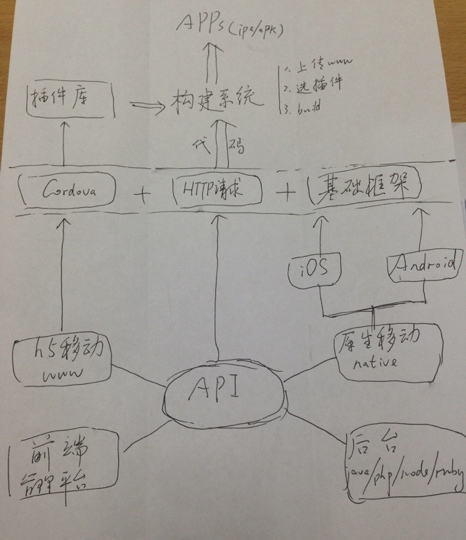
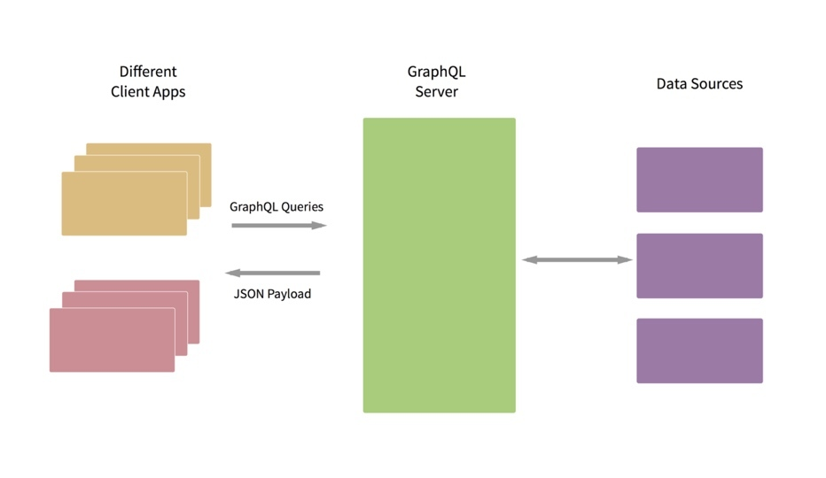

# 189 狼叔：2019年前端和Node的未来-Node.js篇（上）

你好，我是阿里巴巴前端技术专家狼叔，前两篇文章，我分享了大前端的现状和未来，接下来的两篇文章，我将会注重分享一些跟Node.js结合比较密切的点。

## Node.js

Node.js在大前端布局里意义重大，除了基本构建和Web服务外，这里我还想讲2点。首先它打破了原有的前端边界，之前应用开发只分前端和API开发。但通过引入Node.js做BFF这样的API
proxy中间层，使得API开发也成了前端的工作范围，让后端同学专注于开发RPC服务，很明显这样明确的分工是极好的。其次，在前端开发过程中，有很多问题不依赖服务器端是做不到的，比如场景的性能优化，在使用React后，导致bundle过大，首屏渲染时间过长，而且存在SEO问题，这时候使用Node.js做SSR就是非常好的。当然，前端开发Node.js还是存在一些成本，要了解运维等，会略微复杂一些，不过也有解决方案，比如Servlerless就可以降级运维成本，又能完成前端开发。直白点讲，在已有Node.js拓展的边界内，降级运维成本，提高开发的灵活性，这一定会是一个大趋势。

2018 年Node.js发展的非常好，InfoQ曾翻译过一篇文章《2018 Node.js
用户调查报告显示社区仍然在快速成长》。2018 年 5 月 31 日，Node.js
基金会发布了2018 年用户调查报告，涵盖了来自 100 多个国家 1600
多名参与者的意见。报告显示，Node.js的使用量仍然在快速增长，超过¾的参与者期望在来年扩展他们的使用场景，另外和2017
年的报告相比，Node 的易学程度有了大幅提升。

该调查远非 Node 快速增长的唯一指征。根据ModuleCounts.com的数据，Node
的包注册中心 NPM 每天会增加 507 个包，相比下一名要多 4 倍多。2018 年
Stack Overflow 调查也有类似的结果，JavaScript
是使用最广泛的语言，Node.js 是使用最广泛的框架。

本节我会主要分享一些跟Node.js结合比较密切的点：首先介绍一下
API演进与GraphQL，然后讲一下SSR如何结合API落地，构建出具有Node.js特色的服务，然后再简要介绍下Node.js的新特性、新书等，最后聊聊我对
Deno的一点看法。

### API演进与看起来较火的GraphQL

书本上的软件工程在互联网高速发展的今天已经不那么适用了，尤其是移动开发火起来之后，所有企业都崇尚敏捷开发，快鱼吃慢鱼，甚至觉得2周发一个迭代版本都慢，后面组件化和热更新就是这样产生的。综上种种，我们对传统的软件工程势必要重新思考，如何提高开发和产品迭代效率成为重中之重。

先反思一下，开发为什么不那么高效？

从传统软件开发过程中，可以看到，需求提出后，先要设计出ui/ue，然后后端写接口，再然后APP、H5和前端这3端才能开始开发，所以串行的流程效率极低。


于是就有了mock
api的概念。通过静态API模拟，使得需求和ue出来之后，就能确定静态API，造一些模拟数据，这样3端+后端就可以同时开发了。这曾经是提效的非常简单直接的方式。


静态API实现有很多种方式，比如简单的基于 Express / Koa
这样的成熟框架，也可以采用专门的静态API框架，比如著名的
[typicode/json-server](https://github.com/typicode/json-server)，想实现REST
API，你只需要编辑db.json，放入你的数据即可。

``` python
{
  "posts": [
    { "id": 1, "title": "json-server", "author": "typicode" }
  ],
  "comments": [
    { "id": 1, "body": "some comment", "postId": 1 }
  ],
  "profile": { "name": "typicode" }
}
```

启动服务器

``` python
$ json-server --watch db.json
```

此时访问网址 `http://localhost:3000/posts/1`，即我们刚才仿造的静态API
接口，返回数据如下：

``` python
{ "id": 1, "title": "json-server", "author": "typicode" }
```

还有更好的解决方案，比如YApi
，它是一个可本地部署的、打通前后端及QA的、可视化的接口管理平台（<http://yapi.demo.qunar.com/>
）。

其实，围绕API我们可以做非常多的事儿，比如根据API生成请求，对服务器进行反向压测，甚至是check后端接口是否异常等。很明显，这对前端来说是极其友好的。下面是我几年前画的图，列出了我们能围绕API做的事儿，至今也不算过时。



通过社区，我们可以了解到当下主流的API演进过程。

1.GitHub v3的[restful api](https://developer.github.com/v3/)，经典rest；
2.[微博API](https://open.weibo.com/wiki/微博API)，非常传统的json约定方式；
3.在GitHub的v4版本里，使用GraphQL来构建API，这也是个趋势。

GraphQL目前看起来比较火，那GitHub使用GraphQL到底解决的是什么问题呢？

> GraphQL 既是一种用于 API 的查询语言也是一个满足你数据查询的运行时

下面看一个最简单的例子：

-   首先定义一个模型；
-   然后请求你想要的数据；
-   最后返回结果。

很明显，这和静态API模拟是一样的流程。但GraphQL要更强大一些，它可以将这些模型和定义好的API和后端很好的集成。于是GraphQL就统一了静态API模拟和和后端集成。


开发者要做的，只是约定模型和API查询方法。前后端开发者都遵守一样的模型开发约定，这样就可以简化沟通过程，让开发更高效。



如上图所示，GraphQL Server前面部分，就是静态API模拟。GraphQL
Server后面部分就是与各种数据源进行集成，无论是API、数据还是微服务。是不是很强大？

下面我们总结一下API的演进过程。

传统方式：Fe模拟静态API，后端参照静态API去实习rpc服务。

时髦的方式：有了GraphQL之后，直接在GraphQL上编写模型，通过GraphQL提供静态API，省去了之前开发者自己模拟API的问题。有了GraphQL模型和查询，使用GraphQL提供的后端集成方式，后端集成更简单，于是GraphQL成了前后端解耦的桥梁。集成使用的就是基于Apollo
团队的 GraphQL 全栈解决方案，从后端到前端提供了对应的 lib
，使得前后端开发者使用 GraphQL 更加的方便。


GraphQL本身是好东西，和Rest一样，我的担心是落地不一定那么容易，毕竟接受约定和规范是很麻烦的一件事儿。可是不做，又怎么能进步呢？

### 构建具有Node.js特色的服务


2018年，有一个出乎意料的一个实践，就是在浏览器可以直接调用grpc服务。RPC服务暴漏
HTTP 接口，这事儿API网关就可以做到。事实上，gRPC-Web也是这样做的。

如果只是简单透传，意义不大。大多数情况，我们还是要在Node.js端做服务聚合，继而为不同端提供不一样的API。这是比较典型的API
Proxy用法，当然也可以叫BFF(backend for frontend)。

从前端角度看，渲染和API是两大部分，API部分前端自己做有两点好处：1.前端更了解前端需求，尤其是根据ui/ue设计API；2.让后端更专注于服务，而非API。需求变更，能不折腾后端就尽量不要去折腾后端。这也是应变的最好办法。

构建具有Node.js特色的微服务，也主要从API和渲染两部分着手为主。如果说能算得上创新的，那就是API和渲染如何无缝结合，让前端开发有更好的效率和体验。


### Server Side Render

尽管Node.js中间层可以将 RPC 服务聚合成
API，但前端还是前端，API还是API。那么如何能够让它们连接到一起呢？比较好的方式就是通过SSR进行同构开发。服务端创新有限，搞来搞去就是不断的升v8，提升性能，新东西不多。今天我最头疼的是，被Vue/React/Angular三大框架绑定，喜忧参半，既想用组件化和双向绑定（或者说不得不用），又希望保留足够的灵活性。大家都知道SSR因为事件/timer和过长的响应时间而无法有很高的QPS（够用，优化难），而且对API聚合处理也不是很爽。更尴尬的是SSR下做前后端分离难受，不做也难受，到底想让人咋样？

对于任何新技术都是一样的，不上是等死，上了是找死。目前是在找死的路上努力的找一种更舒服的死法。


目前，我们主要采用React做SSR开发，上图中的5个步骤都经历过了（留到QCon广州场分享），这里简单介绍一下React
SSR。React
16现在支持直接渲染到节点流。渲染到流可以减少你内容的第一个字节（TTFB）的时间，在文档的下一部分生成之前，将文档的开头至结尾发送到浏览器。当内容从服务器流式传输时，浏览器将开始解析HTML文档。渲染到流的另一个好处是能够响应背压。
实际上，这意味着如果网络被备份并且不能接受更多的字节，那么渲染器会获得信号并暂停渲染，直到堵塞清除。这意味着你的服务器会使用更少的内存，并更加适应I
/ O条件，这两者都可以帮助你的服务器拥有具有挑战性的条件。

在Node.js里，HTTP是采用Stream实现的，React
SSR可以很好的和Stream结合。比如下面这个例子，分3步向浏览器进行响应。首先向浏览器写入基本布局HTML，然后写入React组件`<MyPage/>`，然后写入`</div></body></html>`。

``` python
// 服务器端
// using Express
import { renderToNodeStream } from "react-dom/server"
import MyPage from "./MyPage"
app.get("/", (req, res) => {
  res.write("<!DOCTYPE html><html><head><title>My Page</title></head><body>");
  res.write("<div id='content'>"); 
  const stream = renderToNodeStream(<MyPage/>);
  stream.pipe(res, { end: false });
  stream.on('end', () => {
    res.write("</div></body></html>");
    res.end();
  });
});
```

这段代码里需要注意`stream.pipe(res, { end: false })`，res本身是Stream，通过pipe和`<MyPage/>`返回的stream进行绑定，继而达到React组件嵌入到HTTP流的目的。

上面是服务器端的做法，与此同时，你还需要在浏览器端完成组件绑定工作。react-dom里有2个方法，分别是render和hydrate。由于这里采用renderToNodeStream，和hydrate结合使用会更好。当MyPage组件的html片段写到浏览器里，你需要通过hydrate进行绑定，代码如下。

``` python
// 浏览器端
import { hydrate } from "react-dom"
import MyPage from "./MyPage"
hydrate(<MyPage/>, document.getElementById("content"))
```

可是，如果有多个组件，需要写入多次流呢？使用renderToString就简单很多，普通模板的方式，流却使得这种玩法变得很麻烦。

伪代码

``` python
const stream1 = renderToNodeStream(<MyPage/>);
const stream2 = renderToNodeStream(<MyTab/>);

res.write(stream1)
res.write(stream2)
res.end()
```

核心设计是先写入布局，然后写入核心模块，然后再写入其他模块。

-   1\. 布局(大多数情况静态html直接吐出，有可能会有请求)；
-   1\. Main（大多数情况有请求）；
-   1\. Others。

于是

``` python
class MyComponent extends React.Component {

  fetch(){
    //获取数据
  }

  parse(){
    //解析，更新state
  }

  render(){
    ...
  }
}
```

在调用组件渲染之前，先获得renderToNodeStream，然后执行fetch和parse方法，取到结果之后再将Stream写入到浏览器。当前端接收到这个组件编译后的html片段后，就可以根据containerID直接写入，当然如果需要，你也可以根据服务器端传过来的data进行定制。

前后端如何通信、服务端代码如何打包、css如何直接插入、和eggjs如何集成，这是目前我主要做的事儿。对于API端已经很成熟，对于SSR简单的做法也是有的，比如next.js通过静态方法getInitialProps完成接口请求，但只适用比较简单的应用场景（一键切换CSR和SSR，这点设计的确实是非常巧妙的）。但是如果想更灵活，处理更负责的项目，还是很有挑战的，需要实现上面更为复杂的模块抽象。在2019年，应该会补齐这块，为构建具有Node.js特色的服务再拿下一块高地。

小结一下，本文主要分享了API演进与GraphQL，SSR如何结合API落地，以及如何构建出具有Node.js特色的服务等前端与Node.js紧密相关的内容，下一篇文章中，我将主要分享一些Node.js的新特性，以及我对大前端、Node.js未来的一点看法，欢迎继续关注，也欢迎留言与我多多交流。

## 作者简介

狼叔（网名i5ting），现为阿里巴巴前端技术专家，Node.js
技术布道者，Node全栈公众号运营者。曾就职于去哪儿、新浪、网秦，做过前端、后端、数据分析，是一名全栈技术的实践者，目前主要关注技术架构和团队梯队建设方向。即将出版《狼书》3卷。
