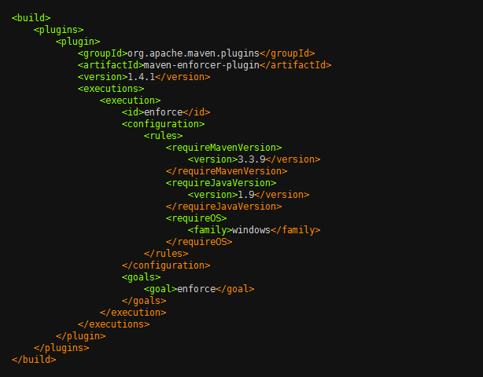
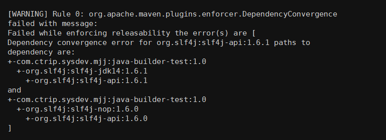
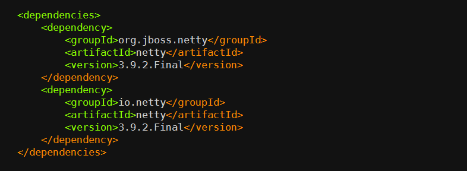
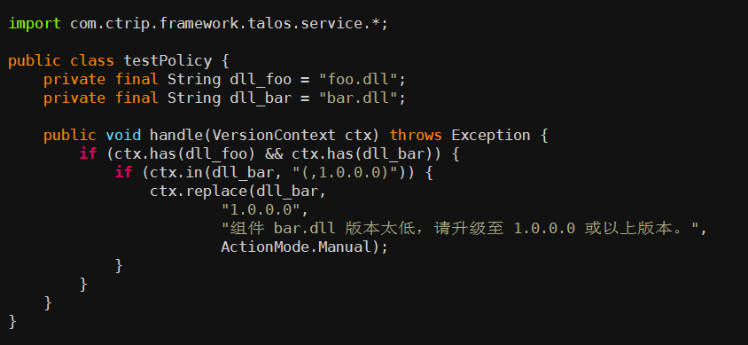

# 15 构建检测，无规矩不成方圆

在这个专栏的第5篇文章《手把手教你依赖管理》中，我介绍了构建 Java
项目的一些最佳实践，同时也给你抛出了一个问题：如果用户偷懒不遵循这些规范该怎么办？

所谓没有规矩不成方圆，构建是持续交付过程中非常重要的一步，而好的构建检测则可以直接提升交付产物的质量，使持续交付的流水线又快又稳。所以，也就有了
Maven 构建中的大杀器：Maven Enforcer 插件。

## 什么是 Maven Enforcer 插件？

Maven Enforcer 插件提供了非常多的通用检查规则，比如检查 JDK 版本、检查
Maven 版本、检查依赖版本，等等。下图所示就是一个简单的使用示例。

上述的配置会在构建时（准确的说是在 validate 时）完成三项检查：

-   requireMavenVersion检查 Maven 版本必须大于 3.3.9；
-   requireJavaVersion检查 JDK 版本必须大于等于 1.9；
-   requireOS检查 OS 必须是 Windows 系统。

如果你使用 Java 1.8， Maven 3.3.3， 在 Linux 上构建，
便会出现如下的错误：

-   Rule 0: org.apache.maven.plugins.enforcer.RequireMavenVersion failed
    with message: Detected Maven Version: 3.3.3 is not in the allowed
    range 3.3.9.
-   Rule 1: org.apache.maven.plugins.enforcer.RequireJavaVersion failed
    with message: Detected JDK Version: 1.8.0-77 is not in the allowed
    range 1.9.
-   Rule 2: org.apache.maven.plugins.enforcer.RequireOS failed with
    message: OS Arch: amd64 Family: unix Name: linux Version:
    3.16.0-43-generic is not allowed by Family=windows

从而导致构建失败。

那么，是否有办法在所有应用的构建前都执行Enforcer的检查呢。

我在专栏的第5篇文章《手把手教你依赖管理》中，也已经介绍了在携程内部，一般
Java 应用的继承树关系，每个项目都必须继承来自技术委员会或公司层面提供的
super-pom。携程在 super-pom 之上又定义了一层 super-rule 的 pom，这个pom
中定义了一系列的 Enforcer 规则。 这样，只要是集成了 super-pom
的项目，就会在构建时自动运行我们所定义的检查。

也许你会问了， 如果用户不继承 super-pom
是不是就可以跳过这些规则检查了？是的， 继承 super-pom 是规则检查的前提。

但是，我们不会给用户这样的机会， 因为上线走的都是统一的构建系统。

构建系统在构建之前会先检查项目的继承树，继承树中必须包含 super-pom，
否则构建失败。并且，构建系统虽然允许用户自定义 Maven
的构建命令，但是会将 Enforcer
相关的参数过滤掉，用户填写的任何关于Enforcer的参数都被视为无效。Enforcer会被强制按照统一标准执行，这样就保证了所有应用编译时都要经过检查。

因为携程的构建系统只提供几个版本的 Java 和 Maven，并且操作系统是统一的
Linux
CentOS版本，所以就不需要使用之前例子中提到的三个检查，一定程度的缩小标准化范围，也是有效的质量保证手段。

了解了Maven Enforcer插件，我再从Maven
Enforcer内置的规则、自定义的Enforcer检查规则，以及构建依赖检查服务这三个方面，带你一起看看构建监测的"豪华套餐"，增强你对交付产物的信心。

## 丰富的内置的 Enforcer 规则

Maven Enforcer
提供了非常丰富的内置检查规则，在这里，我给你重点介绍一下bannedDependencies
规则、dependencyConvergence 规则，和banDuplicateClasses 规则。

**第一，bannedDependencies 规则**

**该规则表示禁止使用某些依赖，或者某些依赖的版本**，使用示例：

该代码检查的逻辑是，只允许使用版本大于等于 1.8.0 的 org.slf4j:slf4j-api
依赖，否则将会出现如下错误：

bannedDependencies 规则的常见应用场景包括：

1.  当我们知道某个 jar
    包的某个版本有严重漏洞时，可以用这种方法禁止用户使用，从而避免被攻击；

2.  某个公共组件的依赖必须要大于某个版本时，你也可以使用这个方法禁止用户直接引用不兼容的依赖版本，避免公共组件运行错误。

**第二，dependencyConvergence 规则**

在《手把手教你依赖管理》一文中，我介绍了Maven
的依赖仲裁的两个原则：最短路径优先原则和第一声明优先原则。

但是，Maven
基于这两个原则处理依赖的方式过于简单粗暴。毕竟在一个成熟的系统中，依赖的关系错综复杂，用户很难一个一个地排查所有依赖的关系和冲突，稍不留神便会掉进依赖的陷阱里，这时
dependencyConvergence 就可以粉墨登场了。

**dependencyConvergence规则的作用是： 当项目中的 A 和 B
分别引用了不同版本的C时， Enforce 检查失败。**
下面这个实例，可以帮你理解这个规则的作用。

org.slf4j:slf4j-jdk14:1.6.1依赖了 org.slf4j:slf4j-api:1.6.1， 而
org.slf4j:slf4j-nop:1.6.0依赖了
org.slf4j:slf4j-api:1.6.0，当我们在构建项目时， 便会有如下错误：

这时就需要开发人员介入了，使用 dependecy 的 exclusions
元素排除掉一个不合适的版本。 虽然这会给编程带来一些麻烦，
但是非常必要。因为，我始终认为你应该清楚地知道系统依赖了哪些组件，
尤其是在某些组价发生冲突时，这就更加重要了。

**第三，banDuplicateClasses 规则**

**该规则是 Extra Enforcer Rules 提供的，主要目的是检查多个jar
包中是否存在同样命名的 class，如果存在编译便会报错。** 同名 class
若内容不一致，可能会导致
java.lang.NoSuchFieldError，java.lang.NoSuchMethodException
等异常，而且排查起来非常困难，因为人的直觉思维很难定位到重复类这个非显性错误上，例如下面这种情况：

org.jboss.netty包与io.netty包中都包含一个名为NettyBundleActivator的类，另外还有2个重复类：spring/NettyLoggerConfigurator
和 microcontainer/NettyLoggerConfigurator。

当激活了 banDuplicateClasses 规则之后，Enforcer检查，便会有如下的报错：

通常情况下，用户需要排除一个多余的 jar
包来解决这个问题，但有些情况下两个 jar
包都不能被排除，如果只是个别类名冲突了，那么可以通过 ignoreClasses
去忽略冲突的类，类名可以使用通配符（\*），如:
org.jboss.netty.container.\*。

但是，用户不能随意更改这个配置，因为它必须得到一定的授权，否则随意忽略会产生其他不确定的问题。因此我们将这个插件做了一些改动，通过API来获取
ignoreClasses 的内容。当用户有类似的需求时，可以提交 ignoreClasses
，但必须申请，经过 Java 专家审批之后才可忽略掉。

## 自定义的 Enforcer 检查规则

除了上述的官方规则，实际上携程还做了若干个扩展的规则，如：

-   CheckVersion，用于检查模块的版本号必须是数字三段式，或者带有
    SNAPSHOT 的数字三段式；

-   CheckGroupId，用于检查 GroupId
    是否符合规范，我们为每个部门都分别指定了GroupId；

-   CheckDistributionManagementRepository，用于检查项目的
    distributionManagement 中的 repository
    节点，并为每个部门都指定了他们在 Nexus 上面的 repositroy；

-   CheckSubModuleSaveVersion，用于检查子模块版本号是否与父模块版本号一致。

以上，便是携程基于 Maven Enforcer
在构建检查上的一些实践，你可以借鉴使用。

但是，有时候 Maven Enforcer 也无法满足我们所有的需求，比如，它无法完成非
Java 项目的检查。因此，我们还有一个通用的依赖检查服务。

## 构建依赖检查服务

其他语言， 比如 C#，NodeJS 等，没有 Maven Enforcer
这样成熟的工具来做构建时的依赖检查。对于这类语言我们的做法是：构建后，收集该项目所有的依赖及其版本号，将这些数据发送给依赖检查服务
Talos，Talos
根据内置的规则进行依赖检查。Talos是一套携程自研的，独立的，组件依赖检查系统，其中包含的检查逻辑，完全可以自由定义。

而且，Talos依赖检查的逻辑更新非常灵活，可以直接在平台内使用 Java
代码在线编写检查逻辑，提交后便可实时生效。

以下是一段 .NET 项目检查逻辑的示例代码：

该逻辑的含义是： 当项目的依赖存在 foo.dll 和 bar.dll 时，bar.dll
的版本号必须大于 1.0.0.0。看， 是不是非常方便快捷通用！

这样一套组合拳下来，构建检测以及项目依赖的问题已不再那么让人望而生畏了。因此，工欲善其事必先利其器，
好的工具可以解放大量的生产力，最重要的是构建检测后的交付让你我更有信心了。有条不紊的流程与规范，就像一列高速列车下的枕木，时刻保证着整个系统稳定而可靠地推进。

## 总结与实践

我围绕着构建检测，和你一起学习并介绍了：

1.  Maven Enforcer 插件可以帮我们更好地完成编译检测；

2.  可以使用内置的 Maven Enforcer 规则，覆盖常规检测；

3.  可以使用自定义 Maven Enforcer
    检查规则的方式，增加版本号规则等的检查；

4.  Maven Enforcer
    之外，你还可以自己丰富一些例如依赖版本检测这样的服务，以提高检测效果。

Maven Enforcer 提供了非常丰富的内置检查规则，感兴趣的话，你可以通过
<https://maven.apache.org/enforcer/enforcer-rules/index.html> 以及
<http://www.mojohaus.org/extra-enforcer-rules/>
逐个尝试这些规则，并说说哪些规则是你工作总最最需要的。

欢迎你给我留言。
