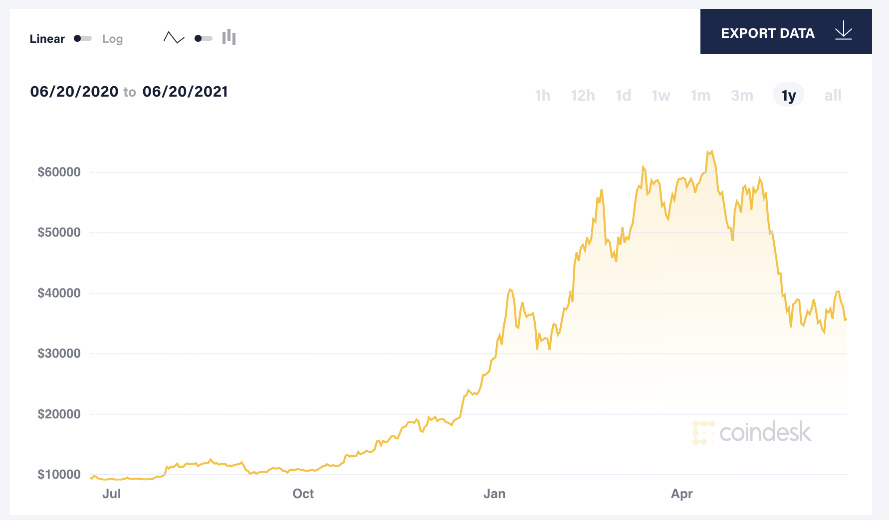
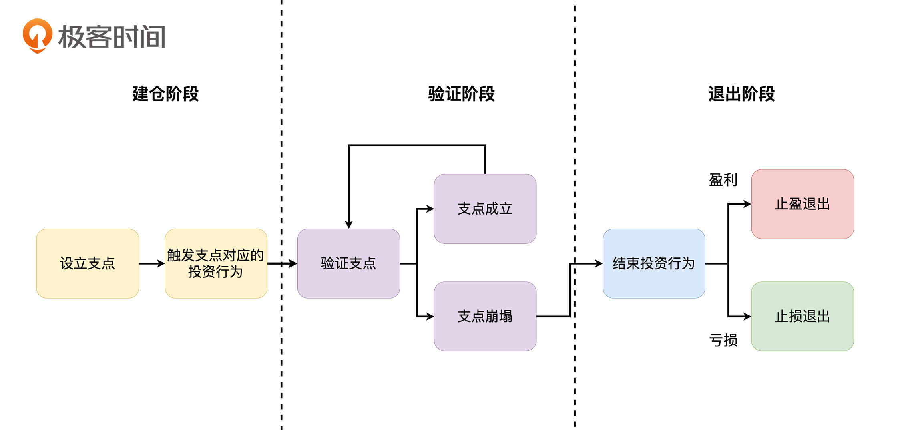
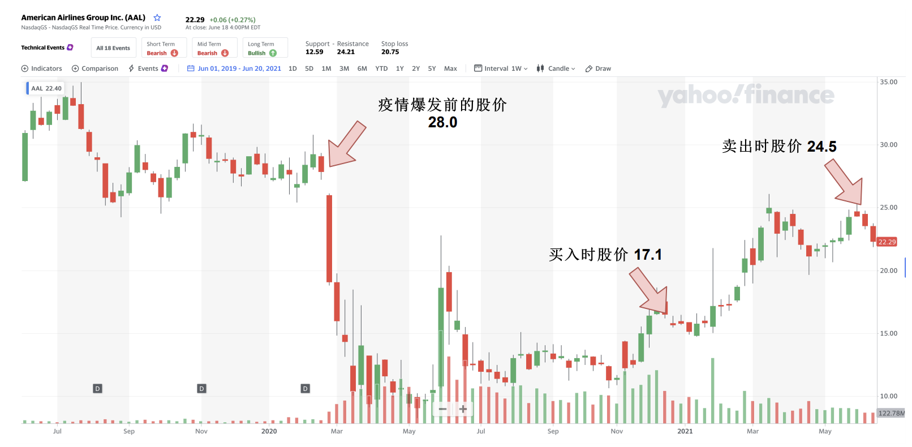

# 05 支点投资法：主动投资是讲逻辑的！

你好，我是王喆。今天我想跟你讨论这个问题：在投资理财过程中，如何主动出击，赚取超额的收益？

在前面的两讲，我们学习了资产配置的概念，还了解了几个易于操作、收益稳健的经典投资组合。合理的资产配置是我们"投资理财塔"的基石。只要你有足够的定力，就可以通过简单的资产配置策略，享受长期稳定的收益。

但有的同学可能会说："我觉得永久组合6.8%的年化收益还是太低了。我想通过投资来赚到足够的钱，实现我财富自由的梦想。"

我首先要纠正的是，**长期稳定的6.8%的年化收益其实是一个非常优秀的收益率**，而能够不受诱惑，十几年如一日地坚持永久组合的配置，本身就是一件极难做到的事情。

至于"财富自由"，我想只有在合理的资产配置基础上，依照非常严密的逻辑来进行主动投资，并长期进行投资实战训练，才有可能实现这个目标。除此之外的任何"暴富"想法都是不切实际的。

那么这一讲，我就和你聊聊**如何主动出击，寻求超额的年化收益。**

## 投资公理：投资是讲逻辑的

刚才我们提到，要想进行主动投资，就必须依照非常严密的投资逻辑。这就涉及到投资中的一个本质问题：**我们所有投资行为的出发点到底是什么？**

有的同学说：我最近投资比特币赚了不少钱，因为我一直跟着一个币圈大佬，他怎么投，我就怎么投。那么这位同学的出发点就是"跟投大牛"。

有的同学说：我最近又买了很多茅台的股票，因为我看茅台已经从最高点跌下来不少了，价格足够便宜。那这位同学的出发点是"抄底"。

还有同学说：我最近又买了不少A股的指数基金，因为我看A股大盘又开始上涨了。那他的出发点就是"追涨"。

这些同学的出发点都对不对呢？对，也不对。说对，是因为他们都能给自己的投资找到一个理由；说不对，是因为他们找到的理由都太过片面：一没有严格的数据和丰富的经验支撑，二没有严密的投资逻辑指导后续的投资行为。

其中，第二点是更加重要的。我在跟几位专业投资人交流时，也常聊到这点，对此我们达成了共识：**投资行为的出发点有且只有一个，那就是"严谨的投资逻辑"。**你可以把这句话看作投资领域的公理。

## 个人情绪是所有投资者的"公敌"

在哲学领域，有一个非常重要的概念叫EGO，即"自我"或"自我意识"。如果说按照严谨的逻辑进行投资是投资者必须遵循的公理，那么包含着大量个人情绪的EGO就是投资者的公敌。

具体来说，在投资中个人情绪会有什么样的消极影响呢？也许你没有太直观的感受，那我就举个例子。普通投资者常常会有和下面类似的投资行为。

2020年下半年的时候，无论国内还是国外，关于新能源的投资都非常火热。特斯拉、蔚来汽车、理想汽车，它们的涨幅都在10倍以上。于是，很多人坐不住了，有人眼红，有人兴奋，有人后悔。在种种个人情绪的驱使下，大部分人都顾不上太多，想的只是一定要赶上新能源这趟车，于是纷纷打开券商APP，抓紧下单买入。

我们先不说这样的投资能不能赚到钱，你的投资动机就已经注定了这笔投资是毫无价值的。赚钱了，只会驱使你在错误的路上越走越远，直到下一次亏钱；亏钱了，带给你实打实的损失，让你怀疑否定自己。我把这些由人类EGO触发的投资叫作"**无效投资**"。

再拿我身边人的投资行为举个例子。2021年上半年，以比特币为代表的数字货币经历了一波急速上涨并大幅回调的行情。2021年1月，我的一位同事在比特币30000美元附近的点位入场，他的本意是趁着上涨趋势赚一波"快钱"，然后快速退场。

这个出发点其实没有问题，跟着大趋势走，短线操作一波离场就好。但到了3月份，比特币上涨到60000美元附近时，他却推翻了自己的投资逻辑，转而去看好比特币的长期发展。他说，随着越来越多企业用比特币支付，比特币将迎来真正的牛市，所以选择继续加仓比特币。

还是那句话，我们先不管这样的投资能不能赚到钱，先看背后的投资动机。这样随意改变自己投资逻辑的行为，只可能有一个结果，那就是毫无逻辑的止盈和止损。也就是说，投资者根本不知道自己为什么赚到钱，或者亏了钱。我把这样的投资者称为"**神经错乱**"的投资者。

截止到2021年6月末，比特币已经跌回了35000美元，由于高位加仓的原因，这位同事的利润已经由正转负。这时候我们要担心的是，他会不会再次"神经错乱"，又不再看好比特币的长期价值，选择抛出了。在专业的投资者眼中，这样"神经错乱"的投资者是非常高价值的韭菜。

不管是由人类EGO触发的"无效投资"，还是随意改变投资逻辑的"神经错乱"行为，它们对于财富管理来说都毫无意义。甚至，这些行为都称不上是一次"主动出击"，顶多算是拿自己的钱扔了一回骰子，玩了一把还挺刺激的游戏。

那到底什么才是真正的"主动投资"呢？什么才是所谓的有逻辑的投资呢？下面我就跟你讲一种典型的有逻辑且可行的投资方法，**支点投资法**。

## 支点投资法

支点投资法是我和李腾总结了十几年的投资经验后提出的，它不复杂，足够基础且实用。我建议你认真听一听下面的每一句话，因为支点投资法是我们这门课所有主动投资所遵循的投资框架。

**所谓"支点投资法"，就是要先为你所有的投资行为寻找一个逻辑支点，之后随着时间的推移，不断去验证这个支点还存不存在。一旦这个支点消失，就要毅然决然地选择结束这次投资行为。**

这里，我用图示的方式把支点投资法的要点描述了出来，你可以对照着这个流程图来听我的讲解。

支点投资法主要分为三个阶段，分别是"建仓阶段""验证阶段"和"退出阶段"。

"**建仓阶段**"的主要任务是寻找这次投资行为的逻辑支点，然后根据这个支点，触发相应的投资行为。

"**验证阶段**"则是要不断验证你的投资支点，如果支点的逻辑还成立，就持续持有当前投资标的；如果支撑投资支点的条件已经不存在了，那么就证明当初的投资行为已经没有支撑了，就要进入投资的退出阶段。

最后的"**退出阶段**"，需要的是你坚定的执行力，不管该次投资是盈利，还是亏损，只要投资支点不存在了，都应该坚定不移地退出。退出时如果你处于盈利状态，就是"止盈退出"，这次投资行为就是成功的。而如果处于亏损状态，就是"止损退出"，这次投资行为虽然失败了，但由于你清楚地知道亏损的理由是什么，这次投资过程就成为了提升投资水平的宝贵经验。

下面，我来举一个应用"支点投资法"的典型例子。2021年初到2021年6月，我基于"美国疫情终将好转"的支点投资了美国航空（AAL），获得了43.3%的收益，这是一次典型的执行支点投资法的案例。

大家都知道，新冠疫情的爆发对全球航空业的打击是致命的。从图中的股价走势可以看到，在美国新冠疫情于2020年3月全面爆发后，以"美国航空"（AAL）为代表的航空股从28块直接跌到了最低时的10块左右。之后由于美联储疯狂印钱，股价短暂回升，但仍未走出低谷。

时间到了2021年元旦前后，这时候我捕捉到了一个很适合作为投资支点的机会，那就是辉瑞、摩德纳，以及国内的国药等新冠疫苗陆续通过了临床三期测试，可能会在短期内上市。要知道这时候美国的疫情正处于最顶峰的时候，航空业也处于最低谷。那么随着疫苗的上市，疫情减弱，航空股能否重回疫情前的价格呢？

我当时的判断是这样的：如果疫苗成功阻击疫情，那么航空股必然会有相应的反弹；如果疫苗效果不好，情况也不会比现在更糟，投资的损失也不会过大。那么基于这样的投资支点，我在2021年的元旦前后以17.1的价格买入美国航空。

时间来到2021年6月，美国疫苗覆盖率已经超过60%，疫苗的效果也非常好，新增患者大幅下降，加州甚至已经宣布从6月15日开始，重启所有商业活动。因此，航空股的股价也像我当初估计的那样大幅上涨。

但是要注意的是，到现在为止，**当初的投资支点已经消失了**，因为美国航空的股价已经恢复到接近疫情前的价格，美国疫情的最糟糕时刻也已经过去，能够支撑航空股价格修复的支点已经不存在了。所以，我在2021年6月3日以24.5的价格卖出该支股票，这半年的收益率为43.3%。

这是一次完整的应用支点投资法的投资行为。希望你能够对照支点投资法的流程图，厘清我是怎样设立投资支点，验证投资支点，并最后止盈退出的。

当然，在具体的投资行为中，还有调研、选股、择时等诸多会影响投资结果的细节问题。但只要你在每次主动投资时都遵循支点投资法，就一定能不断丰富自己的经验，提高自己发现投资支点的能力。在投资之路上，只有方向正确，我们的所有努力才是有意义的，这就是我一再强调投资支点重要性的原因。

## 止盈和止损的本质是什么？

有了支点投资法的框架，我们就可以在这个基础上，很好地回答一个投资领域的关键问题：**到底如何做止盈和止损？**如果你认识不清这个问题，就永远无法真正把钱赚到自己的口袋里。因为你即使在一次两次投资中侥幸赚到了钱，也会因为没有合理的止盈止损体系，在未来的投资中凭实力把钱亏回去。

那么"止盈"和"止损"的本质到底是什么呢？表面看起来，这是投资中两种截然不同的结局，但它们其实在本质上是统一的。因为**无论是"止盈"还是"止损"，都在做同一件事，就是"退出"**。而"退出"的原因，有且只有一个，那就是你当初那个投资支点的崩塌。

在这里，我们再从三个不同的角度，用三句话来"翻译翻译"什么叫作"**投资支点的崩塌**"。

1.  为了进行一次主动投资，你首先要做的肯定是做出一个投资假设，来指导你的投资行为。在投资行为发生后，如果最初的这个投资假设已经不成立了，那么就应该选择退出，不管是止盈还是止损。
2.  在投资行为发生之前，你一定要有一个投资理由，或者说理论支撑。当这个支撑不存在的时候，就应该止盈或者止损。
3.  我们在投资开始时，其实总会为我们的投资找寻一个支点，你之后所有的行为都是建立在这个支点之上的。当这个支点消失的时候，你难道不应该退出重来吗？

显然，这三句话说的都是一回事，重要的事情说三遍，就是为了加深你的印象。道理很简单，难的是真正内化到自己的认知体系中，并在你的投资实践中坚定地执行。在这里，你可以再翻出之前的支点投资法流程图看一看，我相信你会对止盈和止损的时间点有更好的把控。

## 小结

今天这一讲，我们讨论了一个关键的问题：在默认的资产配置方案基础上，如果我们想主动追求超额收益，应该怎么做？答案就是支点投资法。支点投资法是我们这门课所有主动投资所遵循的投资框架，所以非常重要，我把相关的要点列在了下面，希望你能够牢记：

1.  永久组合6.8%的年化收益其实是一个非常优秀的收益率，想要通过主动投资获得超过它的收益率，并不是一件容易的事情；
2.  要想通过主动投资真正赚到钱，就必须遵照"**严谨的投资逻辑**"；
3.  "逻辑"和"情绪"是一对严格对立的敌人，在投资过程中，一定要避免由情绪驱使的"无效投资"和"神经错乱"现象；
4.  "支点投资法"分为**"建仓""验证""退出"**三个阶段。它的大致过程是：在投资行为发生之前，先寻找一个逻辑支点。之后，随着时间的推移，不断去验证这个支点还存不存在。一旦这个支点消失，就要毅然决然地选择结束这次投资行为；
5.  **止盈和止损的本质是统一的，就是在投资支点崩塌之后的退出行为**。退出时盈利，则是止盈操作；退出时亏损，则是止损操作。

## 思考题

掌握了支点投资法，是不是就意味着我们一定能盈利？一个掌握支点投资法的新手，和一个成熟运用支点投资法的大神，他们的主要差距会是什么呢？

欢迎你在留言区和我交流讨论，我们下一讲见。
