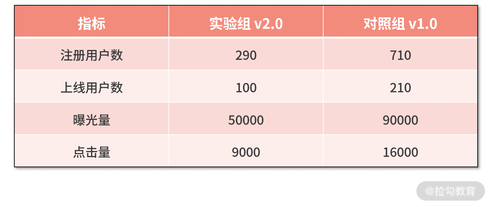
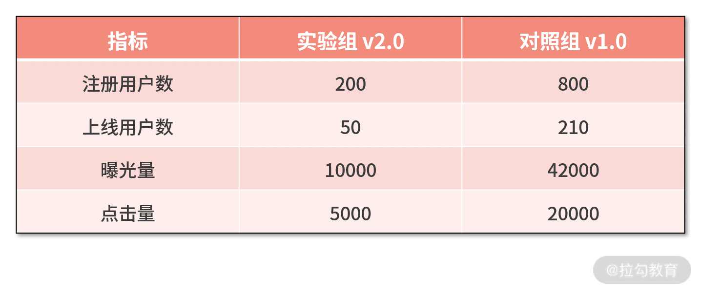

# 11 灰度实验：如何设计灰度实验并计算实验的收益？

在之前的课时，我们对问题进行了形式化定义，并利用一个很牛的算法进行了最优化求解，之后我们便打造了一个全新的策略优化解决方案。

而接下来，你需要面对的问题，就是证明这个新的解决方案是有效的，是优于之前的解决方案的，而这个证明方法就是做
AB 实验。所以，这一讲我们就来说说 AB 实验的那些事。

### 灰度实验

在实际的工作中，通常需要进行灰度实验来验证某个新系统相对于旧系统的收益。**灰**是介于黑和白之间的颜色，可以理解为是个中间态。灰度实验，也可以称作为
AB 实验、灰度发布，名称虽然不同，但本质上是没有什么区别的。

AB
实验的理念，是构造一个平行世界，去观察两个世界的不同。具体来说就是，把线上的流量随机地拆分为具有同样分布的实验组和对照组，然后将新旧两个系统分别作用在这两组流量上，去观察业务指标的变化。

我们举个例子，假设大迷糊负责某个 App 信息流的推荐系统算法的开发。

原本推荐系统的版本号是
v1.0，大迷糊经过对算法和策略的功能迭代，开发了推荐系统
v2.0。接下来，他需要测试 v2.0 相比 v1.0
是否有效果的提升。如果没有提升，则说明开发失败；如果有提升，则开发成功，并可以考虑在线上用
v2.0 来代替 v1.0。

-   为了测验证 v2.0 相比 v1.0 是否有效果的提升，大迷糊从数据库里筛出了 N
    个用户。
-   接着，大迷糊通过某个随机算法，把这 N
    个用户随机地拆分为人数相等的两组，分别命名为实验组和对照组，每组 N/2
    个用户。
-   下一步，大迷糊用 v2.0 的推荐系统给实验组的 N/2 个用户推荐信息，再用
    v1.0 的推荐系统给对照组的 N/2 个用户推荐信息。
-   经过了几周后，大迷糊分别计算了实验组和对照组用户的业务指标，可能有点击率
    CTR、阅读量 PV、UV、用户活跃度等指标。
-   最终，大迷糊发现，实验组用户的各项指标都优于对照组用户的指标。

这就证明 v2.0 的效果要优于 v1.0 的效果，因此 v2.0 系统成功代替了 v1.0
的系统，并在线上环境中全量生效。

#### 灰度实验的两个关键步骤

虽然，大迷糊全量 v2.0
推荐系统的流程很复杂，但灰度实验本质上只有两个大步骤。

-   第一步，分流。即如何获得实验组和对照组的两波流量。
-   第二步，评估。即用什么指标来分别衡量实验组和对照组的效果。

可以说，这两步将直接决定灰度实验的成败。

你可能会困惑，决定灰度实验成败的不应该是新系统吗？v2.0
开发得好不好，才应该是决定灰度实验成败的因素呀。

其实，v2.0
的开发是上一个篇章中"形式化定义"和"最优化求解"要解决的问题；而灰度实验要解决的问题，是假设
v2.0 开发后，如何客观、量化地计算 v2.0 相比于 v1.0 的效果。

### 分流原理

分流的理念，是构造一个假想的平行世界，用以分别观察两个世界中样本的表现。

举个例子，大迷糊想论证推荐系统 v2.0 相对于推荐系统 v1.0
的效果。理论上最完美的做法是，在 1月1日 将 v1.0
部署在线上，观察用户在1月1日～1月31日整体的阅读表现；接着，再让时间回退到
1月1日，将 v2.0
部署在线上，再观察用户在1月1日～1月31日整体的阅读表现。可惜的是，平行世界并不存在，我们永远也无法让时间回退。

因此，人们想到一个替代办法，那就是在现实世界中，分别构造两波差不多的集合（也可以称作流量），来拟作两个平行世界，分别评测两个版本的推荐系统的效果，这就是分流。

网络上有这样一个段子。一个生物专家把一个完好的蜘蛛放在地上，拿个锣一敲，蜘蛛跑了；然后将蜘蛛的腿拔光，将其放在地上，再拿个锣一敲，咦，蜘蛛没反应！于是得到结论：蜘蛛的听觉器官在腿上。

在这个实验中，两组实验的蜘蛛一个有腿、一个没有腿，很显然犯了分流不随机的错误。可以说，分流方案的好坏，将直接影响评估结果的对错。常见的分流方法包括下面几种：

-   按用户分流，即把用户随机拆分为两组；
-   按时间分流，例如上半月上线 v1.0，下半月上线 v2.0；
-   按地区分流，例如北边的用户上线 v1.0，南边的用户上线 v2.0；
-   组合分流，将上面的方法组合在一起使用。

分流的底线要求是保持随机性，但到底按照上面哪个方法去分流，则需要根据实际情况来选择。我们再举几个工作中的例子。

-   案例一 大漂亮论证推荐系统 v2.0 相对于推荐系统 v1.0 的效果。

她采用了按地区分流，即北方人上线 v1.0，南方人上线
v2.0。这显然不是个好方法。原因是，北方人和南方人的喜好并不一样。当你的
AB
实验论证有正向收益时，你很难证明收益的来源，是喜好的不同，还是系统升级带来的效果。

-   案例二 大聪明负责公司火车票业务的系统开发。

他的实验采用了按时间分流，即二月份采用老系统，三月份采用了新系统，来对比系统之间的稳定性效果。这显然也不是个好方法，因为二月份包含了春节，访问量天然就大，性能压力也就大。所以新系统在三月表现出性能好，也许不是因为系统本身性能的提升，而是因为三月份访问量下降。

**因此要想做好分流，除了要满足一定的随机性外，更要符合人们认知的常理。**

### 分流的实现

分流的实现一般需要借助一个随机函数，再通过这个随机函数的输出结果，来判断分流的结果。假设待分流的样本有
1000 个，我们希望把样本随机分拆为 7:3
的两组。对每个样本，则需要调用随机函数得到一个随机值，再根据这个随机值对样本进行打标。

我们给出下面的一段代码：

    import random

    exp = []

    con = []

    for i in range(1000):

        value = random.randint(1,100)

        if value <= 30:

            exp.Append(i)

        else:

            con.Append(i)

    print len(exp)

    print len(con)

我们对代码进行走读：

-   第 3～4 行，用两个数组来保存实验组和对照组；
-   第 5～10 行，对 1000 个样本进行循环；
-   对于每个样本，第 6 行得到一个 1～100 的随机数；
-   第 7～10 行，根据这个随机数与 30
    的大小关系，来判断样本到底应该归为实验组还是对照组。

这样就实现了按比例的随机分组，代码执行的结果如下图：

\![image(assets/CgqCHl_Ar3mAZ-X0AABHe97oDUs202.png)

我们分为了实验组 290 人，对照组 710 人。

### AB 实验的评估

当我们分好了流量之后，就要对实验组应用新系统、对对照组应用老系统，来开展
AB 实验。那么，当经历了一段时间后，如何来对 AB 实验的结果进行评估呢？

**这里的关键问题就是指标的计算。指标，就是说用什么变量来衡量观察的效果；以及由于分流带来样本集合的缩小，这些指标在样本子集上又该如何计算。**

我们举个例子，大漂亮想论证推荐系统 v2.0 相对于推荐系统 v1.0 的效果。

她采用用户随机分流的方式，以 3:7 的分流比例，开展 AB 实验，其中实验组有
30% 的用户，对照组有 70% 的用户，假设分流过程完全正确、没有偏差。

经过了一周的时间后，她观察到如下的原始数据：

接下来，如何衡量实验效果的好坏呢？

> 一个误区，是实验组点击量为 9000 小于对照组的
> 16000。于是得到结论，新系统效果不如老系统。这很显然是不对的，因为实验组只有
> 290 人，而对照组有 710 人。流量的不平衡天然就会造成点击量的不同。

**因此 AB
实验的指标中有这样一个原则："量"指标一定要对流量进行归一化，得到"率"指标后，才可以对比。**

基于这个原则，我们可以重新设计如下几个实验评估指标：

-   CTR（点击通过率）= 点击量 / 曝光量
-   上线率 = 上线用户数 / 注册用户数
-   人均曝光量 = 曝光量 / 注册用户数
-   人均点击量 = 点击量 / 注册用户数

并将数据整理成下表：

根据该表实验对比的结果，可以得到以下结论：

-   v2.0 的推荐系统相对于 v1.0 的推荐系统，点击率提高了 0.2
    pp，有正向收益，但并不算多；
-   然而，点击率的小幅度提高，带来了用户留存、复访的大幅度提高，体现在上线率提高了
    4.9 pp；
-   上线率提高，又让人均曝光量提高了 45 篇，让人均点击量提高了 8 篇。

可见，推荐系统的迭代，换来了点击率的提高，点击率的提高又带来了更多的用户留存和复访，进一步带来了更多的用户曝光量和点击量。因此，v2.0
的推荐系统技术指标更优，并且带来了明显的业务收益。

### 小结

这一讲的核心就是评估效果，即当你完成了某个系统的迭代后，如何衡量新系统相比于就系统的收益是多少，这个过程便依赖灰度实验。

灰度实验的关键步骤包括两步，分别是分流和评估：

-   分流有很多种方法，但一定要保证分流的随机性。
-   评估则需要把握好一个原则，那就是先把"量"指标按照流量归一化为"率"指标后，再来进行对比分析。

最后留一个课后作业：假设有下面的实验数据，请你试着去分析实验的效果。

欢迎你在评论区与我分享你的答案。

现在我们学习了通过灰度实验去验证评估效果，那么又如何证明我们实验效果的可信度呢？所以下一讲，我将向你讲解"12
\|
统计学方法：如何证明灰度实验效果不是偶然得到的？"带你将灰度实验进行到底。
