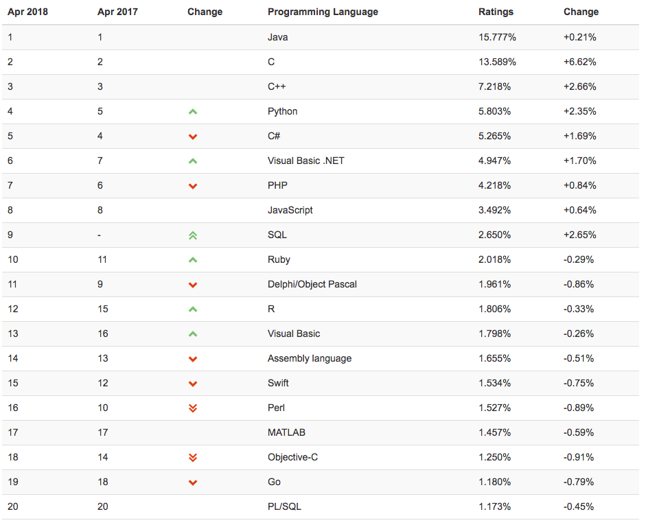

# 02 初惑：技术方向的选择

初入职场或还在校的同学想必都会有些共同的疑惑，比如："到底我该选哪个技术方向？""现在该学哪门语言？""未来
Java
语言的发展趋势如何？"这些问题的本质其实都是技术的投资决策问题，也即现在我该把时间精力花在哪个方向上，未来的收益才可能最大。

这个问题并不好回答，因为这个问题的本质和 "我现在应该投资哪只股票"
一样。没有人能回答好这个问题，我觉得最好的做法就是：从投资的出发点而非终点来选择一条路径。

至于这样选择的路径是否能在未来获得很好的收益，这是没法预测的。但选择技术方向和选择股票不同的是，只要你在这条路径上持续努力、学习与进步，基本可以保证能和
"大盘" 持平而不至于有亏损，但是否能取得超过 "大盘"
的收益，其实是看运气的。

## 选择语言

选择技术方向，从某种意义上讲就是选择语言。

虽然有一些流传的说法，类似于："语言并不重要，必要的时候可以在各种语言间自由切换。"但实际情况是，能做到自由切换的前提是你得对一门语言掌握到通透之后，再学习其他语言才可能触类旁通。

计算机程序语言虽然很多，但种类其实有限。2018 TIOBE
程序语言排行榜（见下图）上的前三位（Java、C、C++），本质上其实是一类语言。但大部分人只能选择去熟悉并通透其中一种，因为这些语言背后都有庞大的生态圈。

2018 TIOBE 程序语言排行榜

要做到通透，只熟悉语言本身是远远不够的，其实是要熟悉整个生态圈。而三门语言中最年轻的
Java
都有二十多年历史了，足够你耗费数年时光去熟悉其整个生态圈，而且目前其生态圈还处在不断扩张的状态，展现出一种蓬勃的生命力。

那么，要是我来选，我会如何选择语言呢？我会选择那些展现出蓬勃生命力的语言。

但其实十多年前我只是凑巧选择了
Java，它就像是被潮水推到我脚边的漂流瓶，顺手捡了起来。没想到居然蓬勃地发展了十多年，还没见衰退迹象。

那时的 Java 刚诞生不过七八年，和今天的 Go 语言很像。Go
语言在排行榜上的位置蹿升得很快，而且在云计算时代的基础设施上大放异彩，号称是：易用性要超越
PHP，而性能要超越 Java。

那么在 Java 之前我学的是什么？是 Visual Basic、ASP 和 Delphi / Object
Pascal。我想今天不少年轻的程序员都未必听过这些语言了。但神奇的是，在
TIOBE 的排行榜上，VB 加了个 .NET 排名竟在世界最广泛的 Web 语言 PHP
和JavaScript 之上。而十五年前我用的 Delphi / Object Pascal 居然落后
JavaScript 也不远，且远高于 Go、Objective-C，力压 Swift。

这些老牌语言还值得学吗？当然不值得了。因为它们早已进入暮年，没了蓬勃的生命力。但为什么排名还这么高？也许是因为它们也曾有过蓬勃生命力的热血青春，留下了大量的软件系统和程序遗产，至今还没能退出历史的舞台吧。

美国作家纳西姆·塔勒布（《黑天鹅》《反脆弱》等书作者）曾说：

> 信息或者想法的预期寿命，和它的现有寿命成正比。

而编程语言以及由它编写的所有软件系统和程序，本质就是信息了。换句话说就是，如果你想预测一门语言还会存在多久，就看看它已经存在了多久。存活时间足够长的语言，可以预期，它未来也还可能存活这么长时间。当然这一论断并不绝对，但它更多想说明越是新的语言或技术，升级换代越快，也越容易被取代。

这一点在 Delphi 这门语言上已经得到了体现，进入二十一世纪后，这种编写 C/S
架构软件的语言，居然还存活了这么久。

## 选择回报

选择技术方向，选择语言，本质都是一种投资。

我们为此感到焦虑的原因在于，技术变化那么快，就怕自己选了一个方向，投了几年的时间、精力，最后却被技术迭代的浪潮拍在了沙滩上。

按上面塔勒布的说法，越年轻的语言和方向，风险越高。一个今年刚出现的新方向、新语言，你怎么知道它能在明年幸存下来？所以，考虑确定性的回报和更低的风险，你应该选择有一定历史的方向或语言，也许不能带来超额的回报，但最起码能带来稳定的回报，让你先在这个行业里立稳脚跟。在此基础上，再去关注新潮流、新方向或新技术，观察它们的可持续性。

有一句投资箴言："高风险未必带来高回报。"在选择职业方向的路上，你甚至没法像分散投资一样来控制风险，所以选择确定性的回报，要比抱着赌一把的心态更可取。看看当前的市场需求是什么，最需要什么，以及长期需要什么。

比如，今天技术的热潮在人工智能、机器学习、区块链等上面，这是市场最需要的，而市场给的价格也是最高的。所以，你应该投入这里么？先别头脑发热，看看自己的基础，能否翻越门槛，及时上得了车吗？

世纪之初，互联网时代的到临，网络的爆发，你会写个 HTML
就能月薪上万。上万，似乎不多，但那时北京房价均价也才 5000 多啊。2010
年左右，移动互联网兴起，一年移动开发经验者的平均待遇达到了五到十年 Java
开发的水平。如今，你只会 HTML
基本找不到工作，你有五年移动开发经验和有五年 Java
开发经验的同学，薪资待遇也变得相差不多了。

关于技术，有一句流行的话："技术总是短期被高估，但长期被低估。"今天，在人工智能领域获得超额回报的顶级专家，实际数十年前在其被低估时就进入了这个领域，数十年的持续投入，才在如今迎来了人工智能的
"牛市"
，有了所谓的超额回报。所以，不妨投入到一些可能在长期被低估的基础技术上，而不是被技术潮流的短期波动所左右。

技术的选择，都是赚取长期回报，短期的波动放在长期来看终将被抵消掉，成为时代的一朵小浪花。

## 选择行业

搞清楚了语言、技术方向和回报的关系后，最后做出选择的立足点通常会落在行业上。

当你问别人该选什么语言时，有人会告诉你，你应该学习
JavaScript，因为这是互联网 Web
时代的通用语言，到了移动互联网时代依然通用，而且现阶段生命力旺盛得就像再年轻十岁的
Java。也有人告诉你也许从 Python
开始更合适，语法简单，上手容易。还有人告诉你，现在学 Java
找工作最容易，平均工资也蛮高。这各种各样的说法充斥在你的耳边，让你犹豫不决，左右为难。

一个问题就像一把锁，开锁的钥匙肯定不会在锁上。否则这个问题也就不是问题了，太容易就解开了，不是吗？所以，选择什么语言通常不在于语言本身的特性。

选语言，就是选职业，而选职业首先选行业。

先想想自己想从事哪个行业的软件开发；然后，再看看：这个行业的现状如何？行业的平均增速如何？和其他行业相比如何？这个行业里最好的公司相比行业平均增速又如何？最后，再看看这些最好的公司都用些什么样的技术栈和语言。如果你想进入这样的公司，那就很简单了，就选择学这样的技术和语言。

这样选择是不是太功利了？选择不是应该看兴趣么？注意，这里选择的前提可不是发展什么业余爱好，而是为了获得安身立命的本领，获得竞争的相对优势。而兴趣，就是这件事里有些吸引你的东西，让你觉这是
"很好玩"
的事。但有个通常的说法是："一旦把兴趣变成了职业也就失去了兴趣。"因为，职业里面还有很多
"不好玩" 的事。

兴趣能轻松驱动你做到前 50%，但按二八原则，要进入前
20%的高手领域，仅仅靠兴趣就不够了。兴趣给你的奖励是
"好玩"，但继续往前走就会遇到很多 "不好玩"
的事，这是一种前进的障碍，这时功利，也算是给予你越过障碍所经历痛苦的补偿吧。

以上，就是我关于技术方向选择的一些原则与方法。无论你当初是如何选择走上技术道路的，都可以再想想你为什么要选择学习一门编程语言，学习编程的一部分是学习语言的语法结构，但更大的一部分，同时也是耗时更久且更让你头痛的部分：学习如何像一个工程师一样解决问题。

有时这样的选择确实很难，因为我们缺乏足够的信息来做出最优选择。赫伯特·西蒙说："当你无法获得决策所需的所有信息时，不要追求最优决策，而要追求满意决策。"定下自己的满意标准，找到一个符合满意标准的折中方案，就开始行动吧。

而停留在原地纠结，什么也不会改变。

最后，亲爱的读者朋友，你当初是如何选择技术道路的呢？欢迎留言分享。-
