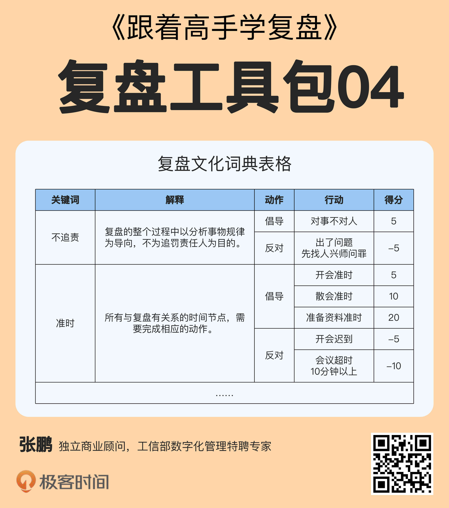

# 04 制度和文化：怎么营造复盘环境？

你好，我是张鹏。

从今天开始，我们进入到课程的第二部分，实操流程篇。

在[第2讲](https://time.geekbang.org/column/article/340198)，我已经介绍过，标准的复盘流程分为三个阶段，会前准备、复盘会议和会后执行。

但是，这一套标准的流程建立在团队内部已经对复盘建立了共识的基础上。如果大家都不认可复盘的价值，不愿意投入足够多的时间和精力来做复盘，那么你会发现，再怎么推都推不动这件事情。

所以要想让复盘顺利落地，不光要掌握复盘流程、工具和方法，也要**营造复盘的环境**。这就像种地，要想有好的收成，在施展耕作的经验之前，先要做好农田的养护。

那么，怎么营造复盘环境呢？具体来说分为两个层面，制度层面和文化层面。其实不只是复盘，但凡你想让一项新政策在管理上落地，都可以从这两个层面出发来思考问题。

## 制度层面

对于制度层面的设计，我想从三种不同的视角来介绍。

### 1. 中高层管理者：效率

首先是中高层管理者的视角。前段时间，一位高管朋友就跟我聊到他遇到的烦恼：

> 直播团队最近业绩不太理想，我让他们的Leader组织了一次复盘会，结果这个Leader就让每个成员轮流发言，介绍自己的工作，最后整个会议非常冗长拖沓。
>
> ## 而且，当时虽然总结了几点改进措施，但是等我半个月之后想起这件事，想要了解后续执行进度的时候，我发现不但需要专门一个一个找人去问，还要等对方临时整理材料，最后汇报的成果也不是很清晰。-
>
> 我就感觉这次复盘非常低效，不但耽误我很多的时间，而且还看不到什么效果。

其实这是中高层管理者面临的非常典型的问题。**因为他们的时间非常宝贵，往往都会养成高效推进、聚焦重点的工作习惯。**

所以，当他们想在整个公司或者某个业务部门推行复盘的时候，一定会关心**效率**，尤其是开会的效率和对齐同步的效率。

怎么才能让复盘会不那么冗长拖沓呢？让每个团队成员挨个发言的开会方式太低效了，一定要优化。

科学管理之父弗雷德里克·泰勒（Frederick W.
Taylor）在《科学管理原理》这本书提出了两个关键概念，**流程标准**和**专职管理**。

基于他的理念，我设计了两个方法。一个是**五步法**，用来高效地组织复盘会议，我会在第7讲详细介绍；五步法要依靠团队来执行，所以另一个方法是**三角法**，用来组建复盘团队、做好角色分工，我会在第5讲详细介绍。

怎么才能让中高层管理者方便地查看复盘之后的执行结果呢？对于中长期复盘，主要是通过**OKRAP工具**，我会在第11讲详细介绍；对于短期复盘，就要做好**归档和更新**工作，我会在第12讲详细介绍。

### 2. 小团队Leader：可控性

然后是3～10人小团队Leader的视角。做培训的时候，我曾经遇到很多小团队的Leader跟我请教类似的问题：

> ## 快到年底了，领导让我组织团队成员一起做个复盘。我把任务分发下去之后，他们都说工作太饱和，没时间做。催了好多次，才陆续收上了一些材料。-
>
> 超过截止时间才发的人有好几个，而且有些人发的材料一看就是没用心做，随便糊弄一下完事。我如果不管，他们以后更不把复盘当回事了；可要是上纲上线地惩罚，又有点小题大做。

这是小团队Leader面临的典型问题。**因为他们要为团队的业务结果负责，所以非常在意事情是不是按部就班，能不能稳定地产出结果。**

所以，当他们在接到复盘任务的时候，一定会关心**可控性**。

#### 优先级

怎么帮团队成员处理好本职工作和复盘之间的冲突呢？这其实是工作事项优先级排序的问题，有4条通用的方法：

1.  让团队成员判断各项工作的优先级，先做"重要性"更高的事情。
2.  提供求助通道，比如无法确定优先级时，应该主动向Leader求助。
3.  建立督导机制，定时检查和确认每个人的工作优先级。
4.  平时就要养成良好的工作习惯，为一些常见的临时性工作做好准备。

关于工作优先级，我补充说明一下。很多人都学过"紧急重要矩阵"，优先级最高的是重要且紧急。

我想告诉你的是，这样做可能会让你掉进陷阱。如果你总是做重要又紧急的事情，慢慢地你会发现重要又紧急的事情越来越多。其实这是一个错觉，真实的情况是你慢慢地变得只会按照紧急排序，重不重要已经很难分清楚了。

其实对于工作比较饱和的岗位来说，根本没有充足的时间和精力去做4个象限的优先级判定（而且还有及时更新，比如之前不紧急的事过一会儿也许就变得紧急了）。可行性高的做法是，**按照重不重要这一个维度去排就行了**。

更何况，每天的工作中本来就应该预留一定的时间给临时性工作。而对常见的临时性工作，平时就要做好资料的整理工作，这样事到临头才不会慌了手脚、顾此失彼。

#### 奖惩措施

本职工作比较好约束，直接跟绩效挂钩。但是对于临时性的非本职工作，只能通过一些小型的奖惩措施来影响。这个事情看似简单，不过也有一些细节需要提升。

一般来说，对于确定性标准的行为，我建议用"处罚"来约束；而对于不确定性标准，我建议用"奖励"来激励。

举个例子，比如复盘会迟到，或者没有按时提交自己负责的材料，这就是违反确定性标准的行为，怎么办呢？你可以制定一个惩罚制度，每违反一次要贡献20元团建经费。

而随便应付复盘工作，就属于违反不确定性标准的行为。这个情况，处罚是不合适的，毕竟很难评估一个人是能力不行，还是意愿度不够。

这时候，**奖励**是更好的办法。你每次复盘结束的时候，可以加多一个环节，评选这次贡献最大的人，并予以奖励（比如一杯奶茶或者"小红花"等积分荣誉）！

### 3. 新人：学习成本

最后是新人的视角。很多管理者都会遇到一个问题，好不容易让现在的团队成员适应了复盘，但人员流动是不可避免的。每次有新员工加入，又要费好大的力气去做传帮带。

很多新人入职之后，还是会害怕复盘变成追责和背锅，或者仍然习惯性地把复盘当总结来做。这是因为，改变一个人长期形成的工作习惯，是一件比较难的事情，而且任何人学习新事物，都有一个逐渐适应的过程。

管理者要做的，就是通过各种手段尽量降低新人的学习成本，具体可以分为两个方面。

#### 书面文档

一是把团队之前积累的经验沉淀下来，整理成系统的书面文档资料。

1.  利用协同办公工具，比如钉钉、Tower、石墨文档等，记录复盘经验。
2.  对复盘经验进行分类，按照项目、部门或流程来分都可以，形成清晰的逻辑，方便查找。
3.  定期组织迭代工作。

新人加入后，把这些资料提供给他就行了。

#### 辅导机制

二是形成系统的辅导机制，形成竞争和帮扶的环境。Facebook在这一点上做得特别好，他们设计了两个机制：

1.  **新兵营**：它比较像国内娱乐频道的偶像天团打造过程，在新兵营中，大家一开始就接触任务、进行PK，同时导师和学员互选、进行辅导，继续进行PK。
2.  **导师制（Mentor）**：导师是自愿带新人的老员工，不一定是新人的直接领导。这个角色相当于是新人的教练，会把公司的各种工作流程注入新人的心智，帮助新人尽快融入公司。

## 文化层面

制度层面的措施，只是减少了复盘的障碍。如果想让团队成员发自内心地认可复盘，还需要从文化层面入手，把复盘融入企业文化的一部分。

接下来我就从是什么（What）、为什么（Why）和怎么做（How）三个角度来介绍。

### 1. 是什么（What）

首先说**是什么**。

企业文化有三大核心：**使命、愿景、价值观**。

-   **使命**指的是我们存在的理由，或者说我们解决了什么问题；
-   **愿景**是我们要发展成什么样子；
-   **价值观**说的是我们倡导什么，反对什么，遵守什么信条、准则。

如果对应在复盘中：

-   **使命**是提升团队成员的认知，优化未来的目标和计划；
-   **愿景**是帮助我们成为学习型组织；
-   **价值观**是反对追责导向，反对敷衍，倡导以学习和提升认知为导向，倡导知行合一等等。

### 2. 为什么（Why）

其次说**为什么**。

为什么要搞企业文化这种看上去很虚的东西呢？**因为业务增长多数情况下会带来熵增，而组织成长的本质是提升墒减的能力。**

一开始，伴随着业务增长，团队协同变得越来越复杂，所以需要建立各种流程和制度让事情变得有序和高效。但是慢慢地你会发现，越来越多的流程和制度，反而成了高效协同的掣肘。

好的企业文化，恰恰能够精简制度和流程，消减这种掣肘，这样团队才有可能升级成为人人向往的、没有部门墙的[**无边界组织**](https://www.sohu.com/a/408365231_100295265)。

同样地，复盘文化的影响也会体现在各种流程和制度的小事上，比如：

-   类似的错误每隔一段时间有没有反复出现？
-   复盘会的决议，后续有没有跟进落实？
-   复盘会的氛围是甩锅还是优化？
-   组织和参与复盘的时候，大家是积极主动还是拖沓被动？
-   大家对于不同意见的心态，是开放接纳还是封闭抵制？

如果我问你，你更愿意在哪种环境下工作？哪种环境下更容易高效地产出成果？我想答案应该是不言自明的吧。

### 3. 怎么做（How）

最后说作为管理者，应该怎么做。

第一，提取几个希望长期坚持的复盘文化的关键词，比如不追责、不甩锅、开放、共识和知行合一等。

第二，对关键词做出解释，具体提出我们要遵守什么，反对什么，倡导什么？举出违背和相符的具体言行作为例子。

第三，保持对关键词的敏感度，勇于改变，比如当流程制度让团队成员感到疲惫不堪的时候，及时迭代优化。文化是让人没有制度也会去做事的行为准则和习惯，对一个人是这样，对一群人也是这样。

整个过程我们做成一张这样的**文化词典表格**：

在表格中，我仅仅是示范填写了一部分，你也可以按照你们团队的具体情况来设计这样的文化词典表格。

当然，仅仅设计出这样的文化词典还是不够的，为了保证制度和文化能够落地，我们需要组建专门的复盘团队来负责管控、辅助和督导等工作，这就是第5讲将要介绍的。

## 小结

在这一讲中，我从制度和文化两个层面介绍了营造复盘环境的方法（其实这些方法不只适合推行复盘，也可以用来推行其他事情）。现在，我们回顾一下重点内容。

1.  想让复盘顺利落地，不光要掌握复盘流程、工具和方法，也要营造复盘的环境，包括设计制度和打造文化两部分。
2.  制度层面，可以从中高层管理者、小团队Leader和新人三个角度出发，提升效率，加强可控性，降低学习成本。
3.  文化层面，可以提取和解释关键词，保持对关键词的敏感度，及时对流程制度进行迭代优化。

## 思考题

这就是今天的全部内容，最后留一道思考题给你吧。

除了我举的这些例子，你还能想到哪些在制度或文化层面营造复盘氛围的措施吗？

欢迎你把答案写到留言区，和我一起讨论。
