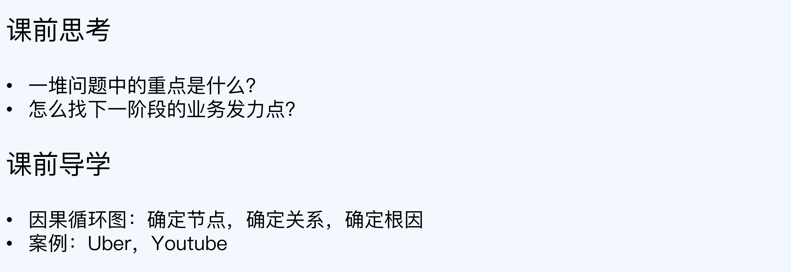
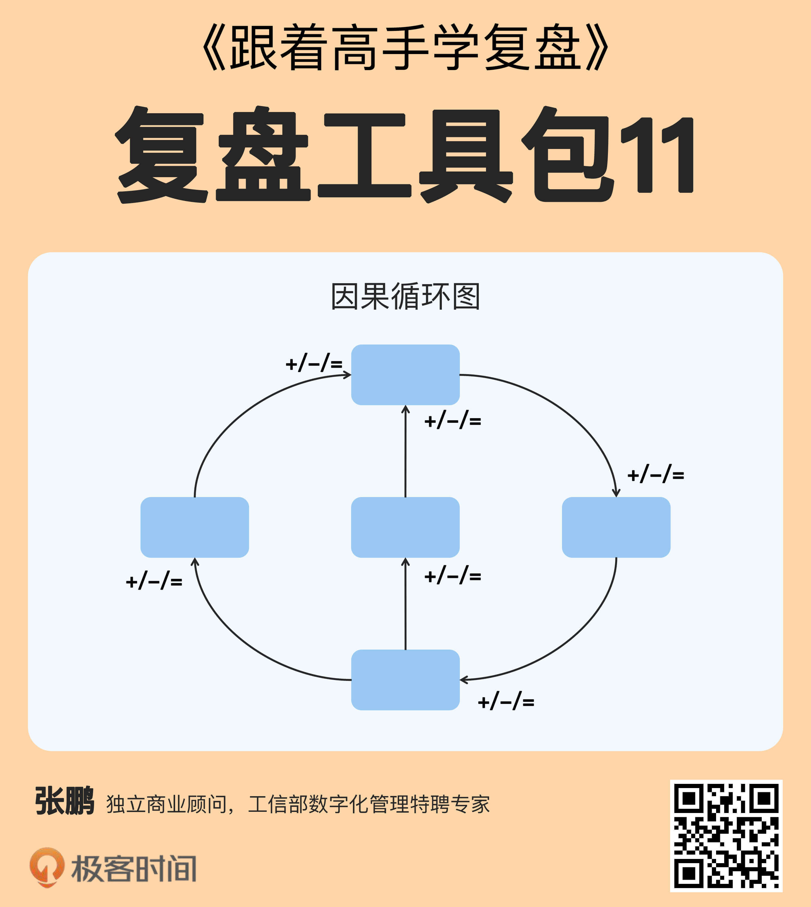
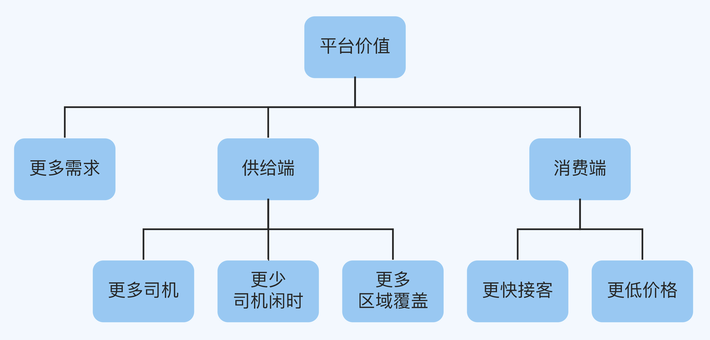
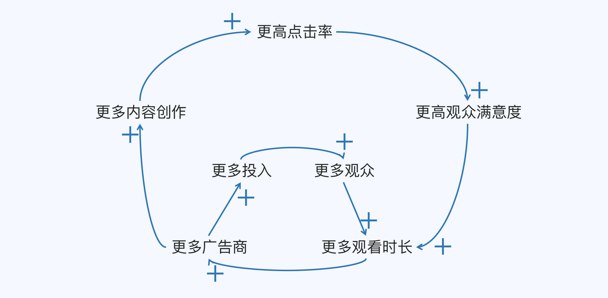

# 10 洞察规律：怎样更新认知才能找准发力点？

你好，我是张鹏。

上一讲，我为你介绍了梳理逻辑时寻找切入点的方法。找到切入点，分析出问题原因之后，我们就到了洞察规律这一步，它正好对应CLAP模型的认知环节。

所谓洞察规律，就是系统地思考整个业务的运转，找准下一步计划的发力点。洞察规律的能力有多重要呢？我带你回顾一下Uber的故事吧。

2014年，Uber进入中国之后，迅速在上海、杭州、深圳、广州、成都、武汉、重庆、北京和天津等一二线核心城市开展业务。

一开始，Uber的获客模式是**人肉两头拉**。"人肉"是指让用户自发通过口碑传播，"两头拉"是指一边拉开车的司机，另一边拉坐车的乘客。这种模式的好处是获客非常精准，适合早期破局。

到了2015年，"滴滴""快的"等中国本土企业也逐渐崛起，在巨大的竞争压力下，Uber**对市场扩张速度的要求更高了**。接下来的半年中，他们准备在华东、华南、西南和华北四大区域拓展自己的业务。

但是Uber内部有个不成文的规定------**不批准任何市场费用**，这也意味着不能以广告等粗暴的模式来获客，所以Uber的城市合伙人**只能从运营手段本身想办法**。

而当时他们面临的现实问题在于，以前的人肉两头拉模式虽然精准，但速度不够快，到了快速扩张期增长乏力，很难支撑业务的升级。

与此同时，"出行场景单一""无法满足更多出行需求""价格没有优势""等车时间长"等一系列问题也都冒了出来，而且这些问题之间还会相互影响。

这种局面给当时的Uber管理层提出了一个挑战：**到底哪个问题才是重中之重，怎么才能找准下一阶段的业务发力点呢？**

## 因果循环图

为了解决战略重心问题，Uber华东区域的管理层使用了一个工具------因果循环图。

**因果循环图**（CLD，Casual Loop
Diagram）出自1990年出版的管理学经典著作《第五项修炼》，它是这本书的作者、学习型组织理论的鼻祖彼得·圣吉（Peter
M. Senge）提出的用于**系统思考**的工具。

那么，因果循环图要怎么用呢？我们继续看Uber华东区域业务的例子。

### 1. 确定节点

**用因果循环图的第一步是确定节点，也就是标记业务的关键节点。**

Uber华东区域一开始的业务破局还是做得不错的，得到了车主和乘客的认可，但是要在宣传资源受限的条件下拓展业务，管理层还需要深挖能够撬动整个市场运转的关键节点。

首先，他们想到的是满足更多的出行需求，于是他们标记了一个关键节点，**更多需求**。

接着，为了满足更多的出行需求，从供给端看，核心是**更多区域覆盖**，从数量和密度两个维度进行拆解，可以细分为**更多司机**和**更少司机闲时**，于是他们又标记了两个关键节点。

从消费端看，核心是**乘客能更快能坐上车**和**车费更便宜**，分别代表时间和价格两个维度，于是他们又标记了两个关键节点，**更快接客**和**更低价格**。

最后，整个逻辑树用MECE原则检查一下，确保没有问题。

到这里，关键节点就基本上找齐了。

### 2. 确定关系

**第二步是确定关系，也就是分析连接关键节点的因果关系。**

关键节点之间的关系用带箭头的曲线来表示，箭头的方向代表因果，类型有三种，分别是：

1.  **增强**，用"+"表示。
2.  **减弱**，用"-"表示。
3.  **延迟**，用"="表示。

这三种类型很好理解：

踩油门和速度之间就是增强关系，油门踩得越大，速度越快。

刹车和速度是减弱关系，刹车踩得越狠，速度越慢。

延迟在生活中更为常见，比如你在浴室拧开热水开关，需要过一段时间水温才会升高。

确定因果关系，重点是搞清楚A节点与B节点之间的关系是增强还是减弱。对于Uber来说：

-   **更多需求**会让更多司机来到Uber平台，所以它们的关系是**更多需求**增强**更多司机**（+）。
-   **更多司机**会让Uber覆盖的区域更广，所以它们的关系是**更多司机**增强**更多区域覆盖**（+）。
-   **更多区域覆盖**会让更多乘客也注册和使用Uber打车，并且进一步促进**更少司机闲时**和**更快接客**（+）。
-   **更少司机闲时**让客单价有进一步降低的空间，所以会导致**更低价格**（+）。
-   当**更低价格**和**更快接客**这两个乘客都最在意的痛点得到满足，会进一步促成**更多需求**（+）。

到这里，单个节点之间的关系就分析清楚了，Uber华东区域管理层也就可以完成Uber整个业务的拼图了。

### 3. 确定根因

第三步是找出根因，就是判断推动运转最底层的根因。

因果循环图非常清晰地展示了单个节点之间的直接因果关系。但是底层的根因要怎么看呢。毕竟各个节点之间是互为因果的。

我跟你分享一个小窍门：

-   连接线入口多出口少的，一般是"果"，比如更多需求。
-   连接线入口少出口多的，一般是"因"。
-   去掉之后会导致整个增强循环断裂的（"没它不行"），一般是"根因"。

从图中可以看出，**更多司机**和**更多区域覆盖**这两个节点是满足根因条件的。而**更少司机闲时**以及**更低价格**即使单独去掉，虽然会影响效率，但整个循环依然可以转动，因此属于重要因素，但并不属于根因。

我们可以从业务逻辑的角度验证一下，更多需求确实是Uber追求的终极结果，而更多司机和更多区域覆盖如果拿掉，就会导致供给端司机少，从而导致消费端注册和使用少，最终导致Uber的业务无法升级。

最终，Uber确认了以**更多司机**和**更多区域覆盖**作为提升整体业务的目标，并设定OKR来进行执行，在华东市场取得重大突破。这部分内容我会在下一讲详细介绍。

现在，因果循环图的使用就讲完了，我用一个流程图来总结一下：

为了方便你理解，我再为你讲解另一个案例，你可以像阅读推理小说一样，看看能否在我揭示谜底之前想出答案。

## 案例补充：Youtube

2013年，YouTube已经成为全球最大的视频平台之一。但是它的创新步伐已经放缓，一旦刹车，重新加速并不容易。

当时YouTube的CEO是Susan
Wojcicki，她意识到YouTube再这样下去，会沦落为一家很普通的公司，于是决定组织高层做战略复盘。她提出了一个问题："如果重新让YouTube走上'10倍速'的指数型增长之路，我们到底应该怎么做？"

Youtube当时面临的考验和Uber很像，都是要在一大堆重要的事情中找到重中之重。对于YouTube来说，流量、点击率、观看率、广告、视频内容、日活......到底哪一个才是应该首先考虑的呢？

当时视频网站普遍看重点击率和日活数据，YouTube内部就有一个工程师正在开发引导观众选择"观看下一个"的推荐系统。显然，这能够对点击率的提高产生巨大的影响。

但是需要思考的是，**点击率的提高是YouTube真正想要的吗？**或者换句话说，业界都认为提高点击率就能提升业务，这个"常识"就一定是对的吗？

YouTube在这次战略复盘中发现，很多因素是相互影响的。它最重要的收入来自广告，但是让用户过多地点击广告，会影响用户的体验，而体验不好就可能造成用户流失，从而降低平台对广告商的吸引力。

当用户花更多宝贵的时间来观看YouTube上的视频时，这些视频必须要给他们提供乐趣，这样才能形成良性循环：

更满意的观看体验带来更长的观看时间，更长的观看时间会吸引更多的广告商，从而激励更多的内容创作者进行创作，于是又会吸引更多的观众。

根据"确定根因"的原则，"没它不行"的节点就是根因。

YouTube最终洞察到：**真正的收益来源不是观看率或点击率，而是观看时长**。虽然短期内，用户时长的增加甚至会降低用户对广告的点击率，但从长远来看，显然会让YouTube走上增强循环。

Susan和她的团队制定了一个**BHAG**（Big, Hairy, Audacious
Goals，宏伟、艰难和大胆的目标）："日均用户观看时长达到10亿小时"。在之后的4年时间里，他们通过各种努力，最终实现了这个BHAG。

## 小结

这一讲，我用Uber的案例为你讲解了使用因果循环图的技巧，并且通过Youtube的案例来帮助你加强理解。现在，我们来回顾一下重点内容：

1.  因果循环图中的节点，就是真实业务中的关键节点，你可以理解成是关键子业务，用逻辑树进行划分，用MECE原则进行验证。
2.  关键节点之间的关系用带箭头的曲线来表示，箭头的方向代表因果，类型有三种，分别是增强、减弱和延迟。
3.  如果因果循环图中，某个关键节点去掉之后会导致整个增强循环断裂，那么它很可能就是根因。

## 思考题

这就是今天的全部内容，最后留两道思考题给你吧。

1.  请你回忆一下学习Youtube案例的过程，你是什么时候找出"根因"的呢？为什么是那个时候？
2.  请尝试画一下你手头项目的因果循环图，看看有什么发现或者问题。

欢迎把你的答案写在留言区，和我一起讨论。
