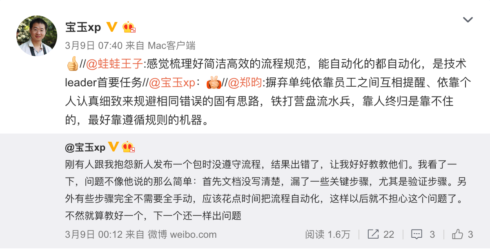
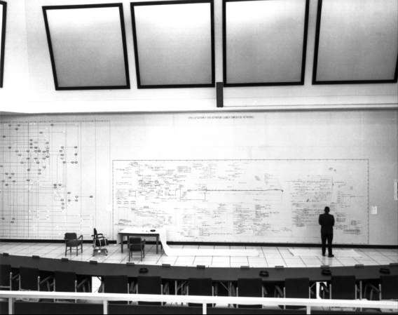
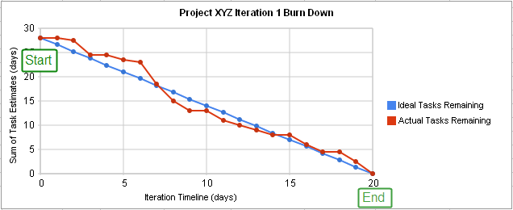
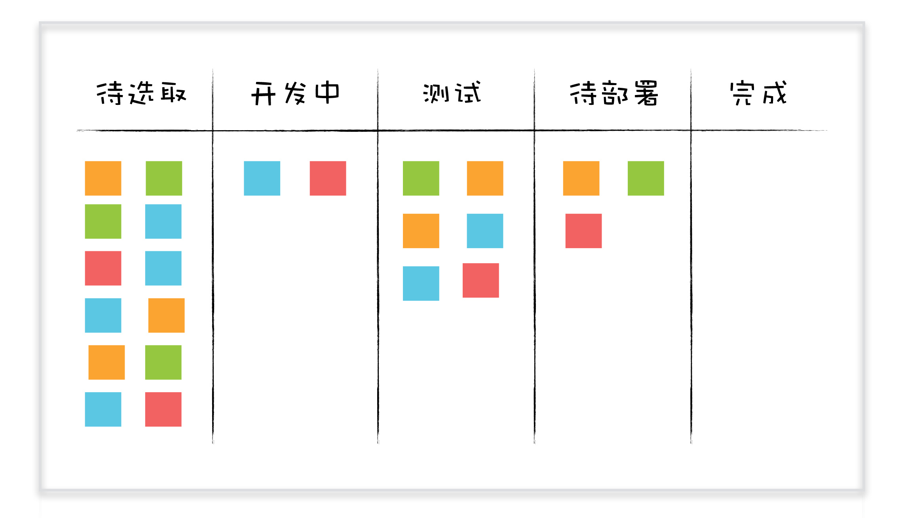

# 14 项目管理工具：一切管理问题，都应思考能否通过工具解决

你好，我是宝玉，我今天想与你分享的主题是：一切管理问题，都应思考能否通过工具解决。

早些年我在做项目管理工作的时候，除了制订计划外，还要花不少时间去跟踪计划的执行情况。

项目管理上出了问题，管理者总是喜欢从流程规范的角度去想办法，于是为此设定了不少流程规范，例如每天要写日报，根据日报更新项目进度，每周要开周例会，看看项目有没有执行上的问题。

对任务进度的量化也是个很困扰项目经理的事情，需要频繁地去问程序员："你这个任务进展如何，大概完成比例多少？"，从程序员那得到的答复通常都是个很乐观的数字，例如
80%。第二天以为他能做完，结果一问是
90%，就这样要持续好多天才真的算做完。

所以后来我得出来一个结论：**一个任务，只有 0% 和 100%
两种状态是准确的，中间状态都是不靠谱的。**

除此之外，还有个问题就是，项目的进展并不太直观，除了项目经理每天看计划表，对计划有一个大概了解以外，其他人可能只有在到了计划设置的"里程碑"时，才对进度有比较直观的感觉。

项目成员手头事情做完，如果和计划有出入，也不知道自己接下来该干嘛，都要跑去问项目经理，所以项目经理对于很多事情都要从中协调，日常有很多繁重的任务管理工作。

后来我发现其实很多管理者都有类似的困惑：任务不好量化难以估算，项目成员对当前项目进度缺少直观感受，管理者要花大量时间在任务管理上。

这些年，随着软件项目管理工具的发展进化，发现当年困扰我的这些问题已经不再是一个主要问题，因为通过工具就能很好的解决这些问题。

这也是我这些年项目管理和技术管理的一点感悟：

> 一切管理问题，都应思考能否通过工具或技术解决，如果当前工具或技术无法解决，暂时由流程规范代替，同时不停止寻找工具和技术。

下面的微博即是一例，当遇到问题时，不仅从流程上思考有没有问题，更要考虑是不是可以用工具或技术手段来解决。

在这里，我还是先带你看一下项目管理工具软件发展史，通过工具的演化，你可以更深入的了解到工具是怎么解决这些管理问题的。

## 项目管理工具软件发展史

#### 在没有项目管理工具的年代，都是怎么管理项目的？

早些年，我除了好奇过大厂是怎么开发大型软件项目以外，还好奇过像登月这种超大型项目是如何做项目管理的。正好前不久看了余晟老师写的一篇文章[阿波罗"登月中的工程管理一瞥](https://mp.weixin.qq.com/s/-u0TtSBA5EynVpTkuSVdog?)，让我有机会一窥究竟。

其实这种大项目的项目管理并不神秘，就是像我们专栏《11
项目计划：代码未动，计划先行》那一篇讲的，这种大项目也是采用
WBS（工作分解结构）把所有任务一级级分解，再排成计划，按照计划有序进行。

但阿波罗项目是个超大型项目，所有的任务分成了 A、B、C 三级，到 C
级已经有超过 4
万个任务。要给这四万多任务排出项目计划就太不容易了，一共要几十名分析人员来协调和跟踪所有的任务。最终列计划的图表贴在墙上超过
100 平米。

阿波罗登月项目巨型计划图

在没有项目管理工具的年代，要制订一个项目计划非常之不容易，需要专业人士花大量时间，而且每次修改调整，都要再花费大量时间精力。

#### 最初的项目管理软件：项目计划工具

直到后来像微软的 MS Project
这样的项目计划工具软件普及，才让制订计划变成了一个相对容易的事情，可以方便的对分解好的任务排出计划。

图片来源：MS Project官网

早些年软件项目的开发以瀑布模型为主，瀑布模型的这种按阶段划分的开发模式，和
WBS （工作分解结构）这种将任务层层分解的理念不谋而合，MS Project
这种软件可以非常好的将所有任务分解、制订计划，按照计划跟踪执行。所以那时候，会使用
MS Project 就是项目经理的标配。

MS Projec
虽然解决了计划制订的问题，但还是有些不足之处。例如不方便跟踪任务进度，进度不直观等。

再加上后来敏捷开发开始兴起，很多项目都开始采用 Scrum
的方式来进行项目管理，开发变成了迭代的方式，以前单纯的项目计划工具，就不能很好的满足项目管理需要了。

#### 基于 Ticket 的任务跟踪系统

传统的项目计划软件还有很多问题无法解决。比如，很多人都有过以下类似的项目经历：

-   产品经理口头让开发对产品做一点小改动，开发也答应了，后来就把这事忘了，或者测试都不知道还有这事，也不记得要测试这个模块；

-   代码审查的时候，发现组内某个同事的代码没有写单元测试，但是因为任务紧，只能先上线，于是叮嘱他后面一定要把单元测试代码补上，结果还是忘了。

日常项目中像这样的小事情不少，如果不记下来很容易忘记，如果用传统的项目计划软件排进去又很麻烦，直到后面有了基于
Ticket 的任务跟踪系统，才很好的解决了这个问题。

Ticket
跟踪最早源于客服的工单（Ticket）系统，每次客户接到一个问题，就创建一个工单，后续和客户的每一次交流和处理，都要更新工单内容和状态，直到结束。

最早在软件项目中，应用 Ticket 跟踪系统的领域是测试领域，用来追踪
Bug，后来逐步衍生到整个项目管理领域，不仅跟踪
Bug，还用来跟踪需求、开发任务等。

也有很多系统用 Issue 来表示 Ticket 的概念，无论 Ticket 还是
Issue，表示的都是一个工作任务，可以包括软件的
Bug、功能需求、某个模块的开发、系统的重构任务等。

那一个 Ticket 应该包含哪些主要信息呢？

一个 Ticket，应该包含：

-   标题：摘要性的描述 Ticket 内容；

-   类型：属于什么类型的 Ticket：Bug、需求、任务；

-   内容：Ticket 的详细内容，例如，如果是 Bug 的话，除了要写清楚 Bug
    内容，还需要重现步骤。如果是需求的话，要有需求的描述，可能还需要额外的文档链接辅助说明；

-   创建人：谁创建的这条 Ticket；

-   优先级：这个 Ticket 的优先级高还是低；

-   状态：Ticket
    的状态，例如：未开始、处理中、已解决、重新打开、关闭等；

-   指派给谁：这个 Ticket 被指派给谁了，谁来负责；

-   历史记录：整个 Ticket 改变的历史信息，用以跟踪；

当然除了这些外，还有一些其他信息，例如创建时间、附件、标签、版本等。另外现在的
Ticket
跟踪软件都有强大的定制功能，可以增加额外的辅助信息，例如你是基于敏捷开发，还可以加上
Sprint、故事分数等信息。

Ticket 的这些内容，基本上可以包含一个工作任务所需要的所有内容。有了
Ticket 之后，无论大到一个功能需求，还是小到一个
Bug，从它创建，一直到完成，整个过程都可以方便的被跟踪起来了。再也不担心像任务被忘记等前面提到的这些情况了。

基于 Ticket
去跟踪任务，不再需要通过日报、一对一会议的方式来收集任务执行情况，负责
Ticket 的项目成员在完成任务后，会直接修改 Ticket
的状态，这样其他人就可以看到 Ticket 是否已经完成。

Ticket
通过各种不同状态，例如未开始、开发中、完成等，可以很直观的了解任务的进展，这就避免了任务难以量化的问题。

Ticket 跟踪系统和敏捷开发也是很好的搭档。在敏捷开发中，产品
Backlog（产品待办任务列表）是一个用来放所有产品的待办任务的清单，在每个
Sprint 开始前的迭代计划会议上，从产品待办任务清单里面选取一部分任务到
Sprint 的待办任务清单（Sprint Backlog）中。

当使用 Ticket 跟踪系统后，就可以把所有产品的待办任务用 Ticket
都记录起来，当我们在迭代计划会议上选取好任务后，就标记为要在当前 Sprint
完成，这样后面就可以方便的筛选出属于当前 Sprint 的所有
Ticket，这样大家就可以从 Ticket 跟踪系统知道我们这个 Sprint 有哪些
Ticket 需要完成、进展如何。

如果将当前 Sprint 中，从开始到结束，每天记录一下 Sprint Backlog 中未完成
Ticket 的数量，绘制成一张图表，横轴表示时间，纵轴表示剩余 Ticket
数量，就可以通过图表直观地看到还剩下多少工作。

这种用于表示剩余工作量的工作图表也叫燃尽图（burn down
chart），可以直观的预测工作将在何时全部完成。

图片来源：维基百科

基于 Ticket
的任务跟踪系统，很好的弥补了项目计划工具的不足，让项目中大大小小的各种开发任务都可以方便的记录跟踪起来。燃尽图也可以直观的了解剩余工作情况。

如果说美中不足的话，就是整体的 Ticket
状态还不是很直观，例如不能清楚的看到哪些任务在进行中，哪些任务待领取。

#### 基于看板的可视化任务管理

看板本来是在 1940
年由"丰田汽车"发明的生产管理系统，其中一些理念被借鉴到软件开发中，尤其是其可视化的任务管理方式，很好地解决了早期
Ticket 跟踪系统不直观的问题。

所以现在的 Ticket
任务跟踪系统几乎都会有看板视图，通过看板可以很直观的看到当前任务进展情况。

参考上图，可以看出，在看板视图上的所有
Ticket，可以很直观的看出哪些还没开始，哪些进行中，哪些已经完成。

这种可视化的任务视图，不仅是对项目经理，可以很直观看到进展，对于普通项目成员也是很方便。

-   从"待选取"栏选择一个 Ticket，拖动到"开发中"栏，表示这个 Ticket
    已经选取，开始开发了。

-   手头上的 Ticket 开发完成后，就可以将 Ticket
    拖动到下一栏------"测试"栏。

-   测试人员看到新加入"测试"栏就可以从测试栏选取 Ticket 进行测试。

-   如果测试没通过，Ticket 就会被拖动到"待选取"栏。

-   如果测试通过，Ticket 就会被拖动到下一栏------"待部署"栏。

-   部署完成后，所有"待部署"栏的 Ticket 就会被拖动到"完成"栏。

整个过程完全不需要项目经理从中协调太多，尤其是结合每日站立会议，可以让项目成员自发有序地按照看板开展日常工作。

借助 Ticket
跟踪和看板可视化，项目经理可以从繁重的任务管理中解放出来，可以抽出来时间做一些其他更重要的事情。

以上就是项目管理工具的一个演化简史，可以看到，每一次工具的发展进化，相应的很多项目管理工作就可以得到简化，很多早期的项目管理问题，也就不再是问题了。

## 有哪些项目管理软件可以选择的？

在了解完项目管理工具的发展历史后，再给你介绍一些目前国内国外主流的项目管理软件，帮助你根据自己项目需要进行选择。

如果单纯是项目计划工具，功能最好、最全的应该是微软的[MS
Project](http://products.office.com/zh-CN/project/)，但遗憾的是只能运行在
Window 上，不支持 Mac 平台。如果要在 Mac
上使用项目计划工具，可选的有[OmniPlan](http://www.omnigroup.com/omniplan)和[Merlin
Project](http://www.projectwizards.net/en)。

而且这些项目计划工具，现在也都支持了看板视图。不过如果只是单机支持的话，意义并没有那么大，需要在线版的
Ticket
跟踪结合看板视图，才能让整个团队可以一起浏览操作，发挥其最大效用。

基于 Ticket
的任务跟踪系统，最有名的应该是[Atlassian](http://www.atlassian.com/)公司出品的[Jira](https://www.atlassian.com/software/jira)软件，功能全面，体验很好。Jira
主要是在海外比较流行，因为访问速度和使用习惯等原因，国内用户要相对少一些。

同类产品也很多，微软的[Azure
DevOps](http://visualstudio.microsoft.com/zh-hans/tfs/?rr=https%3A%2F%2Fshimo.im%2Fdocs%2F5A0wCnmLwn0nCjE9)
（以前叫 TFS, Team Foundation Server），和微软系的产品如 Visual
Studio、Azure 可以很好的整合。

代码托管平台GitHub本身也集成了一套 Issue 跟踪管理系统，虽然没有 Jira
那么强大，但是对于普通项目来说，足够用了。尤其是对于开源项目，完全可以基于
GitHub 的 Issue 进行日常的项目管理。

国内同类的软件有：

-   禅道：为数不多提供开源版本可以自己搭建的；

-   Worktile：集成了即时消息软件；

-   TAPD：腾讯出品，可以和腾讯的服务很好整合，例如企业微信和腾讯云；

-   云效：阿里巴巴出品，可以和阿里的服务很好整合，例如阿里云和钉钉；

-   DevCloud：华为出品，和华为云有很好的整合。

还有一些其他产品，这里就不一一列举。

那么该如何选择适合的工具呢？

从功能上来说，基本上，上面提到的每一款产品都能满足日常项目管理的基本需求，建议从项目特色、团队成员、价格和服务等因素综合考虑。

例如说你的项目完全是微软技术栈，就可以考虑使用
TFS；如果你深度使用阿里云和钉钉，那么就可以考虑阿里的云效；如果你想自己搭建，那么就可以考虑
Jira 或者禅道。

这些产品都有免费版本，可以先试用，你可以仔细对比后，根据自身的情况再最终决定。

## 总结

今天我带你一起了解了软件项目管理工具的发展历史：从完全手工方式管理项目，到借助计划工具分解安排计划，到基于
Ticket
跟踪管理任务，再到基于看板的任务可视化。每一次工具的升级，都是对项目管理工作的一次简化。

合理的使用项目管理工具，可以帮你极大提高管理效率，起到事半功倍的效果。我也列举了一些目前国内外主流的项目管理工具，希望可以帮助你做出选择。

最后，对于日常项目管理的问题，你也可以多思考是不是可以由工具或者技术手段来解决的。
