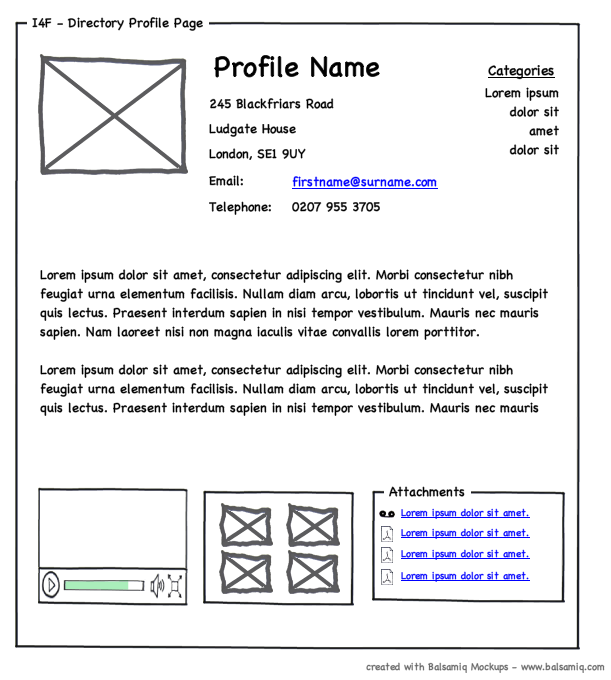
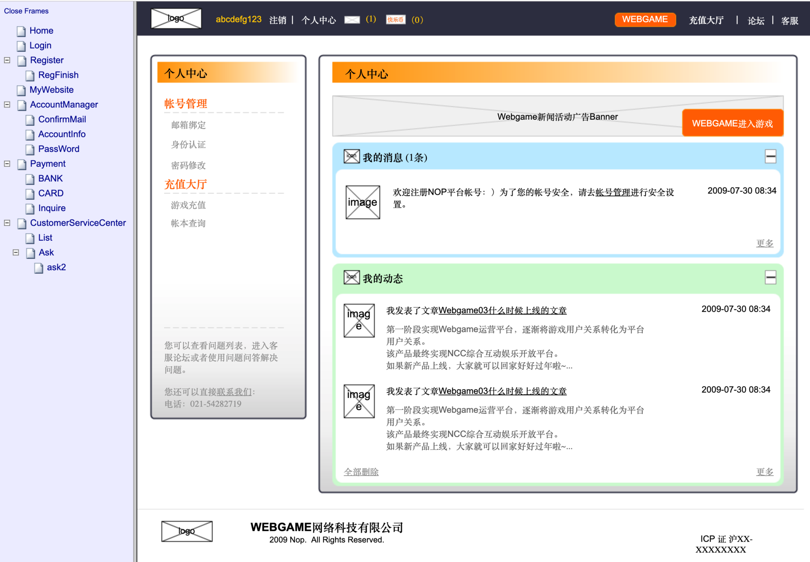
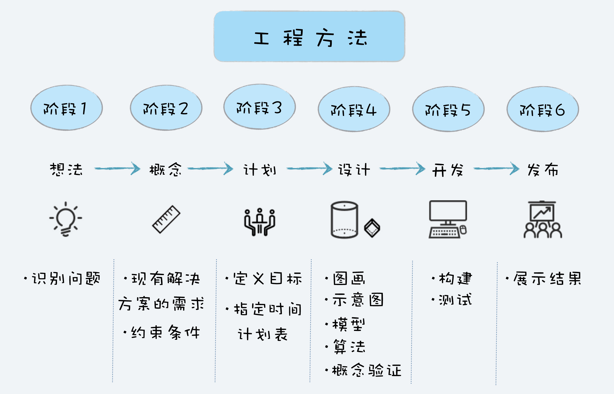
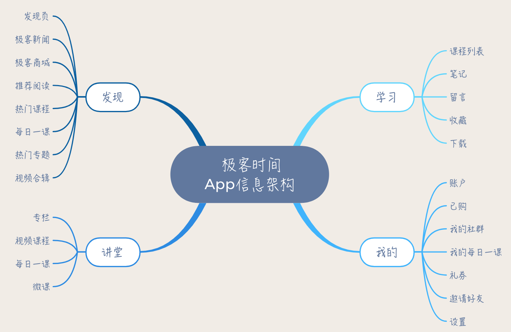
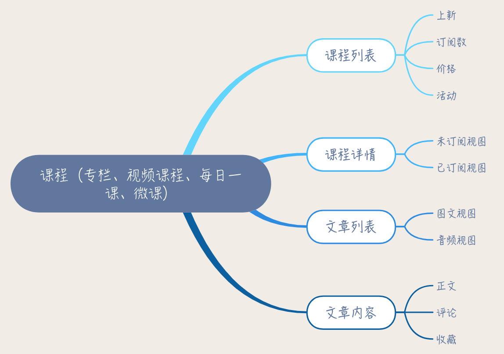
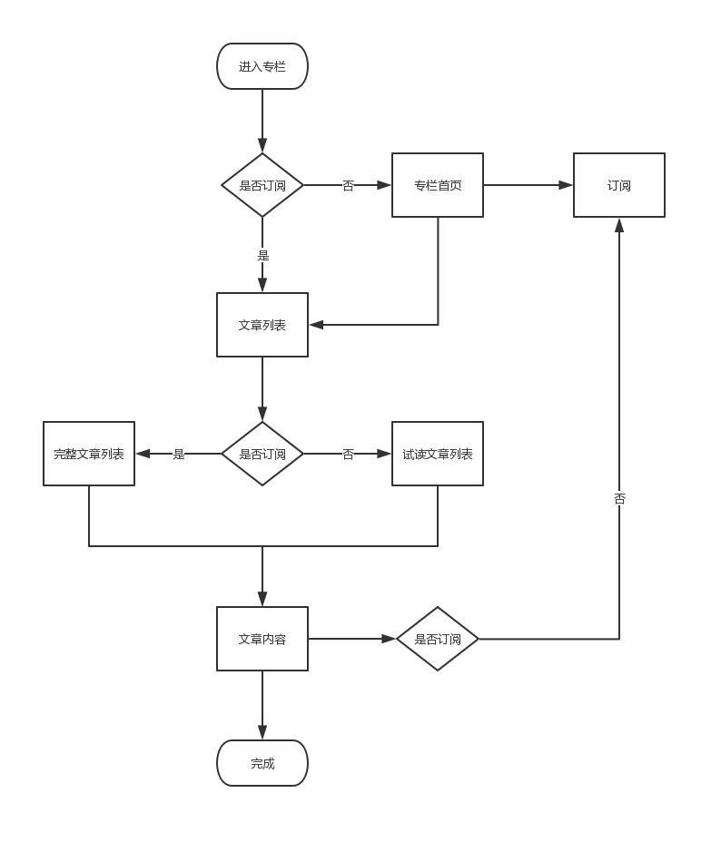
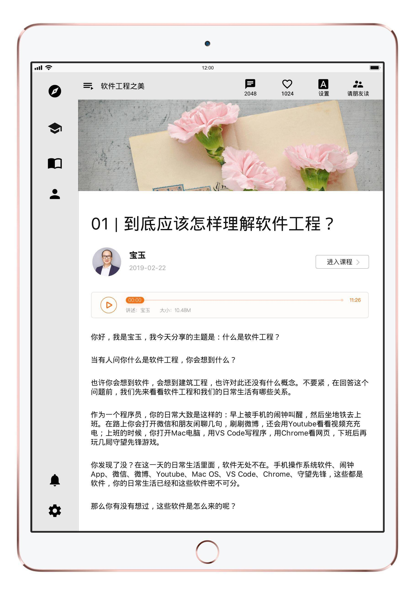
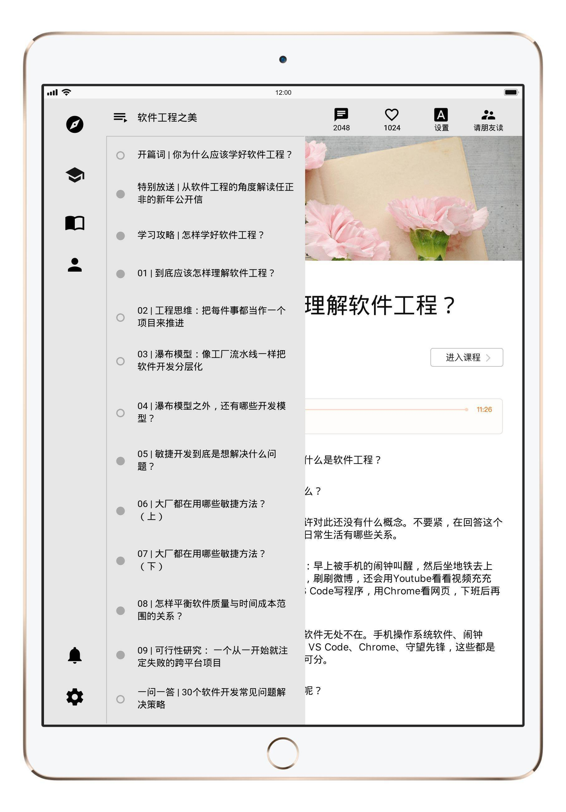

# 18 原型设计：如何用最小的代价完成产品特性？

你好，我是宝玉，我今天想与你分享的主题是"原型设计"。

我们都知道，软件项目中很多问题都和需求相关，比如说需求不明确，需求变更。这些问题轻则导致返工造成浪费，重则导致项目失败带来巨大损失。所以在软件工程中，搞明白需求是一件至关重要的事。

上一篇我带你学习了如何分析需求的方法，而分析需求，同样也离不开工具的支持。所以这一篇，我将带你学习需求分析中原型设计的用法，借助原型设计，用最小的代价完成产品特性。

## 什么是原型设计？

对于原型设计，很多程序员可能比较陌生，但是对于产品经理来说，原型设计却是日常工作中最常用的技能之一。因为原型设计，是产品经理确认需求、设计产品最重要的沟通工具。

其实最早的原型设计，并不是作为一个需求沟通工具存在的。

## 原型设计的发展历史

早在上世纪 70
年代，在瀑布模型提出后，很大程度上改进了软件项目的开发。但是需求不明确、需求多变的问题从那时候开始就是一大难题。

《人月神话》的作者弗雷德里克·布鲁克斯（Frederick P. Brooks,
Jr.）在《没有银弹 -
软件工程中的根本和次要问题》中第一次提出了："在获取和制订软件需求时，将快速原型开发作为迭代计划的一部分"。

后来快速原型就逐步发展成为一个开发模型，叫快速原型模型，我在《04
瀑布模型之外，还有哪些开发模型？》这一篇里也有介绍。这种模型的特点就是快速开发，快速修改。目的是为了解决客户的需求不明确和需求多变的问题。

**注意，这里的快速原型模型，是开发软件项目的一种模式，还不是工具。**

给你举个例子，如果用快速原型模型开发网站，大概分三个阶段。

第一个阶段就是纯静态 HTML
页面，能看到页面什么样子，没有后台，无法保存数据。这种静态页面开发成本不高，速度很快，改起来也方便，做好了就可以拿去跟客户确认需求。

客户看了后就能知道产品长什么样子，是不是满足要求，会提出明确的反馈意见。根据反馈，开发方会继续修改静态页面。

第二个阶段就是模拟一个后台服务，没有数据库，数据直接保存内存中。但是可以让网站有真正的交互：从网站添加内容就能显示出来，修改网站内容，网站显示的内容也会跟着修改。

这个阶段客户可以在网站上体验交互，也能完整的体验操作的流程，可以进一步针对交互再提出反馈，开发方根据反馈继续修改。

第三个阶段就是完成最终的后台服务，接入真正的数据库或者其他后台服务，完成整个网站的开发。由于前面两个阶段，产品经理已经把需求和交互确认清楚，所以这个阶段的开发，就没有太多需求上的反复和修改，可以高效的完成设计和开发。

简单来说快速原型模型就是，**第一阶段确认界面布局和内容，第二阶段确认交互，第三阶段实现。**

通过快速原型模型来开发，可以低成本、快速地确认好需求。但也有一个问题：**整个过程单靠产品经理是无法完成的，必须要有开发人员配合才能完成。**而对产品经理来说，要开发人员配合还是一件高成本的事情。

-   低保真原型设计

于是有产品经理用线框图来代替第一阶段。线框图画起来简单，纸和笔就可以，展示效果不错，通过线框图可以直观地看到界面上有什么，布局是什么样的，一样可以用来和客户确认需求。

图片来源：WikiPedia

线框图简单方便，可以起到沟通需求的效果。但缺点也很明显，就是看起来不够真实，不方便反映界面之间的关系，另外也不能反映界面交互。所以线框图这种模式也叫低保真原型。

-   中等保真原型设计

再后来就有像 Axure
这样专业的原型设计软件产生，不仅可以反映界面上的布局和内容，还可以展示网站的整体结构和交互。也就是说，借助原型设计工具，可以达到前面快速原型开发前两个阶段同等的效果。

图片来源：我参与过的某项目原型设计截图

这种原型设计，可以很好的用来确认需求和界面交互，虽然制作难度上比线框图要复杂一点，但是不需要开发人员介入，产品经理完全可以自己搞定。

但这样制作出来的原型，也不能做到 100%
真实，因为它在界面的真实度、色彩上要比最终产品差一些，所以也被称之为中等保真原型。

-   高保真原型设计

近些年移动端快速发展，对于移动端来说，因为界面比较小，布局和内容上已经没法玩出什么花样。所以客户更追求界面的美观和交互的炫酷，对原型的保真度要求也就越来越高。

所以很多原型工具就在高保真方面狠下功夫，让你简单操作就可以做出漂亮的界面和炫酷的交互，甚至完成后都不需要再做
UI 设计了。

当然，高保真原型的学习成本和制作成本都要高于低保真原型，所以变更成本更高，而且也很容易导致产品经理花大量时间在细节的调整上，影响整体的进度。所以通常高保真都会和低保真原型设计配合使用，先用低保真原型快速确认清楚需求，再用高保真原型确认最终的交互和
UI 设计。

就这样，原型设计从最开始的一种快速开发模式，逐步演进成了今天的原型设计工具。让产品经理不需要会编程知识，也可以做出很酷的软件原型，从而可以低成本、高效率的确认清楚产品需求。

## 怎么做好原型设计？

虽然说现在原型设计工具已经让制作原型越来越简单，但即便如此，原型设计也可以算得上是一个小项目了。因为要做好原型设计，不仅要考虑单个界面怎么设计，还要考虑这个产品整体有多少个界面，各个界面的关系和流程是什么样的。

要做好原型设计，可以借鉴我在《02
工程思维：把每件事都当作一个项目来推进》中讲的内容，用工程方法来完成。

参考工程方法，我们可以将每次原型设计过程分成四个部分：分析、设计、实施和验证。

这里，我以极客时间 App 为例，假设我们需要制作一个极客时间的 iPad
版，应该如何制作原型呢？

#### 第一步：分析

在原型设计时，通常属于需求的最初阶段，需求还是很模糊、不具体的。所以这个阶段首先要做的，就是要对用户的需求有个初步的了解，分析清楚原型设计的目标是什么。

比如说，我们要设计极客时间的 iPad 版，其实在内容上，完全可以基于 iPhone
版本，只是在布局上，交互要重新设计，充分发挥 iPad
大屏幕的优势，展现更多有价值的信息。

#### 第二步：设计

在对需求进行初步分析后，需要开始对原型进行整体设计。在设计阶段，主要从两个维度来考虑：

1.  从信息架构的维度，考虑清楚整个产品的信息架构，划分出模块；
2.  从使用流程的维度，考虑清楚界面之间的流程。

**画产品的信息结构图**

产品的信息结构，就像一本书的目录，整体描述了架构信息。

在做原型设计前，先梳理清楚整体结构，有助于帮你想清楚产品有哪些功能模块，模块之间的关系如何，哪些模块是公共的，哪些模块是面向不同用户显示不同内容的。

参考极客时间 iPhone
的结构，我们可以把主体的信息架构梳理出来，如下图所示：

在考虑清楚主体结构后，可以进一步细化。例如其中"讲堂"下面虽然分成了"专栏"、"视频课程"、"每日一课"和"微课"，但其实点进去都是一样的，我们可以称之为"课程模块"，对于课程模块，我们可以进一步细化。如下图所示：

这样你就可以一步步将整体信息结构从粗到细，一点点整理清楚。

**画产品使用流程图**

用户在使用产品时，会在不同的模块之间跳转，比如说你从极客时间进入到一个没订阅过的专栏，还可以点击订阅按钮进入订阅界面，订阅成功又可以返回专栏界面。

所以，**需要用流程图把这些界面之间跳转的逻辑梳理清楚。**在设计流程图的时候，要重点考虑用户的使用场景，结合使用场景设计好流程。

举例来说，如果当前用户进入到专栏首页，如果用户没有订阅，最重要的就是让用户可以方便的订阅，然后继续阅读；如果用户已经订阅，就没必要显示订阅相关内容，直接可以看到文章列表，选取想看的文章直接阅读。

需要注意，画产品使用流程图时，不仅要考虑正常使用的流程，同时也要考虑清楚异常的情况。比如说用户留言输入错误，网络失败，怎么处理？如果把用户辛辛苦苦输入的消息弄丢了，将会让用户体验大打折扣。

我们以进入专栏，阅读专栏文章这个流程为例，画一个简单的流程图，来说明各种不同情况下的流程和跳转关系。

通过这样的流程图，可以考虑清楚界面和界面之间的跳转逻辑。

#### 第三步：实施

在设计好整体的信息架构和使用流程图后，就可以开始对每个界面画流程图了。

在具体到界面时，**要优先考虑满足产品需求，然后是让界面好看好用。**

比如说阅读专栏文章这个界面，在 iPhone 上，屏幕很小，显示的信息有限，到
iPad
上，有了更大的屏幕，就可以增加更多的内容。但是注意不能造成太多的信息干扰，要突出重点，增强体验。

所以我们可以保留 Tab 导航的设计，让用户可以随时回到一级界面，并且针对
iPad 界面特点，对位置做一些针对性调整。

另外在专栏阅读时，一个常见的场景就是看完一篇后，想切换到目录查看其他文章。可以针对
iPad 的交互特点，点击显示目录，方便在文章之间切换跳转。

这样一个界面基本上就初步完成了。接下来还可以对一些可以点击的界面元素，例如按钮，增加跳转操作，按照前面产品使用流程图的设计，将界面之间连接起来，让用户可以方便的从一个界面跳转到另一个界面。

#### 第四步：验证

原型设计完成后，还需要一个很重要的环节就是验证，产品经理自己反复验证几遍，如果发现有流程上走不通或者使用不方便的地方先自己调整。调整好了交给其他人去体验，让他们提出反馈意见。

一般在正式的项目中，针对原型设计，需要有相应的评审会议，让大家提出反馈，根据反馈再作出调整。

比如说我前面设计的文章阅读界面，在交给朋友体验后，他给我的建议是：这样的设计看起来文章之间跳转方便了，但是要返回专栏页面反而是不方便了。而相对来说，返回专栏是一个更常见的操作。所以对竖版界面来说，这样的设计可能会让用户不知道如何回去，不如还是改回传统的返回式导航。

我觉得他说的很有道理，所以最终界面变成了这样：

而这样的调整，在原型设计工具中，几分钟就完成了，非常小的代价就完成了一个产品设计的确认。

经过分析、设计、实施、验证这四个阶段，再反复的修改和确认几次，基本上就可以做出来不错的原型设计了。

## 如何选择合适的原型设计工具？

原型设计工具，选择非常多。我建议你选择的时候，可以从几个维度考虑：

面向的平台：Web、桌面、手机；

-   保真度：中等保真度还是高保真度；

-   功能：是否满足你的要求；

-   成本：价钱是否可以接受。

这里推荐几款主要的原型设计工具，供参考。

**Axure RP**：Axure RP
曾一度是原型设计工具的代名词，历史悠久功能强大，可以制作网站、桌面软件、移动
App 的原型。 缺点是专业度较高，价格高。

**墨刀**：墨刀
是一款优秀的国产原型设计工具，可以制作网站、桌面软件、移动 App
的原型。上手相对容易，价钱也较 Axure 便宜很多。

**Adobe XD**：Adobe XD 是 Adebe
出的一款设计兼原型设计工具，可以制作出高保真原型，对于设计师尤其容易上手。

**ProtoPie**：ProtoPie
是一款高保真原型设计工具，不需要编程基础，可以做出逼真强大的交互效果。

**Framer X**：Framer
X是一款高保真的原型设计工具，功能很强大，但是需要一定的编程基础，尤其适合程序员使用。

关于原型设计工具更多的资料，可以到"人人都是产品经理"网站的原型设计分类下，可以找到很多有价值的资料。

## 总结

今天带你一起了解了原型开发的演变历史。原型开发，从一个软件开发模型，逐步演变成了一个需求设计工具，让产品经理不用依赖程序员就可以作出逼真的产品原型，也大大降低了项目成员了解需求的难度。

原型设计，让产品经理可以用最小的代价完成产品特性，逐步成为产品经理确认需求、设计产品最重要的沟通工具。原型设计工具有很多可以选择的，建议从面向的平台、保真度、功能和价格等多方面因素综合考虑。

要做好原型设计，可以结合工程方法，分成四个阶段：分析、设计、实施和验证。

-   分析阶段，搞清楚用户的需求，原型设计的目标；

-   设计阶段，划分好产品的信息架构，设计好产品操作的流程；

-   实施阶段，按照设计的结果，对每个界面制作原型，并且将界面组织起来，让界面之间可以相互跳转；

-   验证阶段，和项目成员、客户进行确认，收集意见反馈，根据反馈进行修改。

如果你的项目还没有把原型设计作为确认需求、设计产品的沟通工具，可以考虑推广应用起来，不仅上手容易，而且可以帮你降低确认清楚需求的成本。

如果你打算做自己的产品，先不要着急动手写代码，不妨先做一个原型出来。
