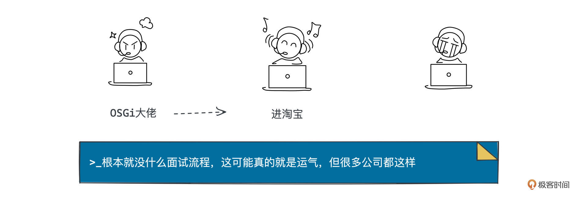
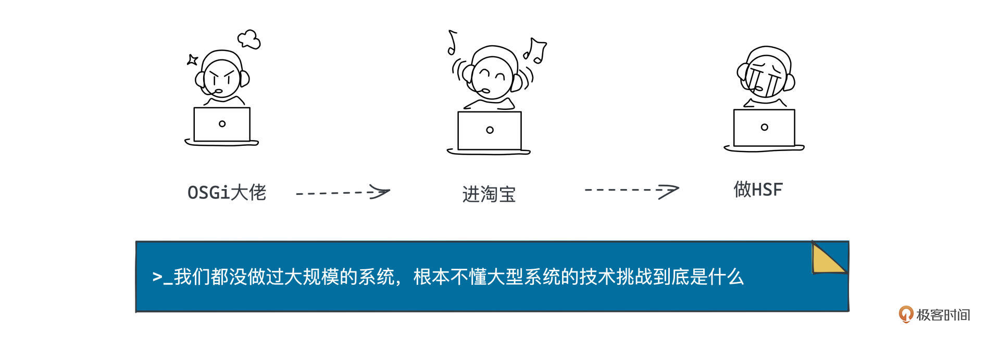
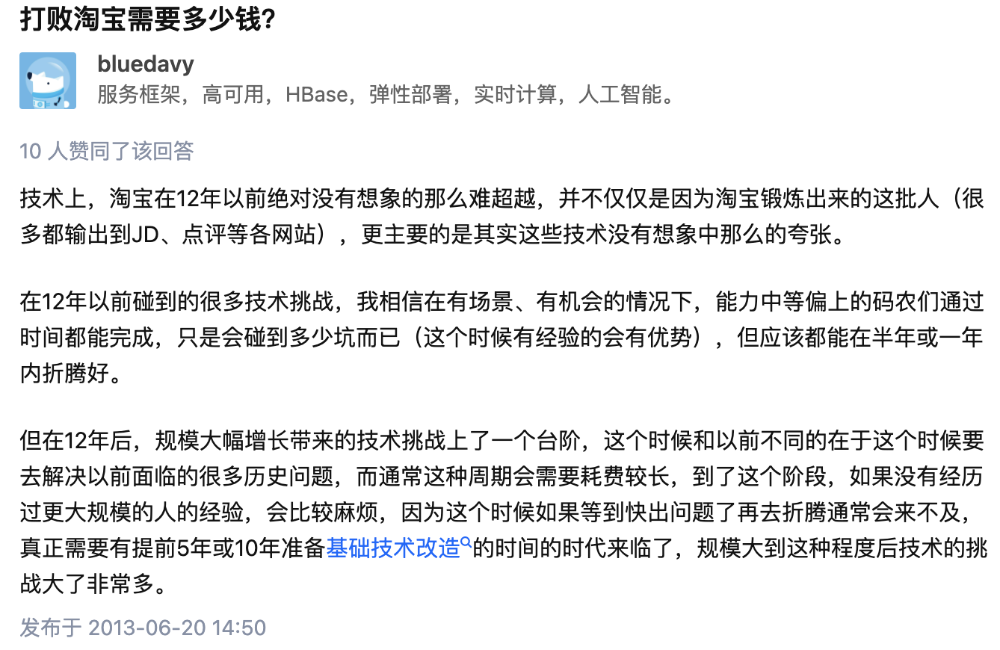

# 03 淘宝HSF：能让淘宝出重大故障的就那批人

> 你好，我是叶芊。- **　**-
> 上一讲我们聊到毕玄加入互联网公司的经历，为冲刺上市的彩票网站写新系统，因为自己不会C语言，也比不过腾讯那拨人，迫不得己成为了一名DBA。但因为突然的规定上市无望，他也走了。-
> **　**- 后面发生的事情，说实话我只能说"很神奇"。- **　**-
> 就他准备找新工作的时候，在没写简历没主动面试的情况下，居然又有一根橄榄枝神奇地伸了过来，然后在一场很神奇的面试后，他进了淘宝，结果第一个项目就神奇地差点把淘宝搞挂了......-
> **　**- 到底发生了什么？我们马上开聊。

**　**- **极客时间：**2007年底你就去阿里了，当时你是怎么进去的？

**毕玄：**也是博客，我到上海工作是因为写博客，换到阿里很大原因也是这个，当时我在网上写了OSGi[那份文档](http://www.blogjava.net/BlueDavy/archive/2009/04/28/267968.html)，OpenDoc，那个时候可流行开放性的文档。

**极客时间：**这篇文档影响力很大，你写了多久？

**毕玄：**一点点积累的，前前后后可能有半年多。

**极客时间：**半年？这么久？

**毕玄：**对，就写了那篇东西，写了之后技术圈的关注确实比较大，最早我们觉得产品化的基础可能是基于OSGi做，因为Eclipse那个时候已经是Java的垄断IDE了，而Eclipse的底层是OSGi。

当时Eclipse把OSGi把插件化的整个体系讲得，你如果听一下思想都会觉得太完美了，而且有Eclipse展示，相当于有了落地，还不光是一个概念，所以大家都觉得哇这是革命性的，基于这个抽象有可能做成产品，只是后来论证了一些东西，不是这样。所以当时OSGi在国内的关注度非常大，加上又没有文章，我写了第一个，很多人可能就因为这个知道了我。

**极客时间：**那个思想是什么，可以具体讲讲吗？

**毕玄：**从业务上讲，以前做整套系统想做成产品，产品化的核心思路是复用，但你不大可能把所有东西都做了，那最好的方式肯定是插件，A、B如果有不同的需求，我做个插件，插在原来的上面做扩展就好了。

而Eclipse是完全基于插件体系的，在里面**如果一个功能没有，你装一个插件就有了，然后插件还可以扩展，你想跟别人的不一样，改一下代码就可以，还只用改部分**。我们觉得这是一个完美的思路，把很复杂的东西抽象掉，做插件、做扩展。

其实到今天为止，所有的扩展型系统仍然是这么构建的。只不过OSGi可能太复杂了，但它的思想其实被用在了所有系统上，现在想产品化的公司，面对复杂系统，还是插件、扩展点的套路。

我们当时觉得这个方向是有可能的，Eclipse也给我们展现了一个完美实践，所以我们说应该研究下来，然后我也比较感兴趣，也觉得这个东西应该就是灵丹妙药。中国又没资料，就开始自己研究了，加上我确实比较喜欢写文章，写上瘾了，就有了那篇非常长的文章。

**极客时间：**所以你写出影响力之后，你是怎么去淘宝的？像以前一样有人看到你的文档被联系过去的？

**毕玄：**写完之后，有个人叫曹晓钢，他做了一个网站叫满江红，以前很多人会用，包括我们搞Java那帮人，那篇文档放在了网站上，可能中国学习OSGi的人都看过了，所以我跟晓钢就非常熟了。

当时比较凑巧，刚好我准备找工作的时候，晓钢就问我要不要考虑下淘宝。因为那个时候他的一个朋友刚刚加入淘宝，那个朋友就是菲青。因为菲青中国朋友比较少，很幸运晓钢就是他的其中一个，菲青刚刚加入淘宝在招人，也找不到别人，就问晓刚能不能推荐几个，就这样我被推荐给了淘宝。

然后我就到杭州面试，说实话那个时候我们不觉得淘宝名声很大，虽然有一定名声，因为它刚刚打败eBay，听肯定都听过，但觉得好像也没啥。出名的是老马。因为马云在前一年上了创业的节目，在那个节目里风格非常犀利，圈粉无数，那我觉得很好啊，就到淘宝面试。

------------------------------------------------------------------------

**　**

**极客时间：**你被推荐过去之后，然后就顺利进去了？

**毕玄：**没有，进淘宝很狗血的。当时晓钢还问我面的咋样，我说我觉得不咋样。

面我的第一个是黄裳，淘宝比较老的一个工程师现在蘑菇街的联合创始人，黄裳第一轮，菲青第二轮，第三轮是马钰。

那个时候黄裳问我很多问题，我都不知道，菲青问我，我也很多都不知道，马钰问的时候我就更懵，因为他是带搜索团队的，问很多算法，算法我不懂，他让我做道题，也没做出来。后来我就说你们到底是怎么让我通过面试的（笑）。

但是最后很神奇的是，等面试结束的时候，马钰居然问我要不要考虑一下加入他的团队，我都震惊了，我是来面菲青的团队，然后马钰说你要不要来我们这。当时我想，啊？我题都没做出来，你们为什么让我加入？这什么团队。所以很搞笑的。

最后当时淘宝整个软件技术部的老大空闻面我，空闻说你前一年不是在做数据库吗，现在为什么面的是Java工程师？空闻简直震惊了。反正很神奇的，我就这么加入了淘宝。

**极客时间：**所以你到底是怎么通过面试的？时机原因吗？

**毕玄：**后来我们一帮当时加入的人都开玩笑说，当时的淘宝估计是你只要投简历，就会招你，根本就没什么面试流程，就是个形式。**这可能真的就是运气，但很多公司都这样。**

因为07年愿意来淘宝的人非常少，包括我们去校招，淘宝绝对是阿里集团里最后一个被选择的。到后来我们才有了很多的要求，淘宝是09年经历的大规模发展，整个架构做了演进，就会有很多要求，比如希望你做过大型系统。

这像我们07年进来的这批人就废了，应该是进不了淘宝的，会被碾压，做过大型系统？没见过，并发量上十万的都没见过，更不用说其他非常非常多的要求了。阿里后来招的人，实践经验简直能亮瞎眼，本科就已经非常厉害了，不用说像硕士、博士，但这是阿里很正常。

**极客时间：**除了你说的运气，应该也有你写OSGi文章的原因吧？

**毕玄：**应该有，后来我跟黄裳他们都说，你们招我，八成是因为OSGi吧。因为他们面试问的很多跟淘宝当时用的整个技术体系相关，淘宝当时又要做服务化，他们觉得这些你是不懂，OSGi你懂啊。但是问那个，他们就不知道我回答的怎么样，因为说实话我答的对还是不对，他们也不知道，只是觉得你有一个点是非常专业的，所以也可以（招进来）。但肯定不是因为我对淘宝多了解。

------------------------------------------------------------------------

**　**

**极客时间：**好，我们接着你进淘宝之后的经历聊，你是一进去淘宝就开始做HSF了？

**毕玄：**对，因为OSGi是一个偏服务化的东西，淘宝当年最重要的策略就是做服务化的架构演进，只有我是有这个背景的，所以进来之后，我就很自然地负责做这个东西。

但问题是，其实我也没做过，而且我们那帮人都没做过大规模的系统。我当时面临的第一个问题是技术选型，但我们根本不懂大型系统的技术选型挑战是非常大的。

以前我做政府，说实话随便选好了，更多的是看功能，**但互联网更多的是看性能，功能对互联网来讲一点都不重要，越少越好，但性能是核心。**所以我进来做的第一个技术选型后面就是一个巨大问题。

**极客时间：**当时你做的选型可以多讲下吗？

**毕玄：**我们做HSF，第一个要选的是通信框架，淘宝最早是WebLogic，菲青进来以后再换成了Jboss，我进来之后，因为菲青用JBoss，就决定也选Jboss的通信框架，把Jboss的老版本升级成新版本，顺带把通信也基于Jboss来做。这就是我们以前的选型（笑），所以后来我们会不断地教育新人，不要瞎来，有非常严格的规定。但以前互联网可能大家都不懂。

所以我们就选了，做了第一个版本上线，这是我面对的第一个大规模系统，日均访问量是200万。我以前做的10万不到，一下直接200万。那个时候**所有人都会告诉你做一个网站，访问量10万、100万、1000万、1个亿、10个亿是不一样的，但没有人告诉你到底哪里不一样**。

因为当时中国没有圈子，就很窄。但国外就有很多，QCon以前在国外的大会有很多互联网公司讲他们的技术，非常适合中国做互联网的那帮人，这点必须说QCon是真的打开了中国交流的圈子，所以我们以前都是看国外的东西。

**极客时间：**所以你上线就出问题了？

**毕玄：**没有，我当时上线以后很正常，所以突然间我就觉得，完全感受不到你们吹嘘的到底有多难嘛，你们是不是在忽悠我啊。我就信心爆棚了，决定不要上这种不那么重要的系统，因为当时上的系统是给阿里的客服小二用的，出问题相对还好。

我们就决定直接上阿里最重要的系统，交易系统。当时交易系统日均访问量大概是1个亿左右，相当于从200万到1个亿的跨越。结果上线的当天就出问题了。

当时发布的时候，大家都去千岛湖Outing了，就留下我和黄裳俩人，因为大家觉得应该也不会有什么问题，所以你们俩就留下发布吧，那个时候发系统都是半夜，不是白天。我们俩半夜开始发系统，发完了以后回去睡觉了。

一大早我就接到监控的电话，说整个淘宝现在很诡异，也说不出来哪里诡异，好像比平时慢一点，就是这个描述。

------------------------------------------------------------------------

**　**

**极客时间：**接到监控的电话，你们就赶紧去公司查问题了？查了多久？

**毕玄：**当年不像现在处理故障有一套专业的流程，而且要求响应非常非常快。当时我们觉得都无所谓，我和黄裳就去公司查，从早上查到晚上。所以后来我们在内部分享的时候都说，按我们当年处理故障的状态，都被阿里开除无数次了（笑），因为现在你必须立刻回滚掉，但当时我们俩觉得，不要回滚，先让我们查一下问题再说。

关键是我们从早上查到晚上都没查出问题在哪，但晚上的时候已经非常严重了，淘宝已经快打不开了，支付宝那边已经快挂了。我们俩也抗不住了，猜想八成就是HSF，虽然业务代码也改了，但换的核心就是这里，所以我们就把HSF回滚掉了，换成了原来的方式，一切恢复了。

然后我就悲剧了，这不用说压力就非常大了，那个时候我入职4个月，刚过试用期。

**极客时间：**有没有转正？

**毕玄：**已经转正了，但也压力很大，毕竟出了很严重的问题，而且就我一个人做这个系统。我就下来开始仔细回顾整个系统，慢慢查，但因为已经回滚了，也不纠结啥了。后来我们就发现了只是一行代码。

**极客时间：**查了多久？

**毕玄：**可能查了一两个星期。

**极客时间：**两星期？不会很焦虑吗？

**毕玄：**心态都还好，我可能觉得不管怎么样，反正先查出问题，其他的后面再说，而且不至于说我出了这个故障就被开掉了，这菲青肯定还会给我机会。但下一次压力可能就真的很大了，因为下一次说实话是不能出问题的，再出问题我觉得我自己也不好意思呆下去了（笑）。

**极客时间：**刚转正就出现了这么大的故障，可能你属于比较冷静的。

**毕玄：**我觉得看得开就好了。

因为我们后来发现有些人会想太多，比如做一件事情，就想着我要通过这个事获得什么，那八成是会做的乱七八糟，出了故障就想会不会被处罚，对晋升、奖金有没有影响，老想这些，那肯定没法做了。如果你什么都不想，先搞定它，剩下的事情等搞定再想也不迟。关键是，你现在想也没有用，你想不会改变任何东西，先安心干好你的活不就好了。

**极客时间：**面对重大事件，你的这种心态，你觉得和之前自己做项目的各种坎坷经历有关吗？

**毕玄：**那我可能高中就是，高中考大学不就是重大挫折嘛。因为我们高中是全省能排前几的，尤其我那个班，可以认为是超级重点班，只要能进那个班，基本都能上重点大学。当时我们每届都有奥赛金牌之类的，上一届还有省状元。

但我觉得这是个接受问题，因为我中考进我们班的时候是正数第8，但高中第一次考试，我就已经二十几名了。

**极客时间：**二十几名之后你是选择接受，不是说"不行，我得整回去"？

**毕玄：**你当然会努力，**但努力一两次之后，你就会发现你得接受**。因为我的几个好朋友，成绩非常非常好，但他们一点都不努力的，根本不读书，上课听一下，下课从来都在玩游戏，但考试每次都能考前几名。所以我说这是接受，很多人可能接受不了，觉得好像很怎么样。

就像我的好朋友，他高中一直考第一名，高考的时候全校都在看他有没有机会得省状元，最后他稍微有点失常，但应该是全省前十，就去清华了，后来我去清华找他聊天，他就说他终于懂了，我们高中的时候是多么痛苦。

**极客时间：**他也像你们高中一样，发现自己学不过别人？

**毕玄：**对，因为他进清华，第一次考试就是班上最后10名，他一看别人成绩这么好，就变得非常努力，每天早上7点就去图书馆学习，一直学到晚上。但即使这样，他一直都在后20名。

**极客时间：**可能他也需要适当接受。

**毕玄：**对，他就接受了，因为他看到前几名也是那样，跟他高中一样，也不怎么读书（笑）。

所以是心态，以前我们总说"但行好事，莫问前程"，当然面对重大问题的时候另外有抗压性的问题。

但抗压很难训练，我总不能给你造个故障，这对公司影响太大了，到底怎么训练面对这种重大问题，一个人的反应是什么。当然阿里后来有很多故障演练，你也不知道那个故障是真的还是假的，会故意出现一些，真假混合，就看你的反应。我们确实会发现不是所有人都适合的。

**极客时间：**面对故障，不是所有人都适合抗压，那有没有人因为这个离开了？

**毕玄：**也会有的，但不多。因为说实话，真正要面对这种压力的人。

**极客时间：**人都是很少？如果能让你去做这么大的系统，他一定是经过检验的。

**毕玄：**对就是少，你说对了。**真的让淘宝整个网站出严重故障的人，说实话也就那批人。**

那批人，很多都能接受是因为觉得就算出故障然后被开掉了，那又怎么样，我还是能找到一个工作，而且不会差，就会觉得无所谓了，有啥好纠结的。说实话，很多人担心还是因为不够自信，害怕如果被开掉，可能就怎么样了。但是不害怕的都是那批，大不了就开掉，这就是最差的结果，这我都能接受，那我还怕什么。

**极客时间：**这是当年，有点好奇现在呢，能让淘宝出重大故障的人？

**毕玄：**现在就不好说了。因为公司大了，出故障的影响面不一样，你现在出故障可能是真的会受到一些处罚。但以前没有处罚，以前尽管号称有，但也不会多严重，因为我们也确实被处罚过，包括绩效等等会受影响，反正大家看得开。

**　**

## 水友讨论区

今天我们主要聊的是毕玄进淘宝，以及做第一段专业领域的系统设计的故事，不知道有没有引发你的一点思考。

之前在知乎搜毕玄，在一个不那么正经的帖下面找到了他相当正经的一段发言：

当时我还将信将疑，但在今天了解了他07年的淘宝面试经历后，疑虑打消了，可能当年那波公司都有一段这样尴尬的时间，之后应该也会有。

进淘宝之后，毕玄做的HSF上第一个系统大获成功，于是这名热血青年信心满满上了1亿日均访问量的交易系统，结果被故障狠狠教训了一把，差点达成进厂就被裁的成就，但他表示稳住心态，先安心干好活，没有什么好纠结的。

不知道你对今天的对谈最感兴趣的是什么，照例是自由讨论环节：

-   OSGi的插件化思路，你是怎么理解的？在哪些系统里感受到这种设计思路吗？
-   工作中你出现过严重的故障吗？影响如何？当时自己怎么处理的呢？

欢迎留言参与讨论，留言区是匿名的，所以欢迎自爆，也欢迎马赛克人名爆别人的料，毕竟独乐乐不如众乐乐，让大家一起围观引以为戒:)

我们下一讲会继续毕玄在淘宝的经历聊，下一讲见。

### 拓展阅读

1\.
这是一扇[传送门](https://time.geekbang.org/column/article/576305)，关于毕玄做HSF的复盘，我们后面单独有一讲，聊一聊他对这次故障的深刻反思，以及之后怎么才能顺利做成事的参考经验。

2\. 如果你对阿里的技术演进感兴趣，可以看《淘宝技术这十年》。

3\.
[满江红](http://skm.zoomquiet.top/data/20071017224730/index.html)网站还在，首页也能看到OSGi那篇文章（毕玄网名Bluedavy），但链接失效了，如果感兴趣可以看看毕玄博客里的这篇：[说说OSGi](http://mp.weixin.qq.com/mp/appmsg/show?__biz=MjM5MzYzMzkyMQ==&appmsgid=10000079&itemidx=1&sign=373f615a85f99c257dc59e0a38265d61&mpshare=1&scene=1&srcid=&sharer_sharetime=1645579244919&sharer_shareid=cfcd208495d565ef66e7dff9f98764da#wechat_redirect)。

4\. 如果你对用OSGi做服务框架的思路感兴趣，当年毕玄也写了一系列思考：-
[服务框架的要素的blog](http://www.blogjava.net/BlueDavy/archive/2008/01/02/172259.html)-
[基于OSGi实现服务框架的分析](http://www.blogjava.net/BlueDavy/archive/2008/01/09/173773.html)-
[基于OSGi实现分布式服务框架历程(一)](http://www.blogjava.net/BlueDavy/archive/2008/01/14/175054.html)-
[基于OSGi实现分布式服务框架历程(二)](http://www.blogjava.net/BlueDavy/archive/2008/01/18/176309.html)-
[基于OSGi实现分布式服务框架历程(三)](http://www.blogjava.net/BlueDavy/archive/2008/01/21/176765.html)-
[基于OSGi实现分布式服务框架历程(四)](http://www.blogjava.net/BlueDavy/archive/2008/01/22/176873.html)-
[分析分布式服务框架](http://www.blogjava.net/BlueDavy/archive/2008/01/24/177533.html)
